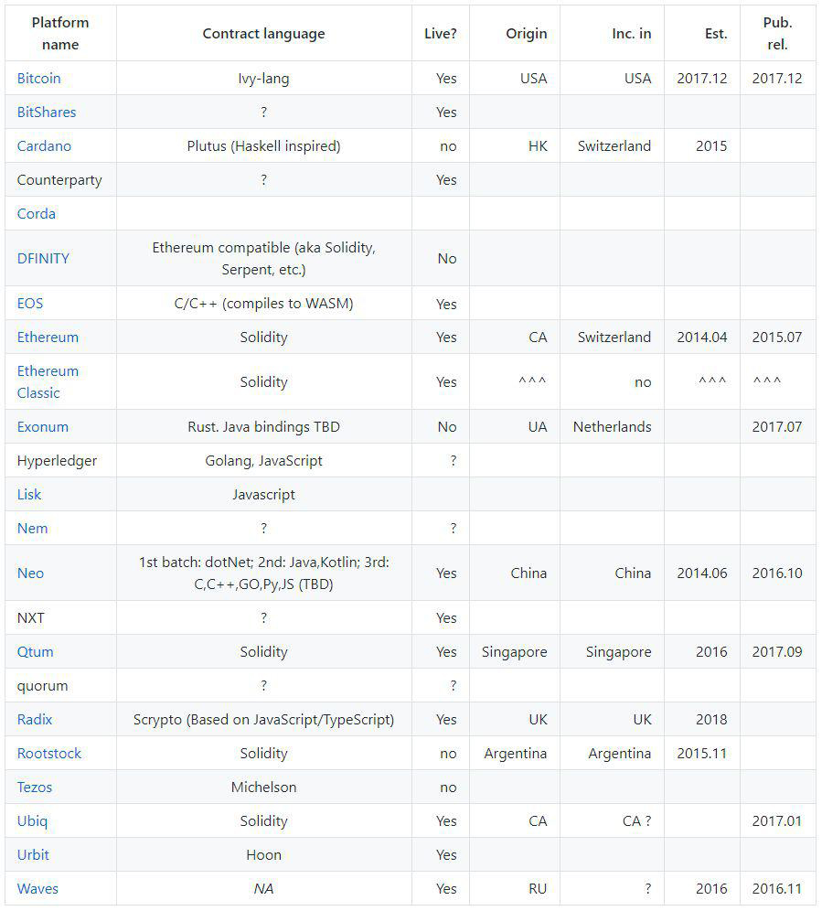

ASCH 智能合约平台致力于成为简单、灵活、安全、高效的智能合约平台。

### 1.1 设计目标

1. 简单。智能合约容易学习、容易编写、容易验证。
2. 灵活。
   1. 设计灵活，易于扩展。
   2. 编写灵活，可满足绝大部分场景。
3. 安全。
   1. 智能合约是运行安全的，恶意合约不会对区块链造成破坏性的影响。
   2. 智能合约语言必须是图灵完备的。
   3. 智能合约运行必须在有限有的时间内停止。
4. 高效。ASCH 智能合约能达到上千 TPS。

### 1.2 技术选型

#### 1.2.1 智能合约平台对比

在设计智能合约之前，首先得选定一门智能合约语言。现在市面上的智能合约平台情况如图所示：

其中最出名的莫过于以太坊的 Solidity，但 Solidity 是一门全新的语音，学习门槛高，以致以太坊后来又开发了新的智能合约语言 Vyper（Python 语言子集），就是为了解决开发门槛高的问题。

#### 1.2.2 基于 Typescript 子集的智能合约语言

阿希技术团队经过各种可行性调研后，最终采用了 Node.js 的 VM（ECMAScript 运行环境） + TypeScript 子集（智能合约语言，最终编译成 js）的方案。好处如下：

1. JavaScript 有庞大的开发者群体，TypeScript 是 JavaScript 的超集，且越来越受欢迎。阿希链本身也是基于 Node.js 开发的，开发者只需要学习 TypeScript 即可上手开发智能合约。
2. Node.js 的 VM 提供了一个安全的沙盒环境运行 JavaScript。
3. Node.js v10.13.0+ 之后内置了大整数（BigInt）的支持。

TypeScript 子集的意思是：精简了 TypeScript 部分特性和 ECMAScript 部分语法。如:

1. 不能使用 any（TypeScript）
2. 不能使用可选类型（TypeScript）
3. 不能使用 Date.now() 和 Math.random()（ECMAScript）
4. 不能使用 delete、with、try、throw 等等（ECMAScript）
5. 具体见后面的章节

#### 1.2.3 为什么是 Typescript 而不是 JavaScript？

TypeScript  是 JavaScript 的超集，主要添加了静态类型检查。使用 TypeScript 有以下几个优点：

1. 更严谨的合约设计。智能合约开发者使用强类型的 TypeScript 更能设计出严谨的 DApp。
2. 更友好地代码提示。配合 VS Code + TypeScript 插件，大大提高智能代码编写效率。
3. 更少的 bug。在编写智能合约期间就能检测代码有效性，配合定制化的 tslint，大大减少编写智能合约过程中的 bug。
4. 最重要的是：在编译 TypeScript 的时候可以拿到参数的类型和属性，保证合约调用时的安全，如：声明为 private 的方法只能在智能合约内部使用，无法通过外部调用。

#### 1.2.4 与以太坊智能合约对比

|          | 以太坊智能合约平台  | ASCH智能合约平台       |
| -------- | ------------------- | ---------------------- |
| 语言     | Solidity            | TypeScript 子集        |
| 运行环境 | 以太坊虚拟机（EVM） | Node.js 沙盒环境（VM） |
| 开发难度 | 难                  | 易                     |
| 燃料价格 | 高                  | 低                     |
| tps      | 低                  | 高                     |

### 1.3 技术实现

**隔离的合约执行进程和存储**

基于安全性的考虑，智能合约代码执行运行在与 ASCH 链相隔离的独立进程中，虽然带来了引擎实现的复杂度，但好处是智能合约的恶意代码不会修改 ASCH 链的数据，修改合约状态只能通过指定的交易才可以实现，恶意代码也难以通过接口直接篡改合约状态，同时每个合约也运行在独立的沙盒中，合约代码之间相互隔离，一个合约无法修改其他合约的状态。

**使用 TypeScript 语言作为合约语言**

TypeScript 是一种由微软开发的自由和开源的编程语言，它是 JavaScript 的一个超集，由实现了静态类型和基于类的面向对象编程。由 Anders Hejlsberg 设计(他同时还是 Delphi 和 .NET 的设计师)，TypeScript 借鉴了许多 C#、Java 等现代语言的优点，相对 JavaScript 来说具有更为安全、更完善的工具支持、代码更易维护的特点。ASCH 智能合约平台使用 Typescript 语言作为智能合约编写语言可以实现对合约代码的有效性检查、减少智能合约编写过程中的 bug，提升开发智能合约的效率。

**自动的状态管理**

合约状态管理是智能合约引擎中一个重要的部分，部分平台的做法是提供底层的持久化接口给开发人员自己手动管理状态，但让开发人员需要关注持久化的细节，这样就增加了不必要的复杂性。在 ASCH 智能合约中状态的持久化是透明的、自动完成的，开发人员只需要对状态变量进行赋值即可，不需要考虑持久化的细节。这样让开发人员把注意力集中在合约的逻辑本身上，降低合约的开发难度，提高合约代码的可理解和可维护性。