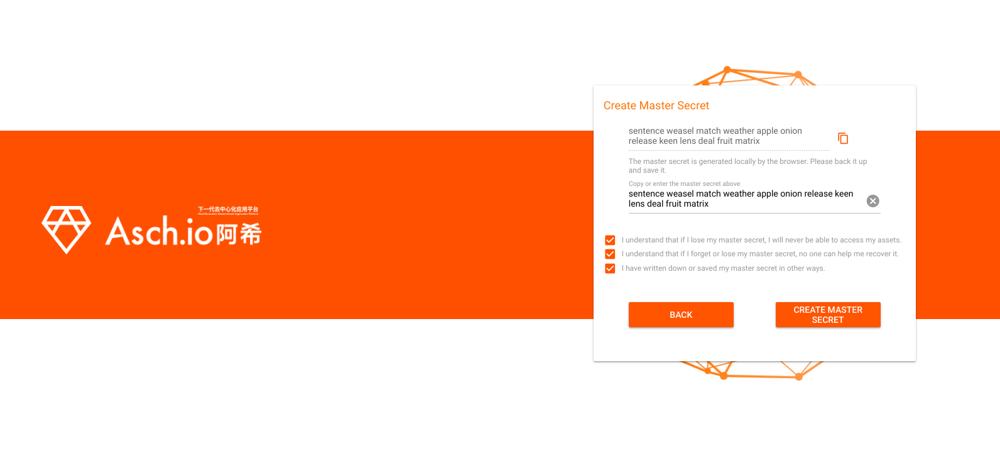
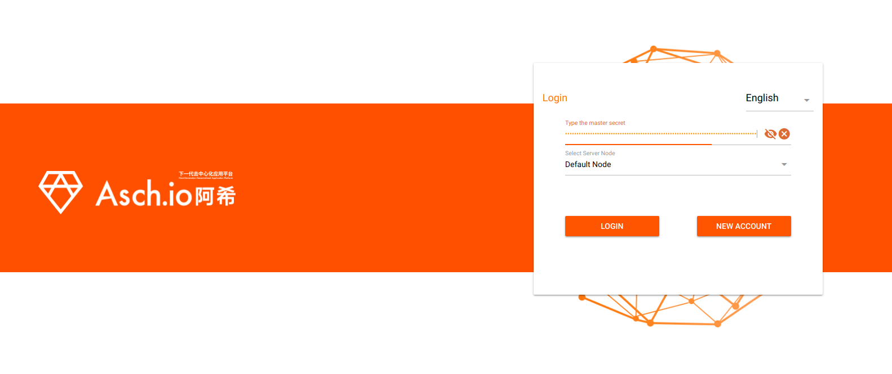
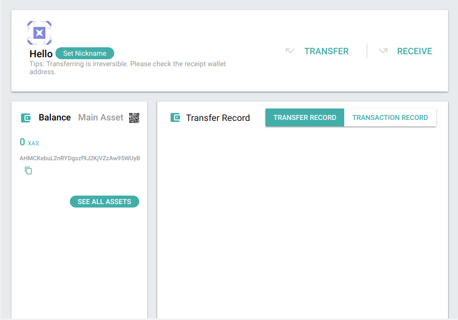
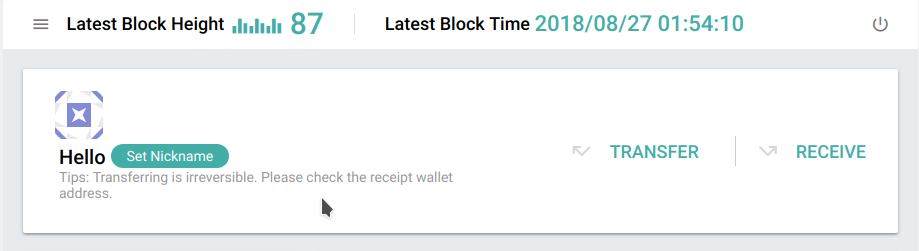
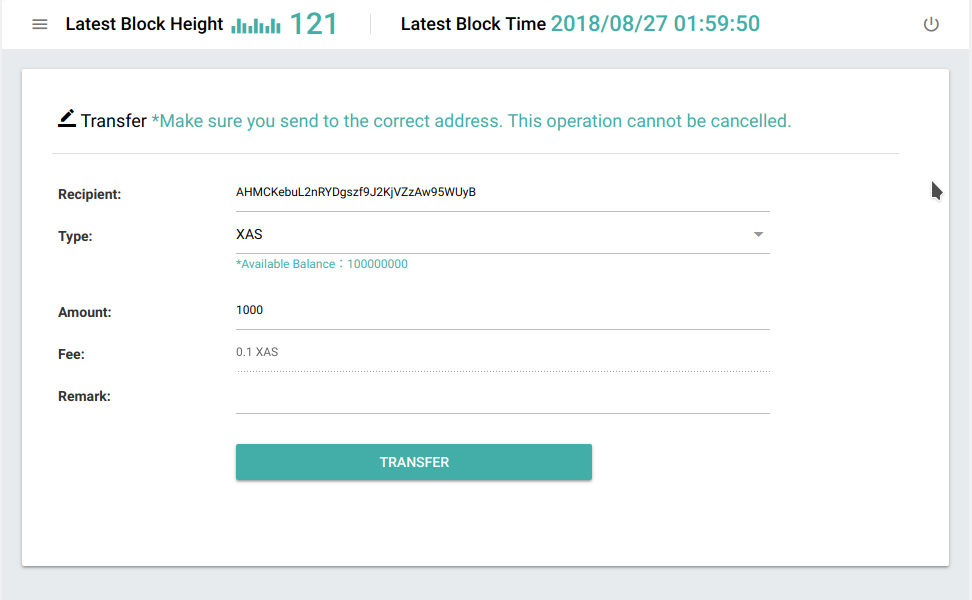

# Create a new account by using the front-end


### Preparation
Make sure to have the ASCH blockchain installed ([Install ASCH blockchain](https://medium.com/aschplatform/develop-blockchain-apps-with-sidechain-technology-part-1-c5aa91c4602f)).  

Be also sure to have the ASCH GUI downloaded ([Download ASCH GUI](https://github.com/AschPlatform/asch-docs/blob/master/install/en.md#56-configure-frontend)).


### New Account
Now start the ASCH blockchain by executing (`cd asch && node app.js`) in your terminal. Now point your browser to `http://localhost:4096/#/login` and press the "New account" button.



In this example the secret is `sentence weasel match weather apple onion release keen lens deal fruit matrix` (write it safely down somewhere). Now press the __CREATE MASTER SECRET__ button to confirm the secret.


Login with your new secret:  


You will find your new account with an empty balance and your address `AHMCKebuL2nRYDgszf9J2KjVZzAw95WUyB`:




<br/><br/>

### Send yourself some XAS

First logout from your current session. The logout button is in the upper right corner:  



Use the genesis account to send our new user some XAS. The genesis account is the account where all the money of the ASCH blockchain is initally located. This account has hundred millions of XAS (our standard currency).


**Genesis Account**
```
    address: ABuH9VHV3cFi9UKzcHXGMPGnSC4QqT2cZ5
    secret: stone elephant caught wrong spend traffic success fetch inside blush virtual element
    publicKey: 116025d5664ce153b02c69349798ab66144edd2a395e822b13587780ac9c9c09
```

Point your browser to `http://localhost:4096/#/login` again. Login with the __secret__ of the genesis account now. Then Click the "Transfer" tab on the left side of your screen. Now send 1000 XAS to `AHMCKebuL2nRYDgszf9J2KjVZzAw95WUyB`.



Login with your new account now. You'll see that your balance is now 1000 XAS.  

# Create a new acount with asch-cli
Alternatively you can also use [asch-cli](https://github.com/AschPlatform/asch-cli) to [create a new account](https://github.com/AschPlatform/asch-docs/blob/master/dapp/hello_world/en.md#6-prepare-account-for-dapp-registration).

