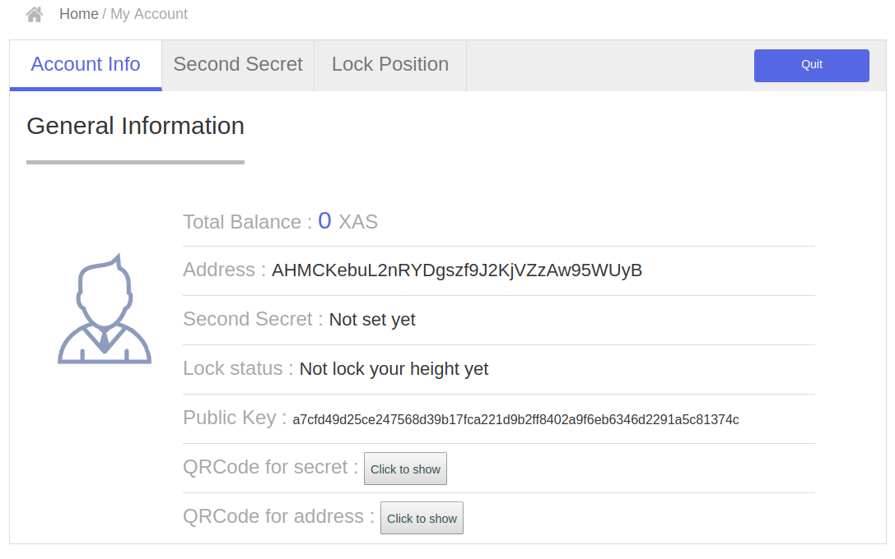

# Create a new account by using the (default) front-end

Make sure that ASCH is running (`cd asch && node app.js`) now point your browser to http://localhost:4096/#/login and press the "New account" button.


In this example the secret will become `sentence weasel match weather apple onion release keen lens deal fruit matrix` (write it down somewhere). Now press the "Next Step" button and confirm the secret.

You will find your new accout with an empty balance:


Find your address under the "My Account" tab on the left side of your screen:



As you see our new XAS address is `AHMCKebuL2nRYDgszf9J2KjVZzAw95WUyB`.

### Give the new user some XAS
Use the genesis account to send the new user some XAS. The genesis account, see also [Dapp Development Tutorial 1: Asch Dapp Hello World](https://github.com/AschPlatform/asch-docs/blob/master/dapp/hello_world/en.md);

**Genesis Account**
```
    address: ABuH9VHV3cFi9UKzcHXGMPGnSC4QqT2cZ5
    secret: stone elephant caught wrong spend traffic success fetch inside blush virtual element
    publicKey: 116025d5664ce153b02c69349798ab66144edd2a395e822b13587780ac9c9c09
```

Point your browser to http://localhost:4096/#/login again. Login with the genesis account now. Then Click the "Transfer" tab on the left side of your screen. Now send 1000 XAS to `AHMCKebuL2nRYDgszf9J2KjVZzAw95WUyB`.


Login with your new account now. Notice that one account can only register as publisher once. You'll see that the balance contains 1000 XAS now. 

# Create a new acount with asch-cli
Alternatively you can also use [asch-cli](https://github.com/AschPlatform/asch-cli) to [create a new account](https://github.com/AschPlatform/asch-docs/blob/master/dapp/hello_world/en.md#6-prepare-account-for-dapp-registration).

