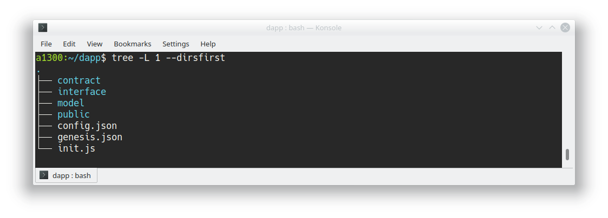
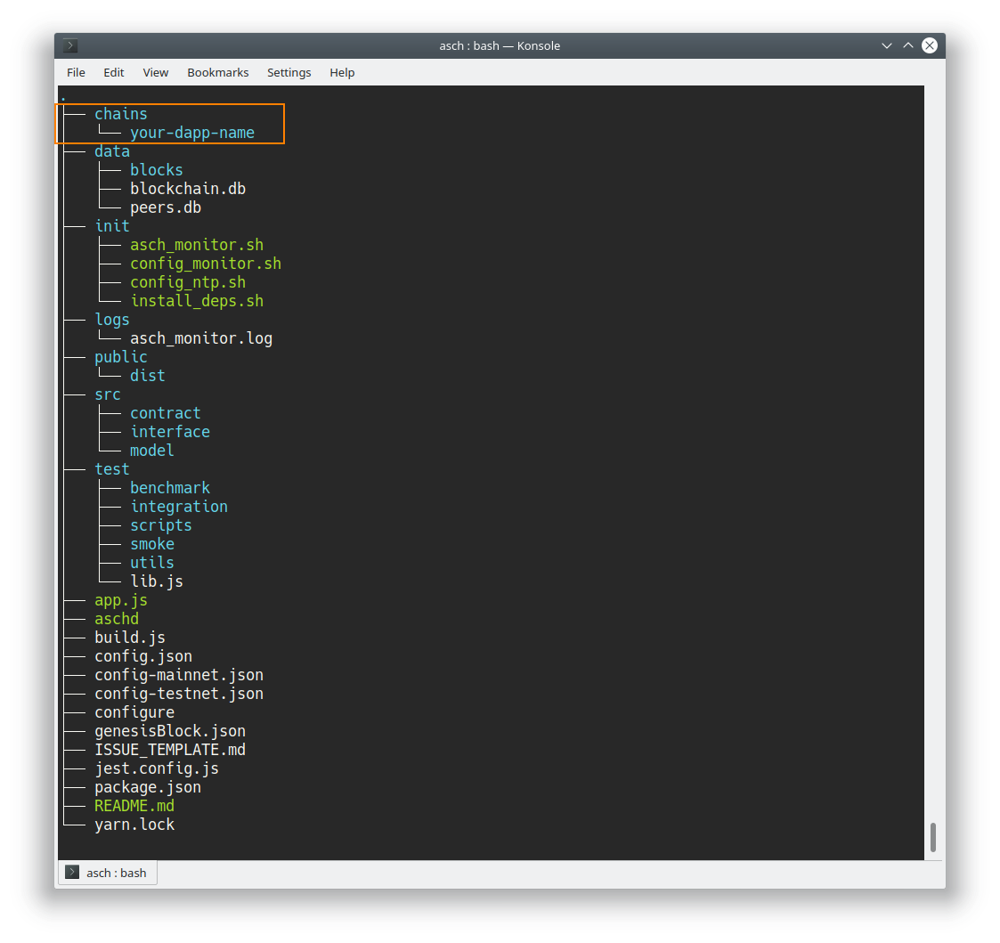
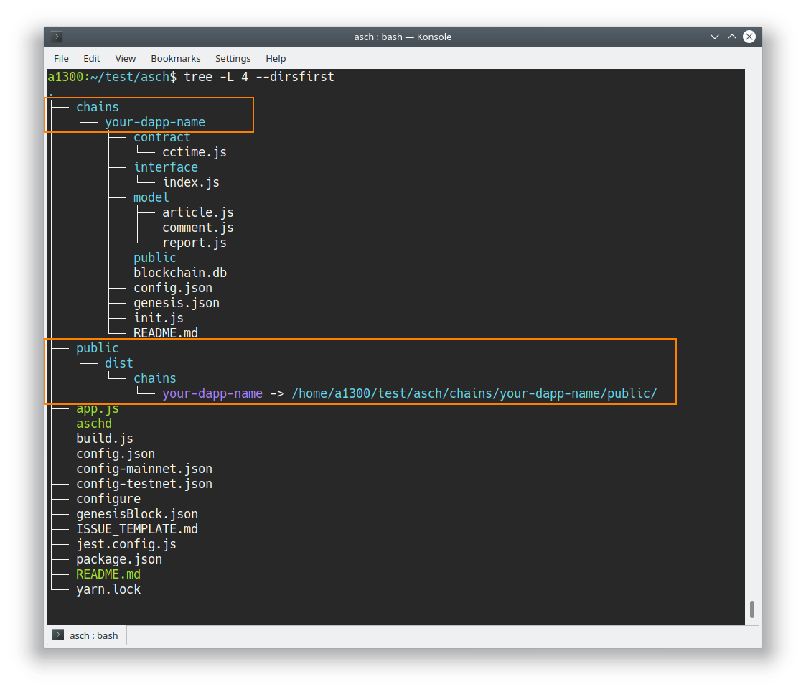

# Common DApp Development Problems  

Table of Contents
=================

<!-- TOC -->

- [Common DApp Development Problems](#common-dapp-development-problems)
  - [Overview](#overview)
  - [**DApp is not starting**](#dapp-is-not-starting)
    - [**Incorrect peers in config.json**](#incorrect-peers-in-configjson)
    - [**DApp needs right folder structure**](#dapp-needs-right-folder-structure)
    - [**Is DApp correctly registered and installed**](#is-dapp-correctly-registered-and-installed)
    - [**Directory asch/public/dist/chains must exist**](#directory-aschpublicdistchains-must-exist)
    - [**Missing length property in conjunction with string type of new DApp model**](#missing-length-property-in-conjunction-with-string-type-of-new-dapp-model)
  - [**DApp is not producing blocks**](#dapp-is-not-producing-blocks)
    - [**Not enough DApp delegates in config.json**](#not-enough-dapp-delegates-in-configjson)
  - [**Transaction failed**](#transaction-failed)
    - [**Depending transaction not verified**](#depending-transaction-not-verified)
    - [**Sending transaction to wrong API endpoint**](#sending-transaction-to-wrong-api-endpoint)
  - [**Can not register custom DApp contracts**](#can-not-register-custom-dapp-contracts)
    - [**Contract number must be above 1000**](#contract-number-must-be-above-1000)
    - [**Contract is not pointing to the right file and function**](#contract-is-not-pointing-to-the-right-file-and-function)
  - [**Request failed with status code 404**](#request-failed-with-status-code-404)
    - [**Check correct Dapp-Name in request URL**](#check-correct-dapp-name-in-request-url)
  - [**Can not run npm install in asch directory**](#can-not-run-npm-install-in-asch-directory)
    - [**Parent directory has space in its name**](#parent-directory-has-space-in-its-name)
  - [**Can not reach ASCH blockchain**](#can-not-reach-asch-blockchain)
    - [**Check port and configuration**](#check-port-and-configuration)

<!-- /TOC -->


<br/><br/>

## Overview
In this document we will present common DApp development problems and their respective solution. 


__Where is my DApp installed__  
Your DApp is installed in your `asch/` directory under `asch/chains/your-dapp-name/` with the dapp-name you registered the DApp with. This is also the place where you can find the DApp log files (`logs/`).

All registerd DApps: `curl http://localhost:4096/api/v2/transactions?type=200`  
All installed DApps: `curl http://localhost:4096/api/chains/installed`  

__Log Files__  
To access the log files of your DApp, go to `asch/chains/your-dapp-name/logs/debug.20180826.log`. To access the log files of your Mainchain, go to `asch/logs/debug.20180826.log`.

__General Information__  
If we talk about a file, then only the file counts that the ASCH blockchain and your DApp is using (the file your DApp is using in `asch/chains/your-dapp-name`). So be sure to have the right files at the right place. Restart the ASCH node if you changed anything.

>NOTE:  
`config.json` = `asch/chains/your-dapp-name/config.json`


<br/><br/>

## **DApp is not starting**  

### **Incorrect peers in config.json**

Don't provide an empty `peers` array in the `config.json` file. Remove the `peers` property or specify at least one peer:

Remove the `peers` property:  
```diff
- {
-   "peers": [],
-   "secrets": [
-     "flame bottom dragon rely endorse garage supply urge turtle team demand put",
-     "thrive veteran child enforce puzzle buzz valley crew genuine basket start top",
-     "black tool gift useless bring nothing huge vendor asset mix chimney weird",
-   ]
- }
+ {
+   "secrets": [
+     "flame bottom dragon rely endorse garage supply urge turtle team demand put",
+     "thrive veteran child enforce puzzle buzz valley crew genuine basket start top",
+     "black tool gift useless bring nothing huge vendor asset mix chimney weird",
+   ]
+ }
```

Or specify at least one peer:  
```diff
- {
-   "peers": [],
-   "secrets": [
-     "flame bottom dragon rely endorse garage supply urge turtle team demand put",
-     "thrive veteran child enforce puzzle buzz valley crew genuine basket start top",
-     "black tool gift useless bring nothing huge vendor asset mix chimney weird",
-   ]
- }
+ {
+   "peers": [{"ip":"127.0.0.1","port":4096}],
+   "secrets": [
+     "flame bottom dragon rely endorse garage supply urge turtle team demand put",
+     "thrive veteran child enforce puzzle buzz valley crew genuine basket start top",
+     "black tool gift useless bring nothing huge vendor asset mix chimney weird",
+   ]
+ }
```

<br/><br/>

### **DApp needs right folder structure**

The minimum folder configuration is listed below:  




### **Is DApp correctly registered and installed**
Make sure, that that your Dapp is correctly located under `asch/chains/your-dapp-name`. Double check all installed DApps: `curl http://localhost:4096/api/chains/installed`




### **Directory asch/public/dist/chains must exist**

Make sure that the `asch/public/dist/chains` exists.



### **Missing length property in conjunction with string type of new DApp model**

In the DApp directory under the `model/` directory are definitions for all custom table fields. If you declare a column with the type `string` then you __must__ also provide the `length` property for this column!

Wrong:  
```js
module.exports = {
  name: 'articles',
  fields: [
    {
      name: 'tid',
      type: 'String'
    }
  ]
}
```

Right:  
```js
module.exports = {
  name: 'articles',
  fields: [
    {
      name: 'tid',
      type: 'String',
      length: 64
    }
  ]
}
```

<br/><br/>

## **DApp is not producing blocks**

### **Not enough DApp delegates in config.json**

Be sure to have enough DApp delegates secrets in your `config.json` file (in your productive DApp directory under `asch/chains/your-dapp-name`). Restart the ASCH node afterwards.

__NOTE__  
Specify the secrets of the DApp delegates which were used during the Dapp registration.  


```diff
- {
-   "peers": [{"ip":"127.0.0.1","port":4096}],
-   "secrets": [
-   ]
- }
+ {
+   "peers": [{"ip":"127.0.0.1","port":4096}],
+   "secrets": [
+     "flame bottom dragon rely endorse garage supply urge turtle team demand put",
+     "thrive veteran child enforce puzzle buzz valley crew genuine basket start top",
+     "black tool gift useless bring nothing huge vendor asset mix chimney weird",
+     "ribbon crumble loud chief turn maid neglect move day churn share fabric",
+     "scan prevent agent close human pair aerobic sad forest wave toe dust"
+   ]
+ }
```


<br/><br/>

## **Transaction failed**

### **Depending transaction not verified**
Your transaction didn't get processed because it depends upon another transaction that wasn't confirmed yet.  

> __Solution:__  
> Wait for __10 seconds__ for the previous transaction to get confirmed and after that send your transaction again. A block gets forged every 10 seconds. As long as the previous transaction can be found in the  unconfirmed transactions (`http://localhost:4096/api/transactions/unconfirmed`) you need to wait.


### **Sending transaction to wrong API endpoint**

With the multitude of API endpoints it is not always easy to use the correct API endpoint:

Mainchain:  
- Signed (HTTP __POST__): `http://localhost:4096/peer/transaction`  
- Unsigned (HTTP PUT): `http://localhost:4096/api/transactions`  

DApp:  
- Signed (HTTP PUT): `http://localhost:4096/api/chains/your-dapp-name/transactions/signed`  
- Unsigned (HTTP PUT): `http://localhost:4096/api/chains/your-dapp-name/transactions/unsigned`  


<br/><br/>

## **Can not register custom DApp contracts**

### **Contract number must be above 1000**

Contract aliases (numbers) below 1000 are reserved for DApp in-built contracts. Use an aliases above 1000.  

```diff
# init.js file

module.exports = async function () {
  app.logger.info('enter dapp init')

- app.registerContract(800, 'cctime.postArticle')
+ app.registerContract(1002, 'cctime.postArticle')

}
```

### **Contract is not pointing to the right file and function**

The string `'cctime.postArticle'` means, that they must be a `cctime` file in the `contract/` directory and in the `cctime` file a function named `postArticle`.

```js
registerContract(1001, 'cctime.postArticle')
```


Documentation: [Register Contract](https://github.com/AschPlatform/asch-docs/blob/master/sdk_api/en.md#82-appregistercontracttype-name)


<br/><br/>

## **Request failed with status code 404**
### **Check correct Dapp-Name in request URL**

Double check that you accesing the correct DApp. Check especially __your-dapp-name__ in your request (`http://localhost:4096/api/chains/your-dapp-name/endpoint`).  

See also [**Sending transaction to wrong API endpoint**](#sending-transaction-to-wrong-api-endpoint)

View all installed DApps:  

```bash
curl http://localhost:4096/api/chains/installed

# returns:  
{
  "success":true,
  "chains":[
    {
      "tid":"23f3c877d9a4163d14cb90a10a8132d9b5ae2d25cf568d994720acd85a9272b1",
      "name":"test-rTGrJniQQEys",
      "address":"CNKb1p78kKY9DGT7eNfYQ4Xe2r1B9T91nB",
      "desc":"A hello world demo for asch dapp",
      "link":"https://test-wnNethfKMmTk.zip",
      "icon":"http://o7dyh3w0x.bkt.clouddn.com/hello.png",
      "unlockNumber":3,
      "_version_":1
    }
  ]
}
```

<br/><br/>

## **Can not run npm install in asch directory**
### **Parent directory has space in its name**

If one of the parent directories of `asch` has a whitespace in its name, the `npm install` process doesn't work:  

Error:  
```
configure: error: The build directory contains whitespaces - This can cause tests/installation to fail due to limitations of some libtool versions
Makefile:61: recipe for target 'libsodium' failed
make: *** [libsodium] Error 1
/home/a1300/test/asch 2/node_modules/sodium/install.js:287
            throw new Error(cmdLine + ' exited with code ' + code);
            ^
```

> __Solution:__  
> Remove the whitespace in the parent's directory name  

<br/><br/>

## **Can not reach ASCH blockchain**

### **Check port and configuration**
If you are running ASCH on localnet the default port is `4096`.

- Did you changed port configuration in the `config.json` file?
- Did you run `node app.js --port 1234` command and specified another port then 4096?
- Did you started ASCH with `./aschd start` as a daemon then check your `asch.pid` file and see on which port the ASCH blockchain is listening: `netstat -tulpn | grep -f asch.pid`.


 
<br/><br/>

---------

If your problem is not represeted above, create an github issue [ASCH/issues](https://github.com/AschPlatform/asch/issues)
