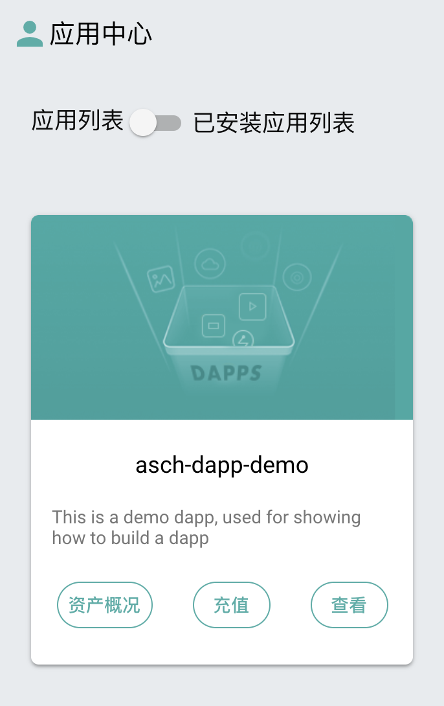
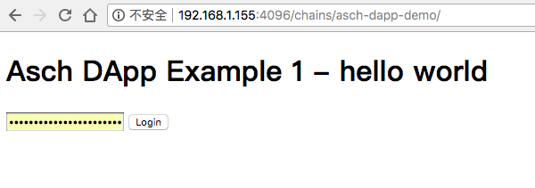
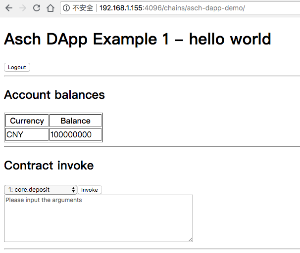
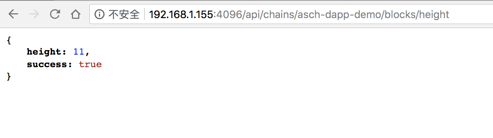

# DApp 的开发及部署

## 一、概述

利用阿希提供的侧链技术，企业或者开发者可以根据自己的业务很容易的开发一个 DApp。基于阿希开发的 DApp 拥有自己独立的数据库。数据模型可以灵活设计，手续费也可以指定为自己发行的资产。开发一个 DApp 使用的编程语言为 JavaScript。

在正式开发 DApp 之前，开发者需要了解一些阿希的基本情况，详细可以参考[官网](https://www.asch.io)或者[白皮书]()。这里仅强调一下阿希的网络类型：

Asch 有三种网络类型，分别是 Localnet，Testnet 以及 Mainnet。其中 Localnet 可以用于本地搭建环境进行开发和测试，Testnet 和 Mainnet 由社区进行维护，访问地址分别为 https://testnet.asch.io 和 https://mainnet.asch.io .

新的功能更新会首先发布到 Testnet 上进行测试，Testnet 在功能上基本和 Mainnet 一致。它和 Mainnet 的区别在于部署时的 magic 值不同（Testnet 的 magic 为594fe0f3， Mainnet 的 magic 为 5f5b3cf5）。另外一个区别就是 Mainnet 上的资产是有价值的，可以在交易所进行流通。Testnet 上的币没有价值，仅用于测试。如果开发者需要测试币，请联系官方团队索取。

## 二、DApp 开发的基本流程

DApp 的开发流程一般为：

- 第一步，在 Localnet 开发、本地调试
- 第二步，部署到 Testnet 进行发布前的测试
- 第三步，正式发布到 Mainnet，其他节点也可以选择安装

## 三、配置 Localnet

### 3.1 安装系统依赖

请参考文档[安装系统依赖](https://github.com/AschPlatform/asch-docs/blob/master/install/zh-cn.md#%E4%B8%80%E7%B3%BB%E7%BB%9F%E7%8E%AF%E5%A2%83%E5%92%8C%E4%BE%9D%E8%B5%96)

### 3.2 安装 Localnet

请参考文档[安装 Localnet](https://github.com/AschPlatform/asch-docs/blob/master/install/zh-cn.md#%E5%9B%9Basch-localnet-%E8%8A%82%E7%82%B9%E5%AE%89%E8%A3%85)

此时打开浏览器，输入 http://your-ip:4096，应该可以看到网页客户端界面了。

创世账户为`stone elephant caught wrong spend traffic success fetch inside blush virtual element`，登录到客户端后会有1亿 XAS。

## 四、安装 asch-cli

运行命令

```JavaScript
npm install asch-cli
```

（由于最新版 asch-cli 还没有推送，大家可以使用git clone https://github.com/AschPlatform/asch-cli 克隆到本地，然后执行npm install）

## 五、生成新账户

每个 DApp 都有独立的受托人，这些受托人也是默认的记账人，他们负责区块的生产，跨链资产的中转，与此同时可以获得 DApp 内部交易的手续费。注册 DApp 的时候，我们只需要收集受托人的公钥就行，为了权力分散，最好每个秘钥分别由一个人保管。

DApp 的受托人是 DApp 里非常重要的角色。这里生成的账户一定要记好。为了演示，这里使用 `asch-cli` 生成5个新账户。一个 DApp 最多有101个受托人，最少是5个。

```shell
asch@asch-16:~/asch-cli$ ./bin/asch-cli crypto -g
? Enter number of accounts to generate 5
[ { address: 'AL7MfrDrUCysvSotoDZ9ir2YESqRUqah4T',
    secret: 'code flush merit drop april theory element during avoid device large plunge',
    publicKey: '9cb5be153e78bfb110790a2210634da58206aabed769ebc51ad6884239995f1c' },
  { address: 'APh8DfNJgiSuPVi196BgnPNVUM3KWPc7zR',
    secret: 'logic field kiss upper lock park wife invest effort exact poverty confirm',
    publicKey: 'e446e798b64d74cb4825872cc217d22d35db67d8f97e73d78d9cc9cd2b2d7214' },
  { address: 'A9T6JRytQmaHrN9NAcma1TYnUhMX69iHay',
    secret: 'kite vapor nest net gesture present prison climb dad salon title donate',
    publicKey: '643d2658656feb41631d2c4800fa7c4f7d117693d789a77c89367d627ddc8fb6' },
  { address: 'AEQfSifHXmQrQA9mtDKbGqA1sREPxHziJo',
    secret: 'parrot couple chef neglect cinnamon attitude discover lecture mask fantasy worth board',
    publicKey: '7bd25b08d1a3f3e61b805eac6a3bc94c2c51ae437f3eb00152317db01020d998' },
  { address: 'A2fH3HzbC3f9XfhVUfhPLHwkUz5wFTnXCt',
    secret: 'upset angle august army problem size glow poem mandate claim toss join',
    publicKey: 'a3efd2079543483f6b54573f0bac9b239e20c5e7e09a173e01eefb2179e1ed8b' } ]
Done
```

## 六、生成应用模板

这一步会生成一个应用的模板目录，可以作为 DApp 开发的起点。

```shell
asch@asch-16:~$ mkdir asch-dapp-demo
asch@asch-16:~$ cd asch-dapp-demo
asch@asch-16:~/asch-cli$ ./bin/asch-cli chain -c
Copying template to the current directory ...
? Enter chain name asch-dapp-demo
? Enter chain description This is a demo  DApp , used for showing how to build a  DApp 
? Enter chain link https://your-domain/dapp.zip
? Enter chain icon url https://your-domain/dapp.png
? Enter public keys of chain delegates - hex array, use "," for separator 9cb5be153e78bfb110790a2210634da58206aabed769ebc51ad6
884239995f1c,e446e798b64d74cb4825872cc217d22d35db67d8f97e73d78d9cc9cd2b2d7214,643d2658656feb41631d2c4800fa7c4f7d117693d789a77c
89367d627ddc8fb6,7bd25b08d1a3f3e61b805eac6a3bc94c2c51ae437f3eb00152317db01020d998,a3efd2079543483f6b54573f0bac9b239e20c5e7e09a
173e01eefb2179e1ed8b
? How many delegates are needed to unlock asset of a chain? 3
Chain meta information is saved to ./chain.json ...
```

这一步会生成一个名字为`chain.json`的文件。此时的文件目录结构应该为：

```shell
asch@asch-16:~/asch-dapp-demo$ ll
总用量 36
drwxrwxr-x  6 asch asch 4096 8月  16 16:29 ./
drwxr-xr-x 25 asch asch 4096 8月  16 16:27 ../
-rw-rw-r--  1 asch asch  590 8月  16 16:26 chain.json
-rw-rw-r--  1 asch asch   23 8月  16 16:24 config.json
drwxrwxr-x  2 asch asch 4096 8月  16 16:24 contract/
-rw-rw-r--  1 asch asch  266 8月  16 16:24 init.js
drwxrwxr-x  2 asch asch 4096 8月  16 16:24 interface/
drwxrwxr-x  2 asch asch 4096 8月  16 16:24 model/
drwxrwxr-x  2 asch asch 4096 8月  16 16:24 public/
```

注意事项：

1. `chain link`是为了方便普通用户自动安装，必须以`.zip`结尾, 如果您的 DApp 不打算开源或者没有准备好，可以把这个选项当做占位符，它所在的地址不必真实存在
2. `chain icon url`这是在阿希应用中心展示用的应用图标, 必须以`.jpg`或`.png`结尾，如果该图片无法访问，阿希应用中心会展示一个默认的图标
3. `How many delegates ...`这个选项表示从` DApp `跨链转账资产时需要多少个受托人联合签名，该数字必须大于等于3、小于等于你配置的受托人公钥个数且小于等于101，数字越大越安全，但效率会变低和费用越高

## 七、生成创世区块

 DApp 的创世块中可以创建内置资产，但不是必须的，内置资产无法跨链转账，只能在链内使用。在主链发行的 UIA（用户自定义资产）可以充值到任意 DApp 中，也可从 DApp 提现到主链，这是 DApp 内置资产和 UIA 最大的区别。“一链多币，一币多链”指的就是主链可以发行多个 UIA，而每个 UIA 都可以充值到多个 DApp 中。

不发行资产的情况：

```shell
asch@asch-16:~/asch-dapp-demo$ ../asch-cli/bin/asch-cli chain -g
? Enter master secret of your genesis account [hidden]
? Do you want publish a inbuilt asset in this chain? No
New genesis block is created at: ./genesis.json
```

发行资产的情况

```shell
asch@asch-16:~/asch-dapp-demo$ ../asch-cli/bin/asch-cli chain -g
? Enter master secret of your genesis account [hidden]
? Do you want publish a inbuilt asset in this chain? Yes
? Enter asset name, for example: BTC, CNY, USD, MYASSET CNY
? Enter asset total amount 100000000
? Enter asset precision 8
New genesis block is created at: ./genesis.json
```

此时在目录里应该生成了一个 `genesis.json` 的文件。

## 八、目录结构

下面我们分析下 DApp 的目录结构

```shell
.
└── asch-dapp-demo
    ├── blockchain.db     //  DApp 数据库文件，与主链的数据是分开存放的
    ├── chain.json
    ├── config.json       // 应用的节点配置文件，目前主要用于配置受托人秘钥
    ├── contract          // 合约目录
    │   └── domain.js     // 域名合约的实现代码
    ├── genesis.json      // 创世区块
    ├── init.js           // 应用初始化代码，可以在该文件进行一些设置、事件注册等
    ├── interface         // 查询接口的实现目录
    │   ├── domain.js     // 域名查询接口实现
    │   └── helloworld.js
    ├── logs              // 日志目录
    │   └── debug.20180816.log
    ├── model
    │   └── domain.js     // 域名业务数据模型定义
    └── public
        └── index.html    // 默认前端页面
```

## 九、DApp 的开发过程

阿希创始人单青峰曾经在这个[博客里](http://blog.asch.so/2017/06/30/asch-1.3-foresight-2/)写过开发理念。在 DApp 中实现一个业务逻辑，大概步骤如下：

### 9.1 定义你的数据模型

在这个环节，你需要考虑的是在区块链中保存什么数据或状态，你的账本内容是什么、哪些字段需要建立索引来以提高客户端查询速度。
DApp 有自己的 db 文件（sqlite3)，位置在 chains/chainname/blockchain.db。所有的表结构定义以及数据都存在这里。这里的数据跟主链的数据是隔离的，主链的db文件在 asch 目录下。

### 9.2 实现合约逻辑

这个环节，你需要考虑的是一个事务或一个调用会修改哪些状态，比如资产余额，账户属性等。我们在 SDK 中提供了丰富的接口可供调用，具体可参考[SDK接口文档](../asch_sdk_api.md)

### 9.3 实现查询接口

在这个环节，你需要考虑的是如何给前端返回数据，比如区块、交易，各种合约业务状态的查询等。也可以可用这个通道将一些非全局状态保存到本地节点，我们会在后续章节介绍这些高级用法。
目前 DApp 有[预置的通用查询接口](../asch_ DApp _default_api.md)，这些是由 asch-sandbox 提供的。另外一部分就是用户自定义的查询接口，在 chains/chainname/interface/xx.js中进行定义。

## 十、注册应用到区块链

利用 `asch-cli` 提供的 `registerchain`来完成应用到区块链的注册。 要选择一个有 XAS 的账户，这里我们使用创世账户。

```shell
asch@asch-16:~/asch-dapp-demo$ ../asch-cli/bin/asch-cli -H 127.0.0.1 -P 4096 registerchain -e "stone elephant caught wrong spend traffic success fetch inside blush virtual element" -f chain.json
f9ccac2a7d353f708c838cc49b54dfb31ea50e7120d5162efc6882274fca20cb
```

此时进客户端查看，会显示



## 十一、部署应用

在正式部署应用之前，我们需要先修改 config.json ，添加之前生成的受托人以及 peers。其中 peers 里的 ip 要改成自己服务器的 IP 地址。

```json
{
  "secrets": [
    "code flush merit drop april theory element during avoid device large plunge",
    "logic field kiss upper lock park wife invest effort exact poverty confirm",
    "kite vapor nest net gesture present prison climb dad salon title donate",
    "parrot couple chef neglect cinnamon attitude discover lecture mask fantasy worth board",
    "upset angle august army problem size glow poem mandate claim toss join"
  ],
  "peers":[{"ip":"192.168.1.155","port":4097}]
}
```

然后执行命令：

```shell
cp -r asch-dapp-demo asch-linux-1.4.3-localnet/chains/
./aschd restart // 进入 asch 目录，重启节点
```

此时查看主链日志，应该有如下字样
`2018-08-16T17:31:25+0800 <info> chains.js:405 (priv.launch) Launched chain[asch-dapp-demo] successfully`

## 十二、查看应用状态

DApp 的登录界面为：http://192.168.1.155:4096/chains/asch-dapp-demo/, 登录后可以查看账户基本信息以及进行调用合约的操作：




DApp 的日志目录为 asch/chains/chainname/logs/debug.2018xxxx.log



查看 DApp 区块高度可以访问接口：http://192.168.1.155:4096/api/chains/asch-dapp-demo/blocks/height
