# How to debug Dapps  


<!-- TOC -->

- [How to debug Dapps](#how-to-debug-dapps)
    - [**Overview**](#overview)
    - [**Differnt Log files and their loction**](#differnt-log-files-and-their-loction)
      - [**Mainchain log file**](#mainchain-log-file)
      - [**Sidechain log file**](#sidechain-log-file)
    - [**Consult Common-Dev-Problems Document**](#consult-common-dev-problems-document)
    - [**Debug your Sidechain code with Chrome `ndb` Debugger**](#debug-your-sidechain-code-with-chrome-ndb-debugger)
      - [**Why an extra tool for Sidechain code Debugging?**](#why-an-extra-tool-for-sidechain-code-debugging)
      - [**Install `ndb`**](#install-ndb)
      - [**Open Chrome `ndb` Debugger**](#open-chrome-ndb-debugger)
      - [**Start Blockchain**](#start-blockchain)
      - [**Where is my Sidechain code?**](#where-is-my-sidechain-code)
      - [**Set debugger statements and Breakpoints**](#set-debugger-statements-and-breakpoints)
      - [**Example: Debug Contract Execution**](#example-debug-contract-execution)
      - [**Kill Process**](#kill-process)
      - [**Restart**](#restart)
      - [**Switch between Contexts**](#switch-between-contexts)

<!-- /TOC -->

<br/><br/>


### **Overview**

Developing Dapps is not always easy and straightforward. Problems can't always be spotted right away because the Dapp code is run by the [asch-sandbox](https://github.com/aschplatform/asch-sandbox-dist). This document tries to help make the lifes of developers easier.

### **Differnt Log files and their loction**

There are different `log` files. One of these can often help to spot the problem.

#### **Mainchain log file**
The log files for the [ASCH](https://github.com/aschplatform/asch) Mainchain are located under `asch/logs/debug.<year><month><day>.log`.

> WARNING  
> The log files for the ASCH mainchain are only created if the blockchain is started through `./aschd start`. If you start the blockchain in the terminal with `node app.js` then the log files are not getting constructed.

#### **Sidechain log file**

The log files for every Sidechain are located under `asch/chains/<chain-name>/logs/debug.<year><month><day>.log`

### **Consult Common-Dev-Problems Document**

If your Dapp is not working this can have numerous causes. Be sure to check out the [Common Dapp Dev Problems](../common_dapp_dev_problems_en.md) file.

### **Debug your Sidechain code with Chrome `ndb` Debugger**

#### **Why an extra tool for Sidechain code Debugging?**

Every Sidechain is running in a separate [asch-sandbox](https://github.com/aschplatform/asch-sandbox-dist) environment.

If we hadn't the Chrome [ndb](https://github.com/GoogleChromeLabs/ndb) tool at hand we would need to pass the `'['--inspect=9228', '--debug-brk']` options to the `spawn()` function (from the built-in `child_process` package). Of course with an extra port number for every Sidechain.

Due to the new Chrome [ndb](https://github.com/GoogleChromeLabs/ndb) tool we can __automatically__ connect to new child processes! No need for extra `spawn()` parameters!

#### **Install `ndb`**

Install the `ndb` npm package:  
```bash
npm install ndb --global
```

The whole installation is approximately 300 MB.


#### **Open Chrome `ndb` Debugger**

Open a terminal and change directories to your `asch/` directory (where your `asch` blockchain is):
```bash
# change directory
cd asch
```

Fire `ndb` in your `asch/` directory up:

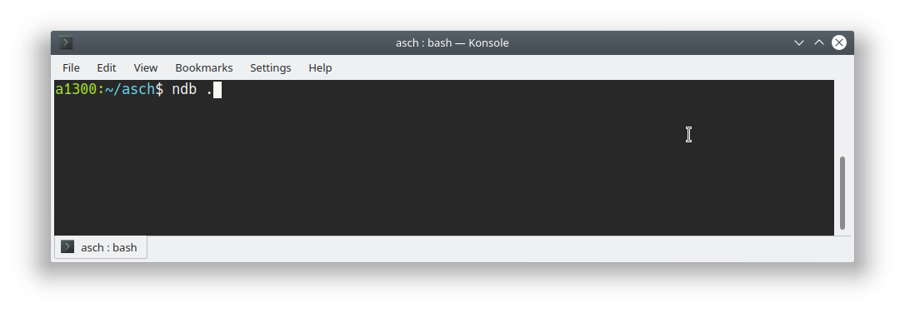


The `ndb` tool looks like the Chrome Debugger. You can also save files to the filesystem.

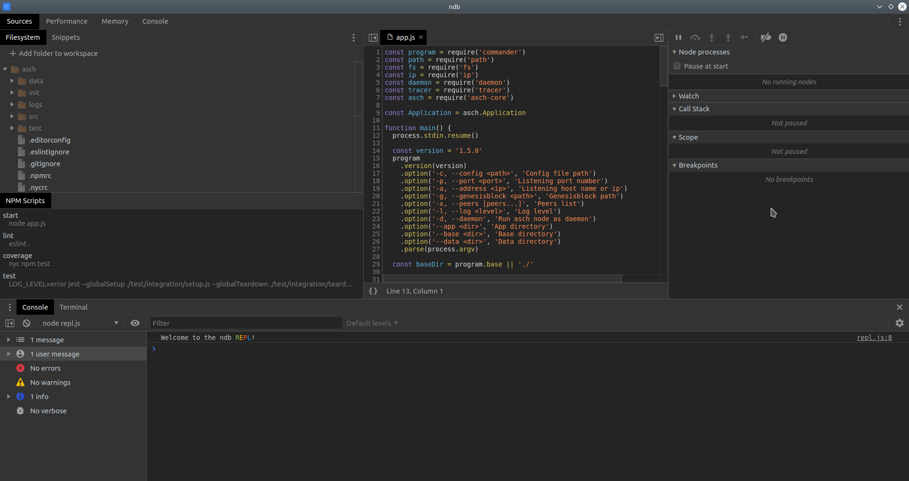

#### **Start Blockchain**

In the panel `Filesystem` on the left you can find the `asch/app.js` file and with `Right Click` + `Run this script` you can start the ASCH blockchain:

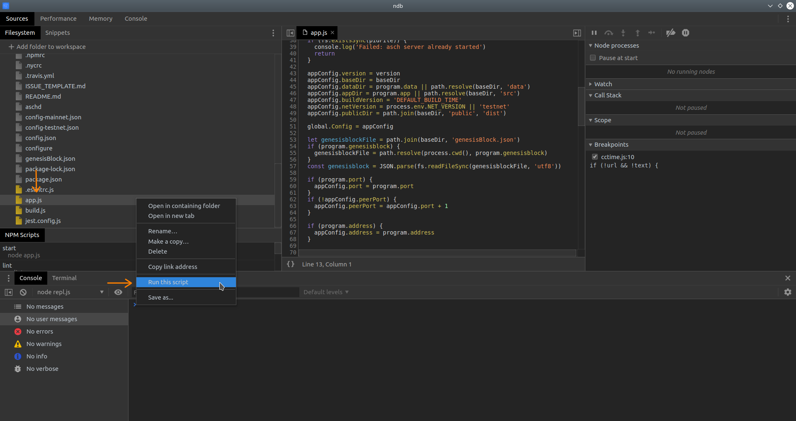


#### **Where is my Sidechain code?**

You can have as many Sidechains installed on your local ASCH blockchain as you like. There are located in the `asch/chains/` directory:

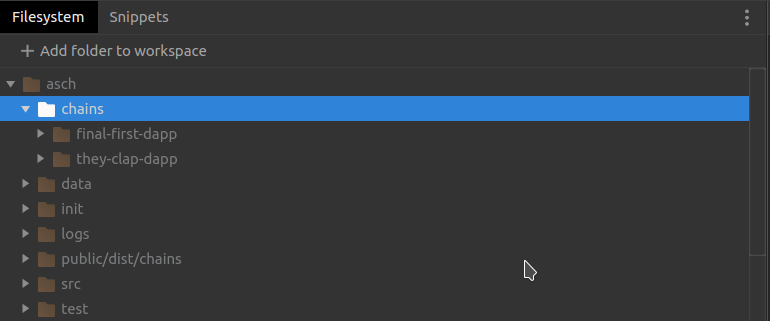


#### **Set debugger statements and Breakpoints**

I want that the execution halts in the `init.js` of my sample `they-clap-dapp` Sidechain. Therefore I place a `debugger;` statement in the `asch/chains/they-clapp-dapp/init.js` file:

Place `debugger;` statement in `init.js` file:
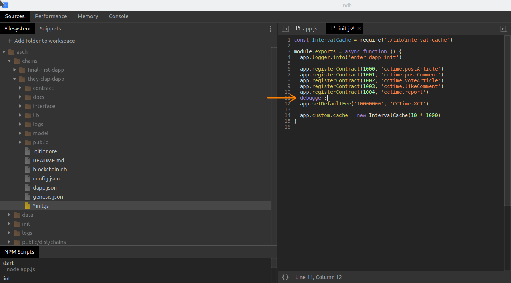

Start the ASCH blockchain again by executing the `app.js` file (like in point [**Start Blockchain**](#start-blockchain)).
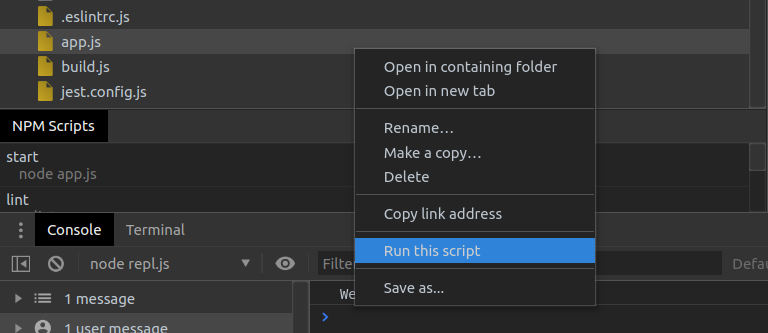


The debugger hits the `debugger;` statement a few seconds after the ASCH blockchain started:

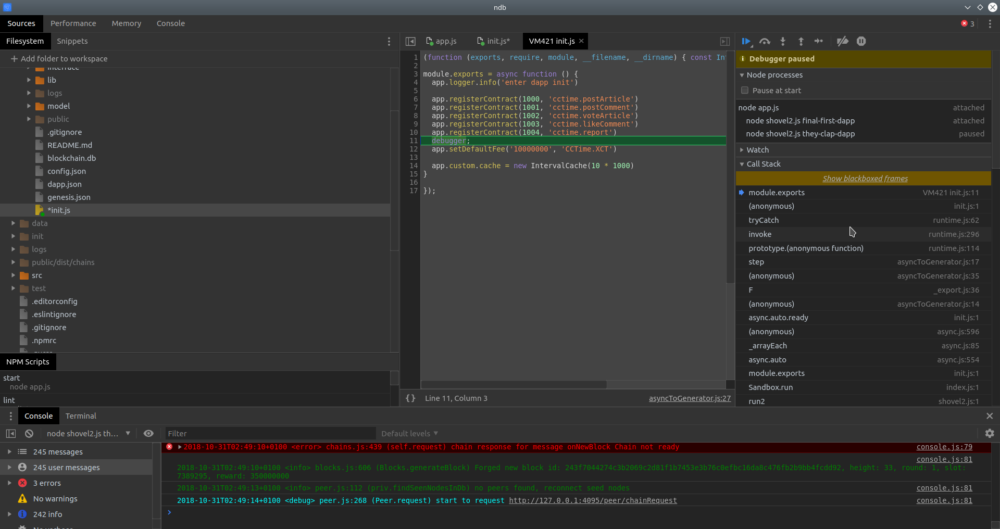


#### **Example: Debug Contract Execution**

> INFO  
> In this example we are using the [CCTime](https://github.com/aschplatform/cctime) Sidechain code but we gave our Sidechains random names, because Sidechain-names must be unique (in this case we named our Sidechain `they-clap-dapp`).

Most times we want to debug an Sidechain contract. Therefore we set a __Breakpoint__ in the `asch/chains/they-clapp-dapp/contract/cctime.js` file:

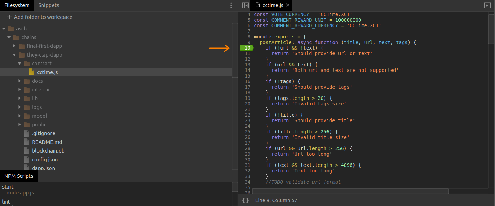

Then we sign a transaction and send it to the `they-clapp-dapp` Sidechain:  

```js
const aschJS = require('asch-js')
const axios = require('axios')

const secret = 'sentence weasel match weather apple onion release keen lens deal fruit matrix';

const type = 1000
const fee = String(0.1 * 1e8)

let title = 'Superb article',
    articleUrl = '',
    text = 'Very long text...',
    tags = 'debugging,javascript,ndb'

const options = {
  fee: fee,
  type: type,
  args: JSON.stringify([title, articleUrl, text, tags])
};

let trs = aschJS.dapp.createInnerTransaction(options, secret);

console.log(JSON.stringify(trs, null, 2))

let dappName = 'they-clap-dapp'
let url = `http://localhost:4096/api/chains/${dappName}/transactions/signed`

let headers = {
  headers: {
    'Content-Type': 'application/json'
  }
}

axios.put(url, { transaction: trs }, headers)
  .then((response) => {
    console.log(`${JSON.stringify(response.data)}`)
  })
  .catch(erro => {
    console.log('error occured')
    console.log(JSON.stringify(erro.message))
  })
```


#### **Kill Process**

On the Chrome [ndb](https://github.com/GoogleChromeLabs/ndb) tool the buttons for stopping the debugging are not so easy to spot.

On the right side under `Node processes`:
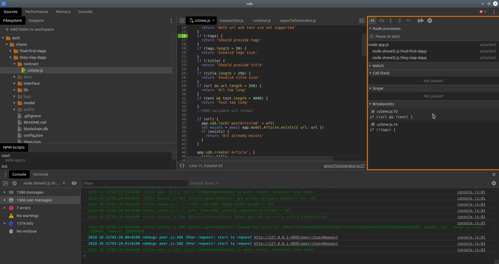

Every process must be killed with the __white square__ button:  
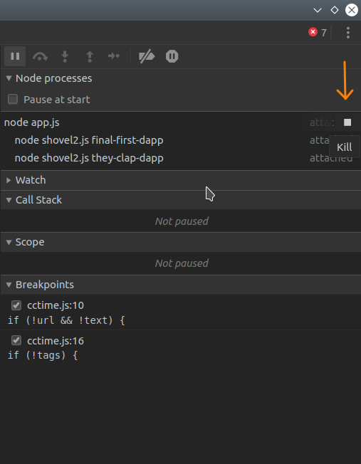


#### **Restart**

Besides killing the process you can also __restart__ the debugging with the latest configuration with the keyboard shortcut `Ctrl + R`


#### **Switch between Contexts**

When you have at least one Sidechain running then you have differnet Javascript Execution Environments to switch between. This step is normally not necessary because the `ndb` is smart enough to switch automatically to the Context where the `debugger;` statement or the `Breakpoint` was hit.

However if you want to pause the execution in the right JavaScript process you need to __switch__ context:

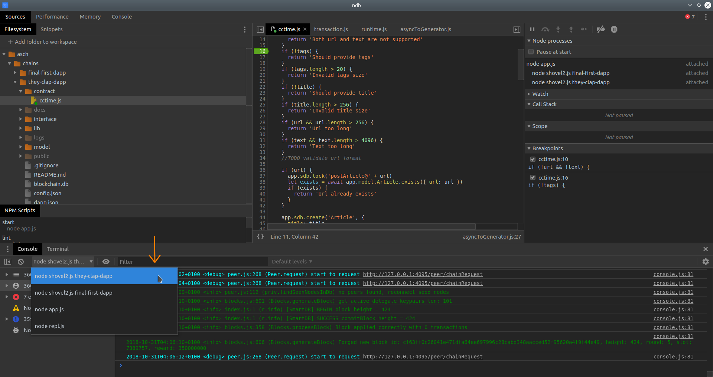

