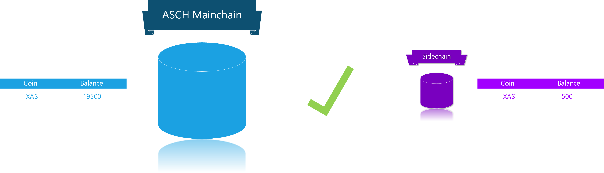
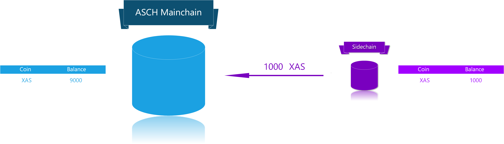
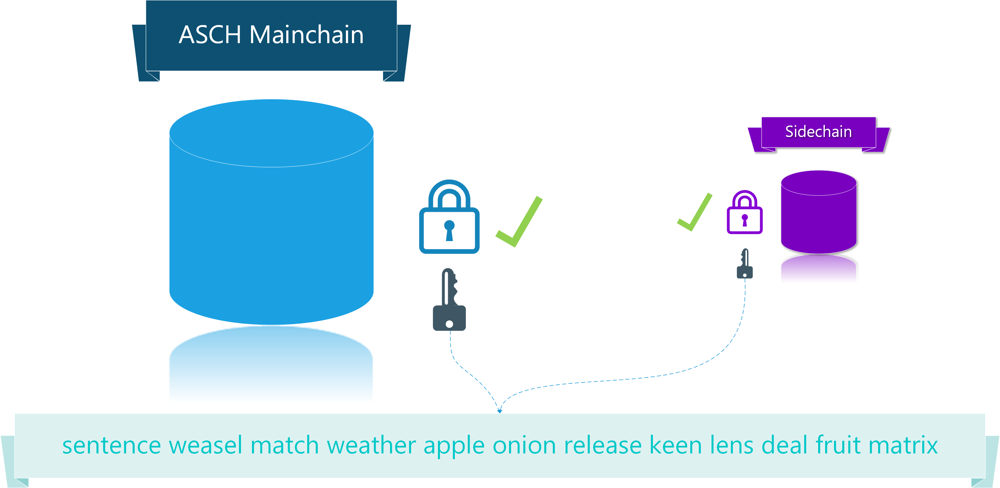

Table of Contents
=================

<!-- TOC -->

- [Asch-JS API](#asch-js-api)
  - [**1 Asch-js description**](#1-asch-js-description)
    - [**1.1 asch-js installation**](#11-asch-js-installation)
    - [**1.2 description**](#12-description)
    - [**1.3 Choose right API Endpoint**](#13-choose-right-api-endpoint)
  - [**2 Account**](#2-account)
    - [**2.1 Get keypairs from secret**](#21-get-keypairs-from-secret)
    - [**2.2 Get address from public key**](#22-get-address-from-public-key)
    - [**2.3 Set second secret, main-type=3**](#23-set-second-secret-main-type3)
    - [**2.4 Lock account funds, main-type=4**](#24-lock-account-funds-main-type4)
    - [**2.5 Set nickname, main-type=2**](#25-set-nickname-main-type2)
  - [**3 Ordinary transactions**](#3-ordinary-transactions)
    - [**3.1 Transfer XAS in the mainchain, main-type=1**](#31-transfer-xas-in-the-mainchain-main-type1)
    - [**3.2 Get TransactionId from Transaction**](#32-get-transactionid-from-transaction)
  - [**4 Asset related UIA**](#4-asset-related-uia)
    - [**4.1 Register Publisher, main-type=100**](#41-register-publisher-main-type100)
    - [**4.2 Register Asset, main-type=101**](#42-register-asset-main-type101)
    - [**4.3 Mint Asset, main-type=102**](#43-mint-asset-main-type102)
    - [**4.4 Transfer Asset, main-type=103**](#44-transfer-asset-main-type103)
  - [**5 Delegate**](#5-delegate)
    - [**5.1 Register as Delegate, main-type=10**](#51-register-as-delegate-main-type10)
    - [**5.2 Upvote Delegate, main-type=11**](#52-upvote-delegate-main-type11)
    - [**5.3 Delete Vote for Delegate, main-type=12**](#53-delete-vote-for-delegate-main-type12)
  - [**6 Dapp**](#6-dapp)
    - [**6.1 Dapp Registration, main-type=200**](#61-dapp-registration-main-type200)
    - [**6.2 Dapp Recharge**](#62-dapp-recharge)
      - [**6.2.1 Overview**](#621-overview)
      - [**6.2.2 Step 1, main-type=204**](#622-step-1-main-type204)
      - [**6.2.3 Step 2, side-type=1**](#623-step-2-side-type1)
    - [**6.3 Dapp Withdraw**](#63-dapp-withdraw)
      - [**6.3.1 Overview**](#631-overview)
      - [**6.3.2 Step 1, side-type=2**](#632-step-1-side-type2)
      - [**6.3.3 Step 2, main-type=205**](#633-step-2-main-type205)
      - [**6.3.4 Step 3, main-type=205**](#634-step-3-main-type205)
    - [**6.4 Create Sidechain Transactions**](#64-create-sidechain-transactions)
      - [**6.4.1 Overview**](#641-overview)
      - [**6.4.2 Sign Built-In Sidechain Contracts**](#642-sign-built-in-sidechain-contracts)
        - [**6.4.2.1 Dapp internal transfer, side-type=3**](#6421-dapp-internal-transfer-side-type3)
        - [**6.4.2.2 Set a dapp nickname, contract type=3**](#6422-set-a-dapp-nickname-contract-type3)
      - [**6.4.3 Sign Custom Sidechain Contracts**](#643-sign-custom-sidechain-contracts)
  - [**7 Signature Verification, crypto**](#7-signature-verification-crypto)
    - [**7.1 Get transaction bytes**](#71-get-transaction-bytes)
    - [**7.2 Get Transaction Hash**](#72-get-transaction-hash)
    - [**7.3 Get transaction id based on transaction content**](#73-get-transaction-id-based-on-transaction-content)
    - [**7.4 Sign the transaction bytes**](#74-sign-the-transaction-bytes)
    - [**7.5 Verify that the transaction signature was really signed by the signer**](#75-verify-that-the-transaction-signature-was-really-signed-by-the-signer)
  - [**8 Miscellaneous**](#8-miscellaneous)
    - [**8.1 Global parameters**](#81-global-parameters)
      - [**8.1.1 Set the variable k/v**](#811-set-the-variable-kv)
      - [**8.1.2 According to the key for value**](#812-according-to-the-key-for-value)
      - [**8.1.3 Get all k/v**](#813-get-all-kv)
    - [**8.2 Time related slot.time**](#82-time-related-slottime)
      - [**8.2.1 Asch main network creation block generation time**](#821-asch-main-network-creation-block-generation-time)
      - [**8.2.2 Get Asch timestamp based on unix timestamp**](#822-get-asch-timestamp-based-on-unix-timestamp)
      - [**8.2.3 Get unix timestamp from Asch timestamp**](#823-get-unix-timestamp-from-asch-timestamp)

<!-- /TOC -->


# Asch-JS API


## **1 Asch-js description**

### **1.1 asch-js installation**

```bash
npm install asch-js
```

Import `asch-js` into your javascript project:  
```js
const AschJS = require('asch-js');
```

### **1.2 description**
Almost all functions can receive a optional second secret. You only need to provide a second secret if you called and published the [2.3 Set second secret, main-type=3](#23-set-second-secret-main-type3) transaction.

- `secret` password (must be BIP39 complient)
- `publicKey` public key (gets generated based off the `secret`)
- `secondSecret` second password (optional custom second Secret)

```js
const secret = 'minor borrow display rebel depart core buzz right distance avocado immense push';
const publicKey = 'ebd4c62ebe2255b7ad5ee43120a9f9191c76e30928c92cd536351e3cc2c626ed';
const secondSecret = 'erjimima2017';
```

### **1.3 Choose right API Endpoint**

The generated transactions by __asch-js__ needs to be send (in `JSON` format) to the ASCH HTTP API:  
- Mainchain:  
  - Signed (HTTP __POST__): `http://localhost:4096/peer/transaction`
  - Unsigned (HTTP PUT): `http://localhost:4096/api/transactions`
- Sidechain:  
  - Signed (HTTP PUT): `http://localhost:4096/api/chains/chain-name/transactions/signed`
  - Unsigned (HTTP PUT): `http://localhost:4096/api/chains/chain-name/transactions/unsigned`

> IMPORTANT:  
> Most of the transactions are build for the ASCH Mainchain. Some are build for the Sidechain. For Sidechain transactions please go to section [6.4 Create Sidechain Transactions](#64-create-sidechain-transactions)

Overview about the right Mainchain/Sidechain endpoints:  


<br/>
<br/>

Send signed __Mainchain__ transaction:  
```js
const axios = require('axios');
const AschJS = require('asch-js');

// example mainchain transaction
let newName = 'sqfasd';
let secret = 'sentence weasel match weather apple onion release keen lens deal fruit matrix';
let trs = AschJS.basic.setName(newName, secret);

let url = 'http://localhost:4096/peer/transaction';

let data = {
  transaction: trs
};

let headers = {
  headers: {
    magic: "594fe0f3",
    version: ''
  }
}

axios.post(url, data, headers)
  .then((result) => {
    console.log(JSON.stringify(result.body, null, 2))
  })
  .catch((error) => {
    console.log(error.message)
  })
```


Send signed __Sidechain__ transaction:  
```js
const axios = require('axios');

// set nickname for Sidechain
const fee = 5;
const type = 4;
const nickname = 'sqfasd';
const options = {
  fee: fee,
  type: type,
  args: JSON.stringify([nickname])
};

let trs = AschJS.dapp.createInnerTransaction(options, secret);  

let url = 'http://localhost:4096/api/chains/chain-name/transactions/signed';

let data = {
  transaction: trs
};

let headers = {
  headers: {
    magic: "594fe0f3",
    version: ''
  }
}

axios.put(url, data, headers)
  .then((result) => {
    console.log(JSON.stringify(result.body, null, 2))
  })
  .catch((error) => {
    console.log(error.message)
  })
```


## **2 Account**

### **2.1 Get keypairs from secret**

Function:  `crypto.getKeys(secret)`

Parameters:  

| Name | Type | Required | Description |
| :---: | :---: | :---: | :---: |
| secret | string | Y | BIP39 comlient secret: e.g.<br/> `sentence weasel match weather apple onion release keen lens deal fruit matrix` |

Example:  
```js
let secret = 'sentence weasel match weather apple onion release keen lens deal fruit matrix'
AschJS.crypto.getKeys(secret)
{
    publicKey: 'ebd4c62ebe2255b7ad5ee43120a9f9191c76e30928c92cd536351e3cc2c626ed',
    privateKey: '7ae536fa343281d9e9ed383e8b5ef62e0fd0d0cbed79786cac241d484e312fdeebd4c62ebe2255b7ad5ee43120a9f9191c76e30928c92cd536351e3cc2c626ed' 
}
```

### **2.2 Get address from public key**

Function: `crypto.getAddress(publicKey)`  

Parameters:  

| Name | Type | Required | Description |
| :---: | :---: | :---: | :---: |
|publicKey| string | Y | ASCH publicKey of an account |

Example:  
```js
let publicKey = 'a7cfd49d25ce247568d39b17fca221d9b2ff8402a9f6eb6346d2291a5c81374c'
AschJS.crypto.getAddress(publicKey);
'AHMCKebuL2nRYDgszf9J2KjVZzAw95WUyB'
```

### **2.3 Set second secret, main-type=3**

Function: `crypto.signature.createSignature(secret, secondSecret)`  


> The transaction-type in the mainchain for this operation is 3

Parameters:  

| Name | Type | Required | Description |
| :---: | :---: | :---: | :---: |
| secret | string | Y | ASCH account secret (BIP39 complient) |
| secondSecret | string | Y | ASCH second secret (custom secret) |

Example:  
```js
AschJS.basic.setSecondSecret(secret, secondSecret)
{
  "type": 3,
  "timestamp": 68843553,
  "fee": 500000000,
  "args": [
    "632a41caf7d3c8d3754f27a11004acaea6f5571eed28b42451b5560ee91e991c"
  ],
  "senderPublicKey": "ebd4c62ebe2255b7ad5ee43120a9f9191c76e30928c92cd536351e3cc2c626ed",
  "senderId": "AFUH568CbGC2GPcE4gXHiZhxdYQYfziz2J",
  "signatures": [
    "a1f7d26e67c2776a6335617b0e20dbffce350b625e1a2d4183ac60d21cdb87ea280442f1ae37c73aaaec7566d5d128164f5a2f279b4d959877512d69d916bb03"
  ],
  "id": "c0e4fb5afd2a68b385702d684968ad362df2e4c61fadaf823c6234279fa2cd6c"
}
```

### **2.4 Lock account funds, main-type=4**

Function: `transaction.createLock(height, amount, secret, secondSecret)`  

> The transaction-type in the mainchain for this operation is 4

Parmeters:  

| Name | Type | Required | Description |
| :---: | :---: | :---: | :---: |
| height | int | Y | Block height until the amount should be locked |
| amount | number | Y | Amount to lock until the given block height |
| secret | string | Y | ASCH account secret (BIP39 complient) |
| secondSecret | string | N | Optional second secret. Must be only provided if previously set |

Example:  

```js
let lockHeight = 100005352
let amountToLock = 1000 * 1e8
AschJS.transaction.transaction.createLock(lockHeight, amountToLock, secret, secondSecret)
{
  "type": 4,
  "timestamp": 68844102,
  "fee": 10000000,
  "args": [
    100005352,
    100000000000
  ],
  "senderPublicKey": "ebd4c62ebe2255b7ad5ee43120a9f9191c76e30928c92cd536351e3cc2c626ed",
  "senderId": "AFUH568CbGC2GPcE4gXHiZhxdYQYfziz2J",
  "signatures": [
    "94a791d797ab07e385097cd110804051c12f6bc9df94560165d3436f9d3c518369ae5eb664ae708ba9c865e49e67b6c562beadad3f903f20f7d86f5935944602"
  ],
  "secondSignature": "f9a7d40c8aea75d31b7b3404095524a41ff6d87e6e3f582e381b33b7a2372b7e35b83488e04097e1827a704cbad16f0abc02c626d173969980565934664a960c",
  "id": "e4077404a78763ab5ba3742e7d462ed907884bf4b2b4a137a22f53768d832981"
}
```

### **2.5 Set nickname, main-type=2**

Function: `basic.setName(nickname, secret, secondSecret)`

> The transaction-type in the mainchain for this operation is 2

Parameters: 

| Name | Type | Required | Description |
| :---: | :---: | :---: | :---: |
| nickname | string | Y | The fee for setting the nickname depends upon the length of it. The longer the nickname gets, the cheaper it is. |
| secret | string | Y | ASCH account secret (BIP39 complient) |
| secondSecret | string | N | Optional second secret. Must be only provided if previously set |

Nickname-Lenght - Fee

| length	| fee |
| :---: | :---: |
| 2 | 200*XAS |
| 3 | 100*XAS |
| 4 | 80*XAS |
| 5 | 40*XAS |
| 6-10 | 10*XAS |
| >10 | 1*XAS |

Example:  

```js
let username = 'sqfasd'
AschJS.basic.setName(username, secret, secondSecret)
{
  "type": 2,
  "timestamp": 69120769,
  "fee": 1000000000,
  "args": [
    "sqfasd"
  ],
  "senderPublicKey": "a7cfd49d25ce247568d39b17fca221d9b2ff8402a9f6eb6346d2291a5c81374c",
  "senderId": "AHMCKebuL2nRYDgszf9J2KjVZzAw95WUyB",
  "signatures": [
    "d6a6f324307715e3aab35662551e94c3e0d3ae676b981379ca44a5ba29fd195c9a86322950590d36e757a682fd67e2720322d8b176af35523fa2bcdc42603705"
  ],
  "secondSignature": "e206d522d8979344b891549f2d418ebaf4a39a1f159e61e873b529c335993e1d056e1ce6a8f1fbb638ca23ba8cf327503da7b4dd0523f209b11a73a62fdfc007",
  "id": "6636906ea4aa7a6f6db36c4b5886ed209c461f7d4efa1db6de439e1d4948aa8b"
}
```

## **3 Ordinary transactions**  

### **3.1 Transfer XAS in the mainchain, main-type=1**  

Function: `transaction.createTransaction(recipientId, amount, message, secret, secondSecret)`

> The transaction-type in the mainchain for this operation is 1

Parameters:  

| Name | Type | Required | Description |
| :---: | :---: | :---: | :---: |
| recipientId | string | Y | Address or nickname of recipient |
| amount | int | Y | Amount of `XAS` to send |
| message | string | N | Optional message for recipient. Message is not encrypted |
| secret | string | Y | ASCH account secret (BIP39 complient) |
| secondSecret | string | N | Optional second secret. Must be only provided if previously set |


Example:  

```js
const recipient = 'AGcqEW2B2WR45eDDndMq4a72k1wMSW4wsz';
const amount = 100 * 1e8; // 100 XAS
const message = 'beizhu';
AschJS.transaction.createTransaction(recipient, amount, message, secret, secondSecret)
{
  "type": 1,
  "timestamp": 68845107,
  "fee": 10000000,
  "message": "beizhu",
  "args": [
    10000000000,
    "AGcqEW2B2WR45eDDndMq4a72k1wMSW4wsz"
  ],
  "senderPublicKey": "ebd4c62ebe2255b7ad5ee43120a9f9191c76e30928c92cd536351e3cc2c626ed",
  "senderId": "AFUH568CbGC2GPcE4gXHiZhxdYQYfziz2J",
  "signatures": [
    "341902235df2daa4201ee4cabc9e8a9fd011ea4500a9244b4a4b05f481ccca6b820162e3be31a1fde5eccdc8a7924c744664aba9cbc14bd1ef3fda76190be307"
  ],
  "secondSignature": "4ca1d4f7d936224facaf37596a5f2fb88798f256f1ab343283a3ae660093c0882dbbc6d54973bfd95f112338b73a8e2c1740242491b0b9e16750dc290a3ac409",
  "id": "95c16ec499ff19d6fc5ea0bc4d230f1eaea1f5ad0622fbe7011a74d77a7146eb"
}
```

### **3.2 Get TransactionId from Transaction**

Function: `crypto.getId(transaction)`  

Parameters:  

| Name | Type | Required | Description |
| :---: | :---: | :---: | :---: |
| transaction | Object | Y | A signed mainchain transaction |

Example:  

```js
const recipient = 'AGcqEW2B2WR45eDDndMq4a72k1wMSW4wsz';
const amount = 100 * 1e8; // 100 XAS
const message = 'beizhu';
let transaction = AschJS.transaction.createTransaction(recipient, amount, message, secret, secondSecret)
{
  "type": 1,
  "timestamp": 68845107,
  "fee": 10000000,
  "message": "beizhu",
  "args": [
    10000000000,
    "AGcqEW2B2WR45eDDndMq4a72k1wMSW4wsz"
  ],
  "senderPublicKey": "ebd4c62ebe2255b7ad5ee43120a9f9191c76e30928c92cd536351e3cc2c626ed",
  "senderId": "AFUH568CbGC2GPcE4gXHiZhxdYQYfziz2J",
  "signatures": [
    "341902235df2daa4201ee4cabc9e8a9fd011ea4500a9244b4a4b05f481ccca6b820162e3be31a1fde5eccdc8a7924c744664aba9cbc14bd1ef3fda76190be307"
  ],
  "secondSignature": "4ca1d4f7d936224facaf37596a5f2fb88798f256f1ab343283a3ae660093c0882dbbc6d54973bfd95f112338b73a8e2c1740242491b0b9e16750dc290a3ac409",
  "id": "95c16ec499ff19d6fc5ea0bc4d230f1eaea1f5ad0622fbe7011a74d77a7146eb"
}

AschJS.crypto.getId(transaction)  
'95c16ec499ff19d6fc5ea0bc4d230f1eaea1f5ad0622fbe7011a74d77a7146eb'  // Return result, transaction id
```


## **4 Asset related UIA**

### **4.1 Register Publisher, main-type=100**

Function: `uia.createIssuer(name, desc, secret, secondSecret)`

> The transaction-type in the mainchain for this operation is 100

Parameters:  

| Name | Type | Required | Description |
| :---: | :---: | :---: | :---: |
| name | string | Y | New publisher name |
| desc | string | Y | Description of new publisher |
| secret | string | Y | ASCH account secret (BIP39 complient) |
| secondSecret | string | N | Optional second secret. Must be only provided if previously set |

Example:  

```js
let name = 'name'
let desc = 'description'
AschJS.uia.createIssuer(name, desc, secret, secondSecret)
{
  "type": 100,
  "timestamp": 68845628,
  "fee": 10000000000,
  "args": [
    "name",
    "description"
  ],
  "senderPublicKey": "ebd4c62ebe2255b7ad5ee43120a9f9191c76e30928c92cd536351e3cc2c626ed",
  "senderId": "AFUH568CbGC2GPcE4gXHiZhxdYQYfziz2J",
  "signatures": [
    "33abb889496dbc2e9238680aee35b3822ec7109fe35cf53a91382dd7f0ad59326516f3be576164f814bc3a16b942822d9f6c0a40dd5e37cda9af4015b2266e03"
  ],
  "secondSignature": "440e32afecbfed62b2a836be35d5a0b6266d334d76414408618dc91464ea752ede3e2300c62efbb297532591624c339421d57ac1b9e7e78fd05bfc5605d9370b",
  "id": "ed4312dccc5531bccb1f8e25667f0aead3f8ef49565052bb43814f4b65a40edb"
}
```


### **4.2 Register Asset, main-type=101**

Function: `uia.createAsset(name, desc, maximum, precision, secret, secondSecret)`

> The transaction-type in the mainchain for this operation is 101

| Name | Type | Required | Description |
| :---: | :---: | :---: | :---: |
| name | string | Y | The name of the new asset |
| desc | string | Y | Asset description |
| maximum | string | Y | The maximum quantity of assets that can be issued |
| precision | int | Y | Precision in decimal places |
| secret | string | Y | ASCH account secret (BIP39 complient) |
| secondSecret | string | N | Optional second secret. Must be only provided if previously set |


Example:  

```js
const assetName = 'CNY'
const assetDescription = 'Asset description'
const maximum = '1000000'
const precision = 3

AschJS.uia.createAsset(assetName, assetDescription, maximum, precision, secret, secondSecret)
{
  "type": 101,
  "timestamp": 68846185,
  "fee": 50000000000,
  "args": [
    "CNY",
    "Asset description",
    "1000000",
    3
  ],
  "senderPublicKey": "ebd4c62ebe2255b7ad5ee43120a9f9191c76e30928c92cd536351e3cc2c626ed",
  "senderId": "AFUH568CbGC2GPcE4gXHiZhxdYQYfziz2J",
  "signatures": [
    "5d58877ce2fcffbbe46d7b7ca867c4f6d592f315386ef7ff1ce80522a727a2cac5deb902e94711841a3d997ca726774b9e2a2cd8caf399552a14dd769fb73301"
  ],
  "secondSignature": "07a6e5094b0ca1e6cfdec495073d05bb699d78453ff798365088dc20d16245f8fe367258fe08d2959afba62af7f595b4b2defb2d560af18c607b93d4e38b370a",
  "id": "6001c7577d0e21ebdfbcc0716efa24acb898ea0abef965c91026ce1dd021e0a7"
}
```

### **4.3 Mint Asset, main-type=102**

Function: `uia.createIssue(currency, amount, secret, secondSecret)`

> The transaction-type in the mainchain for this operation is 102

Parmeters:  

| Name | Type | Required | Description |
| :---: | :---: | :---: | :---: |
| currency | string | Y | Full asset name, format: `${publisherName.assetName}` |  
| amount | string | Y | Actual Quantity to issue is (amount * precision). Sum of all circulating coins <= Upper Limit * Precision |
| secret | string | Y | ASCH account secret (BIP39 complient) |
| secondSecret | string | N | Optional second secret. Must be only provided if previously set |

Example:  

```js
const currency = 'IssuerName.CNY'
const amount = '100000'
AschJS.uia.createIssue(currency, amount, secret, secondSecret)
{
  "type": 102,
  "timestamp": 68846965,
  "fee": 10000000,
  "args": [
    "IssuerName.CNY",
    "100000"
  ],
  "senderPublicKey": "ebd4c62ebe2255b7ad5ee43120a9f9191c76e30928c92cd536351e3cc2c626ed",
  "senderId": "AFUH568CbGC2GPcE4gXHiZhxdYQYfziz2J",
  "signatures": [
    "5e0ca9b92219cff98cb03ca471e8514df3e3ca285d857a2ef987aa46f4fd04b737ef2e5c4a8584a819e22be62b2cf71609526d48fd158ed61fffed940489c004"
  ],
  "secondSignature": "4609f977f44f49e7128ebd6653cbb254010f7cab820a612643804f62d989beab7ecfc523368b0cc8aea66c242103f3cc39e5f74da2742c92f3a70bc66bd28f07",
  "id": "6d20f11ec132f76d656aca280e04cfd4a8e065ce2c1b5fa870854c7a16bd283d"
}
```

### **4.4 Transfer Asset, main-type=103**

Function: `uia.createTransfer(currency, amount, recipientId, message, secret, secondSecret)`

> The transaction-type in the mainchain for this operation is 103

Parameters:  

| Name | Type | Required | Description |
| :---: | :---: | :---: | :---: |
| currency | string | Y | Full asset name, format: `${publisherName.assetName}` |  
| amount | int | Y | The number of transfer (10000) = true number (10) * 10 ** accuracy (3), required <= the current total assets issued |
| message | string | N | Message for the recipient (everybody can read the message because it will be not encrypted) |
| recipientId | string | Y | Address of recipient |
| secret | string | Y | ASCH account secret (BIP39 complient) |
| secondSecret | string | N | Optional second secret. Must be only provided if previously set |


Example:  

```js
const currency = 'IssuerName.CNY'
const amount = 10000
const recipientId = 'AKKHPvQb2A119LNicCQWLZQDFxhGVEY57a'
const message = ''
AschJS.uia.createTransfer(currency, amount, recipientId, message, secret, secondSecret)
{
  "type": 103,
  "timestamp": 68847497,
  "fee": 10000000,
  "message": "",
  "args": [
    "IssuerName.CNY",
    10000,
    "AKKHPvQb2A119LNicCQWLZQDFxhGVEY57a"
  ],
  "senderPublicKey": "ebd4c62ebe2255b7ad5ee43120a9f9191c76e30928c92cd536351e3cc2c626ed",
  "senderId": "AFUH568CbGC2GPcE4gXHiZhxdYQYfziz2J",
  "signatures": [
    "f4aaac3c1c266b9346fc1281a02d72d053e7e8d351a881e8d9fc1cad5c1c11ecabeb92894b89295a25beb07534b00efcd7aa41a291d24b416b00c536ef9eb50d"
  ],
  "secondSignature": "a2ca31aa24483b7f26d2478c9319f7e1d516439569facfcd076fe7971bf7e55b97328e2131abae067a0b4f4ceb0ca055171aaa2d9b149f707e6e2079b7043a00",
  "id": "9c314018db12c6fc0ee9d0b21185cfd64f71c515d6465c8d96c70d2e2d872ab4"
}
```


## **5 Delegate**
### **5.1 Register as Delegate, main-type=10**

Function: `delegate.createDelegate(secret, secondSecret)`  

> The transaction-type in the mainchain for this operation is 10, the nickname for the account must be set for this transaction to succeed


Parameters:  

| Name | Type | Required | Description |
| :---: | :---: | :---: | :---: |
| secret | string | Y | ASCH account secret (BIP39 complient) |
| secondSecret | string | N | Optional second secret. Must be only provided if previously set |


Example:  

```js
AschJS.delegate.createDelegate(secret, secondSecret)
{
  "type": 10,
  "timestamp": 68847932,
  "fee": 10000000000,
  "args": [],
  "senderPublicKey": "ebd4c62ebe2255b7ad5ee43120a9f9191c76e30928c92cd536351e3cc2c626ed",
  "senderId": "AFUH568CbGC2GPcE4gXHiZhxdYQYfziz2J",
  "signatures": [
    "4e20df79b951a3b5273bfa7bae0e56f81f8fd123c540469d961d2b41742f350967a416c935cc32e749236742192d7516d77aa8cccd88f81ae169de4aa74e9b0b"
  ],
  "secondSignature": "e3003ca7f6400c87034cb4012f208455308c4c1b682eec801ad1f5adb07fc59fab792d3a8c44b03a02d70689e0d10abcfdebafdf5c193635b13963d638603c05",
  "id": "a3a4b8d676c24450df015a813a449e82a7b5ff1ad93a3ee4a6ae923b80c06bc2"
}
```

### **5.2 Upvote Delegate, main-type=11**

Function: `vote.createVote(delegateNicknames, secret, secondSecret)`  


> The transaction-type in the mainchain for this operation is 11

Parameters:  

| Name | Type | Required | Description |
| :---: | :---: | :---: | :---: |
| delegateNicknames | Array | Y | Array of delegate's nicknames |
| secret | string | Y | ASCH account secret (BIP39 complient) |
| secondSecret | string | N | Optional second secret. Must be only provided if previously set |

Example:  

```js
let delegateNicknames = ['liangpeili']
AschJS.vote.createVote(delegateNicknames, secret, secondSecret)
{
  "type": 11,
  "timestamp": 68848684,
  "fee": 10000000,
  "args": [
    "liangpeili"
  ],
  "senderPublicKey": "ebd4c62ebe2255b7ad5ee43120a9f9191c76e30928c92cd536351e3cc2c626ed",
  "senderId": "AFUH568CbGC2GPcE4gXHiZhxdYQYfziz2J",
  "signatures": [
    "321d1fa2a52edaf940a33990dcd64e2a673083c843a2fbd22ba37b8af951847ce0ce712d6fab14fd82076958a9ace2ac8c7ffb32e9b419d0ba58fc05d9e1550d"
  ],
  "secondSignature": "9a5000a77e7e2b9c9603fc862d5c8dd49d6079250bc9ebf99ab2908dedf577de6777791a7d678de55f63ba948d8b1fc7dfea79a42a57fcdcbd924ad094618202",
  "id": "fa6c778f78a6eedb31d664298a3f1cc986ee98a16b72e07df2879776a0fa3edd"
}
```

### **5.3 Delete Vote for Delegate, main-type=12**

Function: `vote.deleteVote(delegateNicknames, secret, secondSecret)`  


> The transaction-type in the mainchain for this operation is 12

Parameters:  

| Name | Type | Required | Description |
| :---: | :---: | :---: | :---: |
| delegateNicknames | Array | Y | Array of delegate's nicknames |
| secret | string | Y | ASCH account secret (BIP39 complient) |
| secondSecret | string | N | Optional second secret. Must be only provided if previously set |


```js
const delegateNicknames = ['nickname']
AschJS.vote.deleteVote(delegateNicknames, secret, secondSecret)
{
  "type": 12,
  "timestamp": 68859675,
  "fee": 10000000,
  "args": [
    "nickname"
  ],
  "senderPublicKey": "ebd4c62ebe2255b7ad5ee43120a9f9191c76e30928c92cd536351e3cc2c626ed",
  "senderId": "AFUH568CbGC2GPcE4gXHiZhxdYQYfziz2J",
  "signatures": [
    "4162155521b55d0ceba6a01013fe6386fa5dc31d5715a57fe544617d5ea6abba4a6a2f9b934f112cd191c5006c4de1f5f7c6b8de3712af56391c0a6e4b04940d"
  ],
  "secondSignature": "918a15c0e24f9c245e0a57fedd1e8ab24b847e41f453ab370431570557c9f0c03e9fa2fcd5e672c0de4d19cb48f5cd67e281aad9a4a222893bfd580250b77307",
  "id": "a2a34a5f38dff3ab038814dd588311a7936fd521e9d78cc91d7cfa47a97b7d6d"
}
```


## **6 Dapp**

### **6.1 Dapp Registration, main-type=200**

Function: `dapp.createDApp(options, secret, secondSecret)`

> The transaction-type in the mainchain for this operation is 200

Parameters:  

| Name | Type | Required | Description |
| :---: | :---: | :---: | :---: |
| options | Object | Y | `name` string <br/>`description` string<br/>`link` url<br/>`icon` url<br/>`delegates` array of delegate's public keys<br/>`unlockDelegates` int |
| secret | string | Y | ASCH account secret (BIP39 complient) |
| secondSecret | string | N | Optional second secret. Must be only provided if previously set |


Example:  

```js
const options = {
  name: 'cctime',
  description: 'Decentralized news channel',
  link: 'https://github.com/AschPlatform/asch-dapp-cctime/archive/master.zip',
  icon: 'http://o7dyh3w0x.bkt.clouddn.com/hello.png',
  delegates: [
    "db18d5799944030f76b6ce0879b1ca4b0c2c1cee51f53ce9b43f78259950c2fd",
    "590e28d2964b0aa4d7c7b98faee4676d467606c6761f7f41f99c52bb4813b5e4",
    "bfe511158d674c3a1e21111223a49770bee93611d998e88a5d2ea3145de2b68b",
    "7bbf62931cf3c596591a580212631aff51d6bc0577c54769953caadb23f6ab00",
    "452df9213aedb3b9fed6db3e2ea9f49d3db226e2dac01828bc3dcd73b7a953b4"
  ],
  unlockDelegates: 3
};

AschJS.dapp.createDApp(options, secret, secondSecret);
{
  "type": 200,
  "timestamp": 68860227,
  "fee": 10000000000,
  "args": [
    "cctime",
    null,
    "https://github.com/AschPlatform/asch-dapp-cctime/archive/master.zip",
    "http://o7dyh3w0x.bkt.clouddn.com/hello.png",
    [
      "db18d5799944030f76b6ce0879b1ca4b0c2c1cee51f53ce9b43f78259950c2fd",
      "590e28d2964b0aa4d7c7b98faee4676d467606c6761f7f41f99c52bb4813b5e4",
      "bfe511158d674c3a1e21111223a49770bee93611d998e88a5d2ea3145de2b68b",
      "7bbf62931cf3c596591a580212631aff51d6bc0577c54769953caadb23f6ab00",
      "452df9213aedb3b9fed6db3e2ea9f49d3db226e2dac01828bc3dcd73b7a953b4"
    ],
    3
  ],
  "senderPublicKey": "ebd4c62ebe2255b7ad5ee43120a9f9191c76e30928c92cd536351e3cc2c626ed",
  "senderId": "AFUH568CbGC2GPcE4gXHiZhxdYQYfziz2J",
  "signatures": [
    "80703c5b33c78d9ad7a74f90dd50fbde7fa96d261579d5aa1d92d5b8e9ccbba31123c0203a30dd46ee6465a8ef429d98ed97b2d21b186f76232717846636d10b"
  ],
  "secondSignature": "0a93621e06874ee32bf255790364d83ace611823e8d6173292c378b72819fb16c7bff6e04c9bb189983b899b5bd6ad1775bbe3315fa85cde00fade5dbe6ff30a",
  "id": "81438a5ec10556aabbc3c25ee46057bb122cdd168d746dd5e49aa782e099d381"
}
```

### **6.2 Dapp Recharge**

#### **6.2.1 Overview**

 Dapp Recharge is necessary because every account has for every Sidechain its own account balance. In order to spend `XAS` on your Sidechain you need to `refuel` your Sidechain. You are using the same account with the same secret, whether your are on the Asch Mainchain or on the Sidechain. Every account has its own account balance, on the Asch Mainchain and on the Dapp. This concept is visualized below:

An account is __refueling__ its Sidechain account with 500 `XAS`:  


After we __refueled__ our Sidechain with 500 `XAS` we can spend them for Dapp services. That wasn't possible before.



What happens behind the scenes? (__bold__ steps should be executed by the user)

- **Step 1: The user creates a Mainchain transaction to refuel its Sidechain account ([6.2.2](#622-dapp-recharge-step-1-main-type204))**
- Step 2: The [asch-sandbox](https://github.com/AschPlatform/asch-sandbox-dist) automatically creates an Dapp refuel Sidechain transaction ([6.2.3](#623-dapp-recharge-step-2-side-type1))

<br/>
<br/>

#### **6.2.2 Step 1, main-type=204**

Function: `transfer.createInTransfer(dappName, currency, amount, secret, secondSecret);`

> This step should be executed by the user.  

Parameters:  

| Name | Type | Required | Description |
| :---: | :---: | :---: | :---: |
| dappName | string | Y | name of the sidechain/dapp |
| currency | string | Y | `XAS` or an asset like `CCTime.XCT` |
| amount | int | Y | Number of tokens to use for recharging |
| secret | string | Y | ASCH account secret (BIP39 complient) |
| secondSecret | string | N | Optional second secret. Must be only provided if previously set |


Example:  

```js
const name = 'dappName'
const currency = 'XAS'
const amount = 100 * 1e8
AschJS.transfer.createInTransfer(name, currency, amount, secret, secondSecret)
{
  "type": 204,
  "timestamp": 68860688,
  "fee": 10000000,
  "args": [
    "dappName",
    "XAS",
    10000000000
  ],
  "senderPublicKey": "ebd4c62ebe2255b7ad5ee43120a9f9191c76e30928c92cd536351e3cc2c626ed",
  "senderId": "AFUH568CbGC2GPcE4gXHiZhxdYQYfziz2J",
  "signatures": [
    "268456ae62b94cd772e91a89a53b9209493ab380b49ceecbc73a581569d4ad1385da1656da89a0de1c8f3e7019a624d2801bda890e2003c5807770face08df03"
  ],
  "secondSignature": "40401c209334e8be2643818eae5a226d9837cd79ba1a09ae72b6b826a46350d8bd7318e976c63bfe7aa28f953a138b7dbbfb55195544ffb76a516af77eba2801",
  "id": "85bbacfa64572c7b768876fb8ea850c1360638312752202f79c1b29f642cef23"
}
```

#### **6.2.3 Step 2, side-type=1**


Function: `dapp.createInnerTransaction(options, secret);`

> This step happens **automatically** and is not initated by the user. The code is only executed from the [asch-sandbox](https://github.com/AschPlatform/asch-sandbox-dist)

Example:  
```js
const option = {
  type: 1,
  fee: String(0 * 1e8),
  args: ["dappName", "XAS", 10000000000]
}
AschJS.dapp.createInnerTransaction(options, secret);
```

<br/>
<br/>

### **6.3 Dapp Withdraw**
#### **6.3.1 Overview**

Dapp Withdraw is the process of sending a token from the accounts Sidechain balance to its Mainchain balance. You are using the same account with the same secret, wheter your are on the Asch mainchain or on the Dapp. Every chain has its own account balance, on the Asch Mainchain and on the Dapp. This concept is visualized below:

The user __withdraws__ 1000 `XAS` from the Sidechain to the Mainchain:  



After the __withdrawal__ the send tokens can be spend on the Mainchain:  


What happens behind the scenes? (**bold** steps should be executed by the user)

- **Step 1: The user initiates a DApp-Withdrawal transaction as Sidechain Transaction ([6.3.2](#632-dapp-withdraw-step-1-side-type2))**
- Step 2: The [asch-sandbox](https://github.com/AschPlatform/asch-sandbox-dist) __automatically__ creates a Multi-Signature Mainchain Dapp-Withdrawal Transaction ([6.3.3](#633-dapp-withdraw-step-2-main-type205))
- Step 3: The delegates of the Sidechain __automatically__ sign the Mainchain Multi-Signature DApp-Withdrawal Transaction ([6.3.4](#634-dapp-withdraw-step-3-main-type205))

<br/>
<br/>


#### **6.3.2 Step 1, side-type=2**

Function: `AschJS.dapp.createInnerTransaction(options, secret);`

> REMARK:  
> __This__ is the only __withdrawal__ step an user must execute.  

Parameters:  

| Name | Type | Required | Description |
| :---: | :---: | :---: | :---: |
| options | Object | Y | `fee` 0.1 XAS<br/>`type` 2<br/>`args` ["Asset name", "Withdrawal amount"] |
| secret | string | Y | ASCH account secret (BIP39 complient) |


Example:  

```js
var fee = String(0.1 * 1e8)
var type = 2; // The type here refers to the sidechain contract type, not the mainchain contract type
var options = {
  fee: fee,
  type: type,
  args: JSON.stringify(["XAS", "100000000"])
};

AschJS.dapp.createInnerTransaction(options, secret);
{ 
  fee: '10000000',
  timestamp: 40572732,
  senderPublicKey: 'ebd4c62ebe2255b7ad5ee43120a9f9191c76e30928c92cd536351e3cc2c626ed',
  type: 2,
  args: '["XAS", "100000000"]',
  signature: 'a0d860a0c13cf40d6be08f42a66bf01264f96fadc8ed2997139c583ba7fcd5e7ceeda9207c635215ddfd60bde8c35914cdfe2b03a4862cdd187b9142d497c301' 
}
```


#### **6.3.3 Step 2, main-type=205**

Function: `transfer.createOutTransfer(address, chain, recipient, currency, amount, wid, seq)`

> REMARK:  
> This function is only called by the [asch-sandbox](https://github.com/aschplatform/asch-sandbox-dist) and not by the user.  
>  
> The transaction-type in the mainchain for this operation is 205. This interface is only called by the Sidechain delegates (the Sidechain delegates are scanning the withdraw transactions created by the users of the sidechain every 10 seconds, if one transaction is found they create a Mainchain type = 205 cash transaction in the mainchain. This transaction is signed by multiple Sidechain delegates)

> IMPORTANT:  
> This transaction is __always__ preceding a sidechain withdraw transaction that is intiated by the user ([6.3.2](#632-dapp-withdraw-step-1-side-type2))

Parameters:  

| Name | Type | Required | Description |
| :---: | :---: | :---: | :---: |
| senderAddress | string | Y | The ASCH address of the sender |
| chain | string | Y | The name of the sidechain (DApp) from which the tokens should be withdrawn |
| recipient | string | Y | The ASCH address of the receiver |
| currency | string | Y | `XAS` or an asset like `CCTime.XCT` |
| amount | string | Y | Amount of `XAS` or an another asset to send |
| wid | string | Y | corresponding transaction on the sidechain |
| seq | string | Y | A sequence of numbers in the sidechain `withdrawals` table starting at 1 |


Example ([asch-sandbox](https://github.com/AschPlatform/asch-sandbox-dist)):  

```js
let senderAddress = 'AHMCKebuL2nRYDgszf9J2KjVZzAw95WUyB';
let chainName = 'testChain';
let recipientAddress = 'AHMCKebuL2nRYDgszf9J2KjVZzAw95WUyB';

let currency = 'XAS';
let amount = '10000000';

let sidechainTransactionId = '123b04a6e380500903d8942622d57987661e72b2ae95464066d0af3f02c3c691';
let seq = 35; // sequence is loaded from db

AschJS.transfer.createOutTransfer(senderAddress, chainName, recipientAddress, currency, amount, sidechainTransactionId, seq)
{
  "type": 205,
  "fee": 10000000,
  "senderId": "AHMCKebuL2nRYDgszf9J2KjVZzAw95WUyB",
  "timestamp": 69111599,
  "args": [
    "testChain",
    "AHMCKebuL2nRYDgszf9J2KjVZzAw95WUyB",
    "XAS",
    "10000000",
    "123b04a6e380500903d8942622d57987661e72b2ae95464066d0af3f02c3c691",
    35
  ]
}
```

#### **6.3.4 Step 3, main-type=205**

Function: `transfer.signOutTransfer(transaction, secret)`  

> REMARK:  
> 
> This function is only called by the [asch-sandbox](https://github.com/AschPlatform/asch-sandbox-dist) and not by the user.
>  
> For the Dapp withdraw transactions (sidechain withdraw transaction) more than one Sidechain delegate must sign the transaction. The minimum number of Sidechain delegate signatures depend upon the Sidechain's registration parameters: `unlockDelegates` (minimum is 3). The Sidechain delegates scan the withdrawal transactions created by the user on the Sidechain every 10 seconds and sign the transaction if one is available and if there are not enough signatures.  

> IMPORTANT:  
> This transaction is __always__ preceding a sidechain withdraw transaction ([6.3.2](#632-dapp-withdraw-step-1-side-type2)) and an Multi-Sign signature withdrawal transaction ([6.3.3](#633-dapp-withdraw-step-2-main-type205)))

Parameters:  

| Name | Type | Required | Description |
| :---: | :---: | :---: | :---: |
| transaction | Object | Y | the withdrawal transaction is generated with a call to `transfer.createOutTransfer` |
| secret | string | Y | delegate password |


> INFO:  
> This function is only called by the [asch-sandbox](https://github.com/aschplatform/asch-sandbox-dist) and not by the user.  

Example ([asch-js]()):  

```js
// Follow the previous point: Create a withdraw transaction, type=205"
transaction.signatures = [] // delegate signature list

// The first delegate signs the cash transaction
let delegate1_secret = 'chalk flame jeans rebuild dutch stone abstract capital lucky pottery raven depend'
let signature1 = AschJS.transfer.signOutTransfer(transaction,delegate1_secret);
'ac0ea4c10b911f2134e5adfb3535ffc070ffa8f2858a5a1bc4e9bef442863e117e6bce552bba0d5b0160c4076dd3c657ebc33cbe077a8ef719798a8bb0fac30c'
transaction.signatures.push(signature1) // Add the signature to the transaction's signature list


// The second delegate signs the cash transaction
let delegate2_secret = 'twist arrange matter twice daughter cave cause never enough scare warfare uncover'
let signature2 = AschJS.transfer.signOutTransfer(transaction,delegate2_secret);
'480e0717e4be02e48a27e2323bf6507c4c72d1033b4e7e674651e9e4feced17836f0b81b91ade99b61620a2766ecc901f090d81cc72d22b86807ae981eb2d10c'
transaction.signatures.push(signature2) // Add the signature to the transaction's signature list

// Multiple delegates sign the this mainchain transaction and the transaction is finished if the the number of "unlockDelegates" for the DApp is satisfied
transaction
{
  "type": 205,
  "fee": 10000000,
  "senderId": "AHMCKebuL2nRYDgszf9J2KjVZzAw95WUyB",
  "timestamp": 69111599,
  "args": [
    "testChain",
    "AHMCKebuL2nRYDgszf9J2KjVZzAw95WUyB",
    "XAS",
    "10000000",
    "123b04a6e380500903d8942622d57987661e72b2ae95464066d0af3f02c3c691",
    35
  ],
  "signature": '1dfae733408d374cd7be5f4b55183c0c05dc31341f93daaf82c26c80ab11035202502180dd78c5643edcd3bb481a38f352408bc35e44e6c1c53c95612fbca804',
  "id": '95a0c4ac9d5397452629b89410413f54ed37caee84a13edf3c9c26d3d0606dab',
  "signatures": 
   [ 'ac0ea4c10b911f2134e5adfb3535ffc070ffa8f2858a5a1bc4e9bef442863e117e6bce552bba0d5b0160c4076dd3c657ebc33cbe077a8ef719798a8bb0fac30c',
     '480e0717e4be02e48a27e2323bf6507c4c72d1033b4e7e674651e9e4feced17836f0b81b91ade99b61620a2766ecc901f090d81cc72d22b86807ae981eb2d10c' ]  // array of delegate signatures
}
```


### **6.4 Create Sidechain Transactions**

#### **6.4.1 Overview**

With __asch-js__ is it possible to generate and sign transactions for the __Mainchain__ and for the __Sidechain__.  

An ASCH `secret` (like `sentence weasel match weather apple onion release keen lens deal fruit matrix`) can be used to access the balance of the Sidechain and the Mainchain.  



<br/>

> IMPORTANT:  
> But to create Sidechain Transactions we need to use the `dapp.createInnerTransaction(options, secret)` interface.  
>  
> This function creates transactions that are __only__ suited for the __sidechain__.  
>  
> An ASCH secret works as key for the account on the ASCH mainchain and on its sidechain. But every _chain_ has its own balance.   

Function: `dapp.createInnerTransaction(options, secret)`  


Parameters:  

| Name | Type | Required | Description |
| :---: | :---: | :---: | :---: |
| options | Object | Y | `type` int<br/>`fee` string<br/>`args` parameter array for contract |
| secret | string | Y | ASCH account secret (BIP39 complient) |


#### **6.4.2 Sign Built-In Sidechain Contracts**

- __Built-in__ sidechain contracts:  
  - dapp-recharge [6.2.3](#623-dapp-recharge-step-2-side-type1)
  - dapp-withdraw [6.3.2](#632-dapp-withdraw-step-1-side-type2)
  - [dapp-internal-transfer](https://github.com/AschPlatform/asch-docs/blob/master/dapp/api/en.md#3112-dapp-internal-transfertype3)
  - [dapp-set-nickname](https://github.com/AschPlatform/asch-docs/blob/master/dapp/api/en.md#3112-dapp-set-a-nickname-type4)


##### **6.4.2.1 Dapp internal transfer, side-type=3**

Parameters:  

| Name | Type | Required | Description |
| :---: | :---: | :---: | :---: |
| options | Object | Y | `fee` 0.1 XAS<br/>`type` 3<br/>`args` ["Asset name", "Transfer amount", "Recipient address"] |
| secret | string | Y | ASCH account secret (BIP39 complient) |

Example:  

```js
const fee = String(0.1 * 1e8)
const type = 3;
const options = {
  fee: fee,
  type: type,
  args: JSON.stringify(["CCTime.XCT", "100000000", "A6H9rawJ7qvE2rKwQfdtBHdeYVehB8gFzC"])
};

AschJS.dapp.createInnerTransaction(options, secret);  
{
  fee: '10000000',
  timestamp: 40573272,
  senderPublicKey: 'ebd4c62ebe2255b7ad5ee43120a9f9191c76e30928c92cd536351e3cc2c626ed',
  type: 3,
  args: '["CCTime.XCT", "100000000", "A6H9rawJ7qvE2rKwQfdtBHdeYVehB8gFzC"]',
  signature: '3843bef77ad7c6f2b57083270055720186b8ba286cd44e263028eef9b8650ecf6d243c1861f9b9416e123b594695934430deb0f5146a173ebfcdccb6915acf0c' 
}
```

##### **6.4.2.2 Set a dapp nickname, contract type=3**

- `args` '["nickname"]'

Parameters:  

| Name | Type | Required | Description |
| :---: | :---: | :---: | :---: |
| options | Object | Y | `fee` 5 XAS<br/>`type` 4<br/>`args` ["nickname"] |
| secret | string | Y | ASCH account secret (BIP39 complient) |

Example:  

```js
const fee = 5;
const type = 4;
const nickname = 'sqfasd';
const options = {
  fee: fee,
  type: type,
  args: JSON.stringify([nickname])
};

AschJS.dapp.createInnerTransaction(options, secret);  
{
  "fee": "10000000",
  "timestamp": 69003090,
  "senderPublicKey": "ebd4c62ebe2255b7ad5ee43120a9f9191c76e30928c92cd536351e3cc2c626ed",
  "type": 4,
  "args": [
    "sqfasd"
  ],
  "signature": "2e6375afd04c419b0089c41dd86a3ab9caf7e15b15f2f2b01e7e34dfd9e4484dbd6e47df9e447e395de1a61bafa0fd97752dc7d4743f08cee40310fa1309160a"
}
```


#### **6.4.3 Sign Custom Sidechain Contracts**

For custom contracts are the contract numbers above 1000 reserved.  


- Custom sidechain contracts:  
  - Custom sidechain contracts like [example](https://github.com/AschPlatform/asch-docs/blob/master/sdk_api/en.md#82-appregistercontracttype-name) can be called by passing the arguments to the contract as `args` array:  
  ```js
  const AschJS = require('asch-js')
  const axios = require('axios')

  let fee = String(0.1 * 1e8)
  let type = 1001 /* custom contract type */
  let options = {
    fee: fee,
    type: type,
    args: JSON.stringify(['title', null, 'This is the article content', 'tags'])
  }
  let secret = 'elite brush pave enable history risk ankle shrimp debate witness ski trend'
  let transaction = AschJS.dapp.createInnerTransaction(options, secret)

  let dappName = 'chainName'
  let url = `http://localhost:4096/api/chains/${dappName}/transactions/signed`
  let data = {
    transaction: transaction
  }
  let headers = {
    magic: '594fe0f3',
    version: ''
  }

  axios.put(url, data, headers)
    .then((response) => {
      console.log(JSON.stringify(response.data))
    })
    .catch((error) => {
      console.log(error.message)
    })
  ```


## **7 Signature Verification, crypto**

### **7.1 Get transaction bytes**

Function: `crypto.getBytes(transaction, skipSignature, skipSecondSignature)`  

Parameters:  

| Name | Type | Required | Description |
| :---: | :---: | :---: | :---: |
| transaction | Object | Y | The content of the transaction can be signed or unsigned, and the signed transaction is required by default. |
| skipSignature | boolean | N | Whether to skip the signature calculation, the default is not skipped. Non-mandatory parameters |
| skipSecondSignature | boolean | N | Whether to skip the secondary password signature calculation, the default is not skipped. Non-mandatory parameters |

Example:  

```js
// transaction.signature and transaction.secondSignature are included
AschJS.crypto.getBytes(transaction) 
<Buffer 00 ba 00 6b 02 eb d4 c6 2e be 22 55 b7 ad 5e e4 31 20 a9 f9 19 1c 76 e3 09 28 c9 2c d5 36 35 1e 3c c2 c6 26 ed e3 04 2a 6f 3a 08 ae 89 00 e4 0b 54 02 ... >   // The returned byte buffer
```

### **7.2 Get Transaction Hash**

Function: `getHash(transaction, skipSignature, skipSecondSignature)`

Parameters:  

| Name | Type | Required | Description |
| :---: | :---: | :---: | :---: |
| transaction | Object | Y | The content of the transaction can be signed or unsigned, and the signed transaction is required by default. |
| skipSignature | boolean | N | Whether to skip the signature calculation, the default is not skipped. Non-mandatory parameters |
| skipSecondSignature | boolean | N | Whether to skip the secondary password signature calculation, the default is not skipped. Non-mandatory parameters |

Example:  

```js
// Transaction.signature and transaction.signSignature are counted
AschJS.crypto.getHash(transaction)
<Buffer 87 15 54 a8 34 6d 84 ca b2 14 73 24 70 6d 8a b5 49 4f de 92 8a 74 63 a6 8d 53 6e d6 c0 35 78 97> // the hash buffer which was returned
```

### **7.3 Get transaction id based on transaction content**

Function: `crypto.getId(transaction)`  

Parameters:  

| Name | Type | Required | Description |
| :---: | :---: | :---: | :---: |
| transaction | Object | Y | Signed transaction content |


Example:  

```js
AschJS.crypto.getId(transaction)  
'871554a8346d84cab2147324706d8ab5494fde928a7463a68d536ed6c0357897'  // Return result, transaction id
```

### **7.4 Sign the transaction bytes**

Function: `crypto.signBytes(bytes, keys)`  

Parameters:  

| Name | Type | Required | Description |
| :---: | :---: | :---: | :---: |
| bytes | Buffer | Y | Transaction Bytes, unsigned transactions or primary password signatures but secondary password unsigned transactions |
| keys | Object | Y | Public key / private key pair |

Example:  

```js
// Define unsigned transactions
let trs = { 
  type: 0,  
  amount: 10000000000,
  fee: 10000000,
  recipientId: '16358246403719868041',
  message: 'beizhu',
  timestamp: 40566970,
  asset: {}
}

// created from the password
let keys = AschJS.crypto.getKeys(secret)
{ 
  publicKey: 'ebd4c62ebe2255b7ad5ee43120a9f9191c76e30928c92cd536351e3cc2c626ed',
  privateKey: '7ae536fa343281d9e9ed383e8b5ef62e0fd0d0cbed79786cac241d484e312fdeebd4c62ebe2255b7ad5ee43120a9f9191c76e30928c92cd536351e3cc2c626ed' 
}
 
trs.senderPublicKey = keys.publicKey;
'ebd4c62ebe2255b7ad5ee43120a9f9191c76e30928c92cd536351e3cc2c626ed'

// Get the transaction byte buffer
let buf = AschJS.crypto.getBytes(trs)

// Sign the transaction Byte Buffer with the private key
let signature = AschJS.crypto.signBytes(buf, keys)
'9bef374be100fcfec59d245af59e5646ba5dcb79c6f1399ddd676a617542eeb45cc363822b84410e379f0caa501c25b66e59142353c04d23d1cb95cf64cef306'    // The return value is the same as the signature in the custom signed transaction above
```

### **7.5 Verify that the transaction signature was really signed by the signer**

Function: `crypto.verifyBytes(bytes, signature, publicKey)` returns true/false


Parameters:  

| Name | Type | Required | Description |
| :---: | :---: | :---: | :---: |
| bytes | string | Y | Transaction Bytes Buffer, unsigned transactions or primary password signatures but secondary password unsigned transactions |
| signature | string | Y | Signature to be verified |
| publicKey | string | Y | Signer public key |


Example:  

```js
// Follow the previous section
AschJS.crypto.verifyBytes(buf, transaction.signature, transaction.senderPublicKey)
true // The top of this chapter custom transaction signature
```

## **8 Miscellaneous**

### **8.1 Global parameters**

#### **8.1.1 Set the variable k/v**

Function: `options.set(key, values)`  

Parameters:  

| Name | Type | Required | Description |
| :---: | :---: | :---: | :---: |
| key | string | Y | The key for the dictionary |
| value | any | Y | The value for the dictionary |

Example:  

```js
AschJS.options.set('secret', 'minor borrow display rebel depart core buzz right distance avocado immense push')
undefined
```


#### **8.1.2 According to the key for value**

Function: `options.get(key)`  

| Name | Type | Required | Description |
| :---: | :---: | :---: | :---: |
| key | string | Y | The key to access a specific item in the dictionary |

```js
AschJS.options.get('secret')
'minor borrow display rebel depart core buzz right distance avocado immense push'
```


#### **8.1.3 Get all k/v**

Function: `options.getAll()`

```js
AschJS.options.getAll()
{ 
  clientDriftSeconds: 5,    // asch-js built in variables
  secret: 'minor borrow display rebel depart core buzz right distance avocado immense push'
}
```

### **8.2 Time related slot.time**

#### **8.2.1 Asch main network creation block generation time**

Function: `utils.slots.beginEpochTime()`  

> REMARK:  
> The result is UTC time, the beginning of the Asch era.

Example:  

```js
AschJS.utils.slots.beginEpochTime()
2016-06-27T20:00:00.000Z // Asch main network creation time, but the main network is officially running on August 16 that day (the main network is running the logo is generated block heihgt = 2 block)
```


#### **8.2.2 Get Asch timestamp based on unix timestamp**

Function: `utils.slots.getTime(time)`  

> REMARK:  
> The result is called EpochTim (Asch timestamp), the time passed in relation to the number of seconds experienced by the Asch era

Parameters:  


| Name | Type | Required | Description |
| :---: | :---: | :---: | :---: |
| time | Unix timestamp | N | If you do not pass the current time Unix timestamp * 1000 (ie milliseconds) |

Example:  
```js
AschJS.utils.slots.getTime()
40655681 // Asch time stamp

unix_timestamp = 1507713496
epochTime = AschJS.utils.slots.getTime(unix_timestamp * 1000)
40655896    // Asch time stamp
```

#### **8.2.3 Get unix timestamp from Asch timestamp**

Function: `utils.slots.getRealTime(epochTime)`

> REMARK:  
> The result is a real unix timestamp * 1000

Parameters:  

| Name | Type | Required | Description |
| :---: | :---: | :---: | :---: |
| epochTime | int | Y | Asch timestamp in seconds |

Example:  

```js
unix_timestamp = 1507713496  // unix timestamp
epochTime = AschJS.utils.slots.getTime(unix_timestamp * 1000)
40655896    // Obtained by the unix timestamp asch timestamp
real_time = AschJS.utils.slots.getRealTime(epochTime)
1507713496000 // Get the unix timestamp by asch timestamp

unix_timestamp === real_time/1000
true // The conversion result is the same
```
