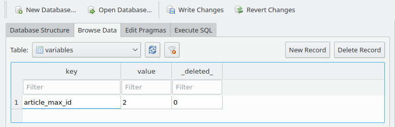
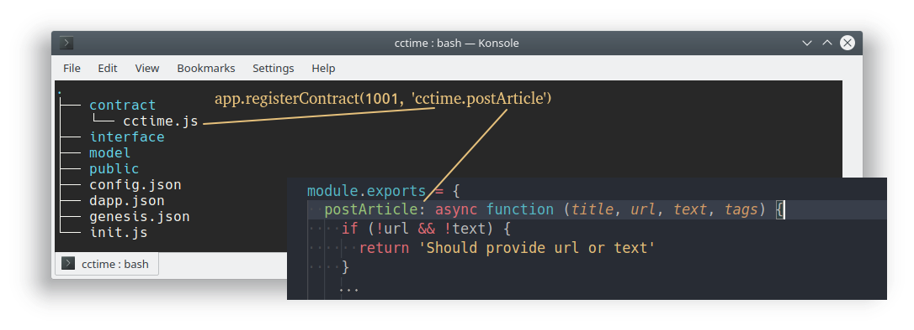

# Table of Contents

<!-- TOC -->

- [Table of Contents](#table-of-contents)
- [Asch SDK API](#asch-sdk-api)
  - [**1. Database**](#1-database)
    - [1.1 `aync` app.sdb.load(model, fields, indices)](#11-aync-appsdbloadmodel-fields-indices)
    - [1.2 app.sdb.get(model, cond)](#12-appsdbgetmodel-cond)
    - [1.3 app.sdb.keys(model)](#13-appsdbkeysmodel)
    - [1.4 app.sdb.entries(model)](#14-appsdbentriesmodel)
    - [1.5 ap.sdb.lock(key)](#15-apsdblockkey)
    - [1.6 app.sdb.create(model, values)](#16-appsdbcreatemodel-values)
    - [1.7 app.sdb.replace(model, values)](#17-appsdbreplacemodel-values)
    - [1.8 app.sdb.update(model, modifier, cond)](#18-appsdbupdatemodel-modifier-cond)
    - [1.9 app.sdb.increment(model, modifier, cond)](#19-appsdbincrementmodel-modifier-cond)
    - [1.10 app.sdb.del(model, cond)](#110-appsdbdelmodel-cond)
  - [2. Balance](#2-balance)
    - [2.1 app.balances.get(address, currency)](#21-appbalancesgetaddress-currency)
    - [2.2 app.balances.increase(address, currency, amount)](#22-appbalancesincreaseaddress-currency-amount)
    - [2.3 app.balances.decrease(address, currency, amount)](#23-appbalancesdecreaseaddress-currency-amount)
    - [2.4 app.balances.transfer(currency, amount, from, to)](#24-appbalancestransfercurrency-amount-from-to)
  - [3 Data model](#3-data-model)
    - [3.1 Existing Data Models](#31-existing-data-models)
      - [3.1.1 Account](#311-account)
      - [3.1.2 Balance](#312-balance)
      - [3.1.3 Block](#313-block)
      - [3.1.4 Deposit](#314-deposit)
      - [3.1.5 RoundFee](#315-roundfee)
      - [3.1.6 Transaction](#316-transaction)
      - [3.1.7 Transfer](#317-transfer)
      - [3.1.8 Variable](#318-variable)
    - [3.2 Query Data Models](#32-query-data-models)
      - [3.2.1 app.model[name]](#321-appmodelname)
      - [3.2.2 fields()](#322-fields)
      - [3.2.3 count(condition)](#323-countcondition)
      - [3.2.4 exists(condition)](#324-existscondition)
      - [3.2.5 findOne(options)](#325-findoneoptions)
      - [3.2.6 findAll(options)](#326-findalloptions)
    - [3.3 Query Options](#33-query-options)
      - [3.3.1 condition](#331-condition)
      - [3.3.2 fields](#332-fields)
      - [3.3.3 sort](#333-sort)
      - [3.3.4 limit](#334-limit)
      - [3.3.5 offset](#335-offset)
    - [3.4 Query Operators](#34-query-operators)
      - [3.4.1 AND](#341-and)
      - [3.4.2 EQUAL](#342-equal)
      - [3.4.3 NOT EQUAL](#343-not-equal)
      - [3.4.4 LIKE](#344-like)
      - [3.4.5 LESS THAN](#345-less-than)
      - [3.4.6 LESS THAN OR EQUAL](#346-less-than-or-equal)
      - [3.4.7 GREATER THAN](#347-greater-than)
      - [3.4.8 GREATER THAN OR EQUAL](#348-greater-than-or-equal)
      - [3.4.9 WHERE IN](#349-where-in)
      - [3.4.10 WHERE NOT IN](#3410-where-not-in)
      - [3.4.11 IS NULL](#3411-is-null)
      - [3.4.12 IS NOT NULL](#3412-is-not-null)
      - [3.4.13 BETWEEN](#3413-between)
  - [4. Routing](#4-routing)
    - [4.1 app.route.get(path, handler)](#41-approutegetpath-handler)
    - [4.2 app.route.post(path, handler)](#42-approutepostpath-handler)
    - [4.3 app.route.put(path, handler)](#43-approuteputpath-handler)
  - [5. Cost pool](#5-cost-pool)
    - [5.1 app.feePool.add(currency, amount)](#51-appfeepooladdcurrency-amount)
  - [6. Increment ID](#6-increment-id)
    - [6.1 app.autoID.get(name)](#61-appautoidgetname)
    - [6.2 app.autoID.increment(name)](#62-appautoidincrementname)
  - [7. Logging](#7-logging)
    - [7.1 app.logger.setLevel(level)](#71-apploggersetlevellevel)
    - [7.2 app.logger.log()](#72-apploggerlog)
    - [7.3 app.logger.trace()](#73-apploggertrace)
    - [7.4 app.logger.debug()](#74-apploggerdebug)
    - [7.5 app.logger.info()](#75-apploggerinfo)
    - [7.6 app.logger.warn()](#76-apploggerwarn)
    - [7.7 app.logger.error()](#77-apploggererror)
  - [8. Tools](#8-tools)
    - [8.1 app.validate(type, value, option)](#81-appvalidatetype-value-option)
      - [8.1.1 amount datatype](#811-amount-datatype)
      - [8.1.2 string datatype](#812-string-datatype)
        - [8.1.2.1 string length validator](#8121-string-length-validator)
        - [8.1.2.2 string isEmail validator](#8122-string-isemail-validator)
        - [8.1.2.3 string url validator](#8123-string-url-validator)
        - [8.1.2.4 string number validator](#8124-string-number-validator)
      - [8.1.3 array datatype](#813-array-datatype)
      - [8.1.4 Register own validator](#814-register-own-validator)
    - [8.2 app.registerContract(type, name)](#82-appregistercontracttype-name)
    - [8.3 app.getContractName(type)](#83-appgetcontractnametype)
    - [8.4 app.registerFee(type, min, currency)](#84-appregisterfeetype-min-currency)
    - [8.5 app.getFee(type)](#85-appgetfeetype)
    - [8.6 app.setDefaultFee(min, currency)](#86-appsetdefaultfeemin-currency)
    - [8.7 app.getRealTime(epochTime)](#87-appgetrealtimeepochtime)
    - [8.8 app.registerHook](#88-appregisterhook)
        - [8.8.1 beforeCreateBlock](#881-beforecreateblock)
    - [8.9 app.custom[]](#89-appcustom)
    - [8.10 app.meta](#810-appmeta)
  - [9 Built in packages](#9-built-in-packages)

<!-- /TOC -->

# Asch SDK API


## **1. Database**

### 1.1 `aync` app.sdb.load(model, fields, indices)

- `model` Datamodel
- `fields` Fields of the data model
- `indices` Array of indexes, it can be a single field index or a multi field index (provide an string array)

> The operation has no return value, it throws an Exception when an error occurs  
> Load the data for the specified model into memory and index the table which can further improve the efficiency of the query
> When a data model needs frequent updates and inquiries, it is recommended to use this interface, such as the system's built-in account balance, the increment ID uses this operation 

Example:

```js
await app.sdb.load('Balance', app.model.Balance.fields(), [['address', 'currency']])
await app.sdb.load('Variable', ['key', 'value'], ['key'])
```

### 1.2 app.sdb.get(model, cond)

- `model` Datamodel
- `cond` Query conditions

> Returns the model that matched the query conditions  
> Query the data according to the specified query condition. When the model can't be loaded an exception will be thrown. Query conditions will also throw an error if the key value is not indexed

Example:

```js
app.sdb.get('Variable', { key: 'foo' })
/* output:
{
  key: 'foo',
  value: 'bar'
}
*/

let balance = app.sdb.get('Balance', { address: 'foo', currency: 'XAS' })
/* output:
{
  address: 'foo',
  currency: 'XAS',
  balance: '1000000'
}
*/
```

### 1.3 app.sdb.keys(model)

- `model` Model

> This operation returns all indexed fields for a model

Example:

```js
let keys = app.sdb.keys('Variable')
for (let i of keys) {
  console.log(i)
}
/* output:
foo
foo1
foo2
*/
```


### 1.4 app.sdb.entries(model)

- `model` Model name

> Returns all cached fields for a data model

Example:

```js
let entries = app.sdb.entries('Variable')
for (let [key, value] of entries) {
  console.log(key, value)
}
/* output:
foo bar
foo1 bar1
foo2 bar2
*/
```

### 1.5 ap.sdb.lock(key)

- `key` 

> No return value  
> Lock a key. This lock is valid for the timespan of a block interval. A block life cycle does not allow a second lock or an exception will be thrown.  
> This features is to prevent a duplicate call in a block life cycle. For example: A contract needs to set a nickname for an account. Before the contract call is confirmed, we need to prevent that the nickname is set again. Therefore we can use the lock function.

Example:

```js
let senderId = 'AHMCKebuL2nRYDgszf9J2KjVZzAw95WUyB'
app.sdb.lock(`cctime.postArticle@${senderId}`)
```

### 1.6 app.sdb.create(model, values)

- `model` Model
- `values` Data items that will be created

> No return value  
> This operation creates a data item that updates the cache in real time if the model is cached. After the block is confirmed, the data will be persisted in the database.

Example:

```js
app.sdb.create('Article', {
  title: 'This is an article title',
  content: 'article contents',
  author: 'qingfeng',
  tag: 'Science'
})
```

### 1.7 app.sdb.replace(model, values)

- `model` model
- `values` data item that will be created or updated

> No return value  
> Create or update the data model. If the data model already exists, update it. The parameter `values` must must contain the primary key.

Example:

```js
app.sdb.replace('Account', {
  address: 'AC3pinmvz9qX9cj6c7VrGigq7bpPxVJq85',
  str1: 'Nakamoto'
})
```

### 1.8 app.sdb.update(model, modifier, cond)

- `model` Model
- `modifier` Data item that should be updated
- `cond` Update condition

> No return value  
> One or many data items of a model are updated according to the update condition.

Example:

```js
app.sdb.update('Account', { str1: 'Nakamoto' }, { str1: 'Satoshi' })
```

### 1.9 app.sdb.increment(model, modifier, cond)

- `model` Model
- `modifier` Data item that should be updated
- `cond` Update condition

> Incremental update of a model by specified number. This can only be used to update integer types.

Example:

```js
app.sdb.increment('Article', { votes: -10 }, { id: '10000' })
app.sdb.increment('Article', { comments: 1 }, { id: '10000' })
```

### 1.10 app.sdb.del(model, cond)

- `model` Model name
- `cond` Delete condition

> No return value  
> Delete data items in a model according to a query condition  
> The implementation of the delete operation is currently marked as obsolete. This query interface will not delete model data. However, a custom implementation can still delete data.

Example:

```js
app.sdb.del('Article', { id: '100001' })
```

## 2. Balance

### 2.1 app.balances.get(address, currency)

- `address` Account address
- `currency` Currency

> Returns the balance of the specified account

Example:

```js
app.balances.get('AC3pinmvz9qX9cj6c7VrGigq7bpPxVJq85', 'XAS')
// returns:
{
  address: 'AC3pinmvz9qX9cj6c7VrGigq7bpPxVJq85',
  currency: 'XAS',
  balance: '10000000'
}
```

### 2.2 app.balances.increase(address, currency, amount)

- `address` Account address
- `currency` Currency
- `amount` Amount to increase

> No return value  
> This operation raises the balance of the address by `amount` (amount to increase).

Example:

```js
app.balances.increase('AC3pinmvz9qX9cj6c7VrGigq7bpPxVJq85', 'XAS', '100000')
```

### 2.3 app.balances.decrease(address, currency, amount)

- `address` Account address
- `currency` Currency
- `amount` Amount to subtract

> No return value  
> This operation subtracts the `amount` of the balance.

Example:

```js
app.balances.decrease('AC3pinmvz9qX9cj6c7VrGigq7bpPxVJq85', 'XAS', '100000')
```

### 2.4 app.balances.transfer(currency, amount, from, to)

- `currency` Currency
- `amount` Amount to transfer
- `from` Sender
- `to` Recipient

> No return value  
> Transfers assets between two accounts

Example:

```js
app.balances.transfer('XAS', '100000', 'AC3pinmvz9qX9cj6c7VrGigq7bpPxVJq85', 'A4MFPoF3c9vCzZ3GGf9sNQ3rDy2q8aXuVF')
```

## 3 Data model

### 3.1 Existing Data Models

Dapps offer numerous inbuilt data models. These data models can be queried ([query data models](#32-query-data-models)). You can also create custom data models and query them.  


#### 3.1.1 Account


> Info:  
> There will only be an entry in the `Account` model if the nickname (field: `str1`) will be set for this account for this Dapp.  

Example:  

|             address               |  str1   |  
|  :-----------------------------:  |  :---:  |  
| AHMCKebuL2nRYDgszf9J2KjVZzAw95WUyB | Nakamato |  

Schema:  

|Fieldname |Type | Description | Primary Key | Not Null | Index |  
|------ |-----  |----   |----   |----  |----  |  
|address|String |The account address  |<ul><li>- [x] </li></ul>|  <ul><li>- [x] </li></ul>| <ul><li>- [ ] </li></ul> |  
|str1   |String |The nickname of the account for this one specific Dapp.<br/>Every account can have a different nickname on each Dapp. |<ul><li>- [ ] </li></ul> | <ul><li>- [ ] </li></ul>  | <ul><li>- [x] </li></ul> |  


<br/>


#### 3.1.2 Balance

> Info:  
> There will only be an entry for an address and a currency if this specific account was refueld (Dapp Refuel) from the mainchain. If an account has 500 XAS on the mainchain, that doesn't mean that it has a balance on the Dapp (Sidechain).  

Example:  

|address   |currency   |balance   |  
| :---: | :---: | :---: |  
|AHMCKebuL2nRYDgszf9J2KjVZzAw95WUyB |CCTime.XCT |50000000000|  
|AHMCKebuL2nRYDgszf9J2KjVZzAw95WUyB |XAS        |20000000000|  

In this example has the account `AHMCKebuL2nRYDgszf9J2KjVZzAw95WUyB` a balance of 500 `CCTime.XCT` tokens and a balance of 200 XAS.

Schema:  

|Fieldname |Type | Description | Primary Key |Not Null |Index |  
|------ |-----  |----   |----   |----   |----  |  
|address|String |The account address  | <ul><li>- [ ] </li></ul> | <ul><li>- [x] </li></ul>  | <ul><li>- [x] </li></ul> |
|currency   |String | The currency for this account.<br/> e.g `XAS` or `CCTime.XCT` | <ul><li>- [ ] </li></ul> | <ul><li>- [x] </li></ul> | <ul><li>- [x] </li></ul> |
|balance  |String | The balance in string format. e.g `'200000'` | <ul><li>- [ ] </li></ul> | <ul><li>- [x] </li></ul> | <ul><li>- [ ] </li></ul> |  

<br/>


#### 3.1.3 Block

Example:  

| id | timestamp | height | payloadLength | payloadHash | prevBlockId | pointId | pointHeight | delegate | signature | count |  
| :---: | :---: | :---: | :---: |  :---: |  :---: |  :---: |    :---: |     :---: |     :---: |     :---: |    
|`8282d8bc3da94071d29...` |65761840 |3 | 166  |`c09eff...` | `29ab2fc...` | `e9c6be7...` | 10 | `7bbf6...` | `68e28128...` | 1 |  


Schema:  

|Fieldname |Type | Description | Primary Key |Not Null |Index |  
|------ |-----  |----   |----   |----   |----  |  
|id  |String   |The unique identifier for the block  | <ul><li>- [x] </li></ul> | <ul><li>- [x] </li></ul> | <ul><li>- [ ] </li></ul> |  
|timestamp | BigInt   |The timestamp on which the block was created  | <ul><li>- [ ] </li></ul> | <ul><li>- [x] </li></ul> | <ul><li>- [ ] </li></ul> |  
|height | BigInt   | The block height is an ongoing number that starts at 1 and counts upwards.<br/>If the block height is `100` that means that there are 99 previous blocks  | <ul><li>- [ ] </li></ul> | <ul><li>- [x] </li></ul> | <ul><li>- [x] </li></ul> |  
|payloadLength | BigInt   |Determines the lenght of the payload | <ul><li>- [ ] </li></ul> | <ul><li>- [x] </li></ul> | <ul><li>- [ ] </li></ul> |  
|payloadHash | String   |A Hash of the payload | <ul><li>- [ ] </li></ul> | <ul><li>- [x] </li></ul> | <ul><li>- [ ] </li></ul> |  
|prevBlockId | String   |The id of the previous Block. Every block has a previous block. Only the first block has no previous block.  | <ul><li>- [ ] </li></ul> | <ul><li>- [ ] </li></ul> | <ul><li>- [ ] </li></ul> |  
|pointId | String   |The id of the corresponding block in the mainchain   | <ul><li>- [ ] </li></ul> | <ul><li>- [ ] </li></ul> | <ul><li>- [ ] </li></ul> |  
|pointHeight | BigInt   |The height of the corresponding block in the mainchain  | <ul><li>- [ ] </li></ul> | <ul><li>- [ ] </li></ul> | <ul><li>- [ ] </li></ul> |  
|delegate | String   | The publicKey of the delegate that generated this block  | <ul><li>- [ ] </li></ul> | <ul><li>- [x] </li></ul> | <ul><li>- [x] </li></ul> |  
|signature | String   |The signature guarantees that the delegate really created this block  | <ul><li>- [ ] </li></ul> | <ul><li>- [x] </li></ul> | <ul><li>- [ ] </li></ul> |  
|count | BigInt   |The count property specifies how many transactions were included in this block | <ul><li>- [ ] </li></ul> | <ul><li>- [x] </li></ul> | <ul><li>- [ ] </li></ul> |  

<br/>

#### 3.1.4 Deposit

> Info:  
> The `Deposit` model records Dapp Refuel's. A Dapp Refuel occures when a mainchain account sends an asset from his mainchain balance to his Dapp balance.  

Example:  

| tid | srcId | recipientId | currency | amount |  
| :---: | :---: | :---: | :---: | :---: |  
| `39619b5d0828ddfced6d7e25a115ebc14df2b3dc700e310c31bb47796be2eff1` | `aaea72a5771def00b161c0aae534f8069f9414c22f8e34a4648c3f40bc491311` | AHMCKebuL2nRYDgszf9J2KjVZzAw95WUyB | XAS | 50000000000 |

In this example refueld the account `AHMCKebuL2nRYDgszf9J2KjVZzAw95WUyB` his Dapp balance with 500 XAS.  


Schema:  

|Fieldname |Type | Description | Primary Key |Not Null |Index |  
|------ |-----  |----   |----   |----   |----  |  
|tid | String | A reference to the transactionId in this Dapp (Sidechain) | <ul><li>- [x] </li></ul> | <ul><li>- [x] </li></ul> | <ul><li>- [ ] </li></ul> |  
|srcId | String | The `srcId` marks the transaction id of the corresponding transaction in the mainchain | <ul><li>- [ ] </li></ul> | <ul><li>- [x] </li></ul> | <ul><li>- [x] </li></ul> |  
|recipientId | String | The address of the recipient: e.g. `AHMCKebuL2nRYDgszf9J2KjVZzAw95WUyB` | <ul><li>- [ ] </li></ul> | <ul><li>- [x] </li></ul> | <ul><li>- [x] </li></ul> |
|currency | String | The currency that was deposited<br/>e.g. `XAS` or `CCTime.XCT` | <ul><li>- [ ] </li></ul> | <ul><li>- [x] </li></ul> | <ul><li>- [x] </li></ul> |  
|amount | String | How much was deposited formatted as string e.g. `15240000` | <ul><li>- [ ] </li></ul> | <ul><li>- [x] </li></ul> | <ul><li>- [ ] </li></ul> |  

<br/>


#### 3.1.5 RoundFee

> Info:  
> The roundfees are fees from transactions and contract operations that are distributed to the delegates in certain rounds.  

Example:  

| round | currency | amount |  
| :---: | :---: | :---: |  
| 1 | XAS | 0 | 0 |  
| 22 | XAS | 0 | 0 |  
| 23 | XAS | 10000000 | 0 |  
| 42 | XAS | 10000000 | 0 |  
| 43 | XAS | 10000000 | 0 |  
| 47 | XAS | 10000000 | 0 |  
| 48 | XAS | 10000000 | 0 |  

Schema:  

|Fieldname |Type | Description | Primary Key |Not Null |Index |  
|------ |-----  |----   |----   |----   |----  |  
|round | Number | The round (block height) in which fees are going to be distributed  | <ul><li>- [ ] </li></ul> | <ul><li>- [x] </li></ul> | <ul><li>- [x] </li></ul> |  
|currency | String | The currency that is going to be distributed | <ul><li>- [ ] </li></ul> | <ul><li>- [x] </li></ul> | <ul><li>- [ ] </li></ul> |  
|amount | String | The amount that is going to be distributed in this round | <ul><li>- [ ] </li></ul> | <ul><li>- [x] </li></ul> | <ul><li>- [ ] </li></ul> |  

<br/>

#### 3.1.6 Transaction

> Info:  
> The `Transaction` model records every Dapp Refuel, Withdraw, Transfer and Contract call with a transaction.  

Example:  

| id | timestamp | senderid | senderPublicKey | fee |  signature | type | args | height |  
| :---: | :---: | :---: | :---: | :---: | :---: | :---: | :---: | :---: |  
| `be189a12acbcf0a86c4851463bc39bb7801be6e23c942abe4fe0982c3e8d56dd` | 65829840 | AHMCKebuL2nRYDgszf9J2KjVZzAw95WUyB | `a7cfd49d25ce247568d39b17fca221d9b2ff8402a9f6eb6346d2291a5c81374c` | 10000000 | `0651c0ac08c...` | 3 | ["CCTime.XCT","2200000000","AN1yKK47P3MtD5ZgHYoncGQ1gCn4p2vGAC"] | 236 |  

In this example we see a transaction record of a internal asset transfer. A transfer where the sender `AHMCKebuL2nRYDgszf9J2KjVZzAw95WUyB` transfers 22 `CCTime.XCT` tokens to `AN1yKK47P3MtD5ZgHYoncGQ1gCn4p2vGAC`.

Schema:  

|Fieldname |Type | Description | Primary Key |Not Null |Index |  
|------ |-----  |----   |----   |----   |----  |  
|id | String | The unique identifier for a transaction | <ul><li>- [x] </li></ul> | <ul><li>- [x] </li></ul> | <ul><li>- [ ] </li></ul> |  
|timestamp | BigInt | The timestamp on which the block was created | <ul><li>- [ ] </li></ul> | <ul><li>- [x] </li></ul> | <ul><li>- [x] </li></ul> |  
|senderId | String | The address of the account that initiated the transaction | <ul><li>- [ ] </li></ul> | <ul><li>- [x] </li></ul> | <ul><li>- [x] </li></ul> |  
|senderPublicKey | String | The publicKey of the account that initated the transaction | <ul><li>- [ ] </li></ul> | <ul><li>- [x] </li></ul> | <ul><li>- [ ] </li></ul> |  
|fee | String | The fee that the transaction costs | <ul><li>- [ ] </li></ul> | <ul><li>- [x] </li></ul> | <ul><li>- [ ] </li></ul> |  
|signature | String | The signature guarantees that the sender really created this transaction | <ul><li>- [ ] </li></ul> | <ul><li>- [x] </li></ul> | <ul><li>- [ ] </li></ul> |  
|type | Number | The number that identifies which contract was called. Contracts types above `1000` are custom contract. Contracts below `1000` are built in contracts | <ul><li>- [ ] </li></ul> | <ul><li>- [x] </li></ul> | <ul><li>- [x] </li></ul> |  
|args| Text | The arguments that will be passed to the contract functions: e.g: `["CCTime.XCT", "2200000000", "AN1yKK47P3MtD5ZgHYoncGQ1gCn4p2vGAC"]` | <ul><li>- [ ] </li></ul> | <ul><li>- [ ] </li></ul> | <ul><li>- [ ] </li></ul> |  
|height| BigInt | Specifies the block height of the block in which this transaction was recorded | <ul><li>- [ ] </li></ul> | <ul><li>- [x] </li></ul> | <ul><li>- [x] </li></ul> |  

<br/>


#### 3.1.7 Transfer

> Info:  
> The `Transfer` model records asset transfers that happen in the chain of this Dapp. It does not record Dapp Refuels or Dapp Withdrawals or other contract calls.  


Example:  

| tid | senderId | recipientId | currency | amount |  
| :---: | :---: | :---: | :---: | :---: |  
| `be189a12acbcf0a86c4851463bc39bb7801be6e23c942abe4fe0982c3e8d56dd` | AHMCKebuL2nRYDgszf9J2KjVZzAw95WUyB | AN1yKK47P3MtD5ZgHYoncGQ1gCn4p2vGAC | CCTime.XCT | 2200000000 |   

In this example we sent 22 `CCTime.XCT` tokens from account `AHMCKebuL2nRYDgszf9J2KjVZzAw95WUyB` (`sentence weasel match weather apple onion release keen lens deal fruit matrix`) to `AN1yKK47P3MtD5ZgHYoncGQ1gCn4p2vGAC` (`flame bottom dragon rely endorse garage supply urge turtle team demand put`).


Schema:  

|Fieldname |Type | Description | Primary Key |Not Null |Index |  
|------ |-----  |----   |----   |----   |----  |  
|tid | String | The transactionId in which the transfer took place | <ul><li>- [x] </li></ul> | <ul><li>- [x] </li></ul> | <ul><li>- [ ] </li></ul> |  
|senderId | String | The address of the sender that sent the currency to the recipient | <ul><li>- [ ] </li></ul> | <ul><li>- [x] </li></ul> | <ul><li>- [x] </li></ul> |  
|recipientId | String | The address that received the currency from the sender | <ul><li>- [ ] </li></ul> | <ul><li>- [x] </li></ul> | <ul><li>- [x] </li></ul> |  
|currency | String | The currency that was transferred<br/>e.g. `XAS` or `CCTime.XCT` | <ul><li>- [ ] </li></ul> | <ul><li>- [x] </li></ul> | <ul><li>- [x] </li></ul> |  
|amount | String | The amount that was transferred | <ul><li>- [ ] </li></ul> | <ul><li>- [x] </li></ul> | <ul><li>- [ ] </li></ul> |  

<br/>


#### 3.1.8 Variable

> Info:  
> The `Variable` model is like a key value store. The `max_id` variables for custom tables are stored there. If you e.g. create your own `Article` model then there will be automatically created an `article_max_id` entry in the `Variable` model.  

Example:  

| key | value |  
| :---: | :---: |  
| article_max_id | 2 |  

This example shows the highest id for the custom created `Article` model.  


Schema:  

|Fieldname |Type | Description | Primary Key |Not Null |Index |  
|------ |-----  |----   |----   |----   |----  |  
|key | String | The key for the key value store | <ul><li>- [x] </li></ul> | <ul><li>- [x] </li></ul> | <ul><li>- [ ] </li></ul> |  
|value | String | The value for the corresponding key | <ul><li>- [ ] </li></ul> | <ul><li>- [x] </li></ul> | <ul><li>- [ ] </li></ul> |  


<br/>
<br/>
<br/>

### 3.2 Query Data Models

All following options can be performed on all [existing](#31-existing-data-models) Data Models but also on new ones.  

#### 3.2.1 app.model[name]

- `name` Model name

> Returns an instance of the model

Example:  
```js
let block = app.model.Block
```

#### 3.2.2 fields()

> Returns all fields of the model

```js
app.model.Block.fields()
// returns:
[
  "id",
  "timestamp",
  "height",
  "payloadLength",
  "payloadHash",
  "prevBlockId",
  "pointId",
  "pointHeight",
  "delegate",
  "signature",
  "count"
]
```

#### 3.2.3 count(condition)

- [condition](#331-condition) Query condition object

> Returns a `Number`  
> The total number of data items that match the specified condition.  

Example:  
```js
let condition = {
  height: {
    $lt: 100
  }
}
return await app.model.Block.count(condition)
// returns:  
99
```

#### 3.2.4 exists(condition)

- [condition](#331-condition) Query condition object  

> Returns a `Boolean`  
> Indicates whether the data item for the specified condition exists.

Example:

```js
let condition = {
  id: '9a5ec0669c79b9f5a1d5a4dbb2c200bc28c9ea829dbff71f41cbb2ad5a7d9b01'
}
return await app.model.Transaction.exists(condition)
// returns:
false


let condition = {
  str1: 'Nakamoto'
}
return await app.model.Account.exists(condition)
// returns:
true
```

#### 3.2.5 findOne(options)

`options` Is an object that has the following properties:

- [condition](#331-condition) Query conditions object
- [fields](#332-fields) Array of fields that should be returned

> Query data items for a specified condition.

If no item for the given condition is found, the return value is:  
```json
{
  "success":true
}
```

Example:

```js
let option = {
  condition: {
    str1: 'Nakamoto'
  }
}
return await app.model.Account.findOne(option)

// returns:
{
  "address":"AHMCKebuL2nRYDgszf9J2KjVZzAw95WUyB",
  "str1":"Nakamoto",
  "str2":"",
  "str3":"",
  "str4":"",
  "str5":"",
  "num1":0,
  "num2":0,
  "num3":0,
  "num4":0,
  "num5":0,
  "bigint1":0,
  "bigint2":0,
  "bigint3":0,
  "bigint4":0,
  "bigint5":0,
  "text1":"",
  "text2":"",
  "text3":"",
  "text4":"",
  "text5":"",
  "success":true
}
```

#### 3.2.6 findAll(options)

`options` Is an object that has the following properties:  

- [condition](#331-condition) Query condition  
- [fields](#332-fields) Fields to return  
- [sort](#333-sort) Fields to sort after  
- [limit](#334-limit) The maximum number to return  
- [offset](#335-offset) Offset  

> Query all data items for the specified condition

If no items are found, the return value is:  

```json
[]
```

Example:

```js
let option = {
  condition: {
    delegate: 'db18d5799944030f76b6ce0879b1ca4b0c2c1cee51f53ce9b43f78259950c2fd'
  },
  fields: ['height', 'delegate'],
  sort: {
    height: -1
  },
  limit: 50,
  offset: 0
}
return await app.model.Block.findAll(option)
```

<br/>
<br/>
<br/>


### 3.3 Query Options

The query options describe in detail how to query the Data Models  

#### 3.3.1 condition

The `condition` object is used like a `WHERE` clause in SQL.  

The following operators can be used in the `condition` object:  
- [AND](#341-and)  
- [EQUAL](#342-equal) `$eq`  
- [NOT EQUAL](#343-not-equal) `$ne`  
- [LIKE](#344-like) `$like`  
- [LESS THAN](#345-less-than) `$lt`  
- [LESS THAN OR EQUAL](#346-less-than-or-equal) `lte`  
- [GREATER THAN](#347-greater-than) `gt`  
- [GREATER THAN OR EQUAL](#348-greater-than-or-equal) `gte`  
- [WHERE IN](#349-where-in) `$in`  
- [WHERE NOT IN](#3410-where-not-in) `nin`  
- [IS NULL](#3411-is-null) `$is`  
- [IS NOT NULL](#3412-is-not-null) `$isnot`  
- [BETWEEN](#3413-between) `$between`  


`condition` Example:  
```js
let option = {
  condition: {
    height: {
      $lt: 20,
      $gt: 15
    },
    count: {
      $ne: 1
    }
  }
}
return await app.model.Block.findAll(option)
```

The equivalent SQL query would be:  
```SQL
SELECT *
FROM blocks
WHERE height < 20 AND height > 15 AND count != 1

```


#### 3.3.2 fields

Array of `fields` that should be selected from the query  

Example `fields` query:  
```js
// show all fields
let option = {
  condition: {
    address: 'AHMCKebuL2nRYDgszf9J2KjVZzAw95WUyB'
  }
}
return await app.model.Balance.findOne(option)
// returns:
{
  "address": "AHMCKebuL2nRYDgszf9J2KjVZzAw95WUyB",
  "currency": "XAS",
  "balance": "50000000000"
}


// select only two fields
let option = {
  condition: {
    address: 'AHMCKebuL2nRYDgszf9J2KjVZzAw95WUyB'
  },
  fields: ['currency', 'balance']
}
return await app.model.Balance.findOne(option)
// returns:
{
  "currency": "XAS",
  "balance": "50000000000"
}
```

#### 3.3.3 sort

`sort` Columns to sort after:  

Sort blocks ascending:  
```js
let option = {
  sort: {
    height: 1
  }
}
return await app.model.Block.findAll(option)
```

Sort blocks descending:  
```js
let option = {
  sort: {
    height: -1
  }
}
return await app.model.Block.findAll(option)
```


#### 3.3.4 limit

`limit` The maximum number to return

Limit the result set. The `limit` option is often used together with [offset](#335-offset) and [sort](#333-sort) to enable paging.  

Example:  
```js
let option = {
  limit: 100
}
return await app.model.Block.findAll(option)
// returns: up to 100 blocks
```


#### 3.3.5 offset

- `offset` Offset

> Offset provide a number

This option __must__ be used with the [limit](#334-limit) option.  
Otherwise you will get a cryptic error message like `{"error":"Error: Error: near line 77: near \"offset\": syntax error\n","success":false}`:  

Load first 50 blocks:  

```js
let option = {
  offset: 0,
  limit: 50,
  sort: {
    height: 1
  }
}
return await app.model.Block.findAll(option)
```

Load second 50 blocks:  
```js
let option = {
  offset: 50,
  limit: 50,
  sort: {
    height: 1
  }
}
return await app.model.Block.findAll(option)
```


<br/>
<br/>
<br/>
<br/>


### 3.4 Query Operators

#### 3.4.1 AND

The default logical operator is __AND__ if at least two object properties are provided:  

Example:  
```js
let options = {
  condition: {
    height: 1,
    timestamp: 0
  }
}
return await app.model.Block.findAll(options)
```

The equivalent SQL query would be:  
```SQL
SELECT *
FROM blocks
WHERE height = 1 AND timestamp = 0
```


#### 3.4.2 EQUAL

Find account by nickname:  

Simple Query:  
```js
let options = {
  condition: {
    str1: 'liangpeili'
  }
}
return await app.model.Account.findOne(options)
```

Example with the `$eq` keyword:  
```js
let options = {
  condition: {
    str1: {
      $eq: 'liangpeili'
    }
  }
}
return await app.model.Account.findOne(options)
```


The equivalent SQL query would be:  

```SQL
SELECT *
from accounts
where str1 = 'liangpeili'
```


#### 3.4.3 NOT EQUAL

Load every account that has __NOT__ the following address:  
```js
let options = {
  condition: {
    address: {
      $ne: 'AHMCKebuL2nRYDgszf9J2KjVZzAw95WUyB'
    }
  }
}
return await app.model.Account.findAll(options)
```

The equivalent SQL query would be:  

```SQL
SELECT *
from accounts
where address != 'AHMCKebuL2nRYDgszf9J2KjVZzAw95WUyB'
```


#### 3.4.4 LIKE

Find with the __LIKE__ keyword all nicknames that start with the letter `a`:  

```js
let option = {
  condition: {
    str1: {
      $like: 'a%'
    }
  }
}
return await app.model.Account.findAll(option)
```

The equivalent SQL query would be:  

```SQL
SELECT *
from accounts
where str1 like 'a%'
```

#### 3.4.5 LESS THAN

Load all blocks that have a smaller block height than 10 (`$lt`):  
```js
let option = {
  condition: {
    height: {
      $lt: 10
    }
  }
}
return await app.model.Block.findAll(option)
```

The equivalent SQL query would be:  
```SQL
SELECT *
FROM blocks
WHERE height < 10
```


#### 3.4.6 LESS THAN OR EQUAL

Load all blocks that have a smaller block height or equal block height of 20 (`$lte`):  
```js
let option = {
  condition: {
    height: {
      $lte: 20
    }
  }
}
return await app.model.Block.findAll(option)
```

The equivalent SQL query would be:  
```SQL
SELECT *
FROM blocks
WHERE height <= 20
```

#### 3.4.7 GREATER THAN

Load all blocks that have a block height greater than 30 (`$gt`):  
```js
let option = {
  condition: {
    height: {
      $gt: 30
    }
  }
}
return await app.model.Block.findAll(option)
```

The equivalent SQL query would be:  
```SQL
SELECT *
FROM blocks
WHERE height > 30
```

#### 3.4.8 GREATER THAN OR EQUAL

Load all blocks that have a block height greater or equal to 40 (`$gte`):  
```js
let option = {
  condition: {
    height: {
      $gte: 40
    }
  }
}
return await app.model.Block.findAll(option)
```

The equivalent SQL query would be:  
```SQL
SELECT *
FROM blocks
WHERE height >= 40
```


#### 3.4.9 WHERE IN

Load all Blocks which block height is in the following array `[1, 2, 3]`:  

Example:  

```js
let num = [1, 2, 3]
let option = {
  condition: {
    height: { 
      $in: num
    }
  }
}
return await app.model.Block.findAll(option)
```

The equivalent SQL query would be:  

```SQL
SELECT *
FROM blocks
WHERE height in (1, 2, 3)
```


#### 3.4.10 WHERE NOT IN

Load all blocks which block height is not in the following array `[4, 5]`:  

Example:  
```js
let num = [4, 5]
let option = {
  condition: {
    height: {
      $nin: num
    }
  }
}
return await app.model.Block.findAll(option)
```

The equivalent SQL query would be:  

```SQL
SELECT *
FROM blocks
WHERE height NOT IN (4, 5)
```


#### 3.4.11 IS NULL

Get all accounts that have no nickname (`$is` null):  

```js
let option = {
  condition: {
    str1: {
      $is: null
    }
  }
}
return await app.model.Account.findAll(option)
```

The above query could also be written in the following way (`$null` true):  
```js
let option = {
  condition: {
    str1: {
      $null: true
    }
  }
}
return await app.model.Account.findAll(option)
```


The equivalent SQL query would be:  

```SQL
SELECT *
FROM accounts
WHERE str1 IS NULL
```


#### 3.4.12 IS NOT NULL

Get all accounts that have a nickname (__IS NOT NULL__):  

```js
let option = {
  condition: {
    str1: {
      $isnot: null
    }
  }
}
return await app.model.Account.findAll(option)
```

The above query could also be written in the following way:  
```js
let option = {
  condition: {
    str1: {
      $null: false
    }
  }
}
return await app.model.Account.findAll(option)
```


The equivalent SQL query would be:  

```SQL
SELECT *
FROM accounts
WHERE str1 IS NOT NULL
```

#### 3.4.13 BETWEEN

Get all blocks where their block heights are `$between` two values:  

```js
let option = {
  condition: {
    height: {
      $between: [1, 10]
    }
  }
}
return await app.model.Block.findAll(option)
```

The equivalent SQL query would be:  

```SQL
SELECT *
FROM blocks
WHERE height BETWEEN 1 AND 10
```


<br/>

## 4. Routing

- `path` Path
- `handler` Http Request Handler (async)

The request handler is called with an object as input. The object will look like that shown below:
```
{
  query: {}
  parameter: {}
}
```
The `query` is set by a Querystring for GET requests, or `field` for POST and PUT Request. The `parameter` is set by the path. When your `path` is '/articles/:id' and you're calling `http://localhost:4096/api/dapps/<dappId>/articles/33` you'll find that `req.paramter.id=33`.


### 4.1 app.route.get(path, handler)

> Register a `get` type `http` request handler


Example 1:  
```js
// file-name: interface/index.js
// Access this API endpoint with a GET call to `http://localhost:4096/api/dapps/<dappId>/articles`

app.route.get('/articles', async (req) => {
  let articles = await app.model.Article.findAll({
    limit: 50,
    offset: 0,
    sort: { timestamp: -1 }
  })
  return articles
})
```

Example 2:  
```js
// file-name: interface/index.js
// Access this API endpoint with a GET call to `http://localhost:4096/api/dapps/<dappId>/articles/33?votes=1`
app.route.get('/articles/:id', async (req) => {
    let id = req.paramter.id; // = 33
    let votes = req.query.votes // = 1
})
```

### 4.2 app.route.post(path, handler)

> Register a `post` type  `http` request handler

Same as the GET request, but you will have send your data with your request to set `req.query`:

Example:  
```js
// file-name: interface/index.js
// Access this API endpoint with a POST call to `http://localhost:4096/api/dapps/<dappId>/articles/33`
app.route.post('/articles/:id', async (req) => {
    let id = req.paramter.id; // = 33
    let votes = req.query.votes // = 1
})
```
can be called with:

```
curl --data "votes=1" -X POST http://localhost:4096/api/dapps/<dappId>/articles/33
```
### 4.3 app.route.put(path, handler)

> Register a `put` type `http` request handler

Same as the GET request, but you will have send your data with your request to set `req.query`:

Example:  
```js
// file-name: interface/index.js
// Access this API endpoint with a POST call to `http://localhost:4096/api/dapps/<dappId>/articles/33`
app.route.put('/articles/:id', async (req) => {
    let id = req.paramter.id; // = 33
    let votes = req.query.votes // = 1
})
```
can be called with:

```
curl --data "votes=1" -X PUT http://localhost:4096/api/dapps/<dappId>/articles/33
```


## 5. Cost pool

### 5.1 app.feePool.add(currency, amount)

- `currency` Currency
- `amount` Amount

> No return value  
> The specified asset (currency) is added to the fee pool (the amount is evenly distributed to all delegates at the end of each round).

Example:

```js
app.feelPool.add('XAS', '10000000')
```

## 6. Increment ID

The creation of a table `articles` (with primary key id) results into the creation of a variable `article_max_id`. This new variable can be incremented.

Example:  
```js
// file-name: model/article.js
module.exports = {
  name: 'articles',
  fields: [
    {
      name: 'id',
      type: 'Number',
      not_null: true,
      primary_key: true
    }
  ]
}
```



### 6.1 app.autoID.get(name)

- `name` Id Type

> Returns a `String`  
> Get the highest Id of a type

Example:  
```js
const aid = 'article_max_id'
app.autoID.get(aid) === '0' // true
```

### 6.2 app.autoID.increment(name)

- `name` Id Type

> Returns a `String`  
> Increment the Id of the specified type by 1 and return the updated value as a string. This is equivalent to the `++i` operation in javascript.

Example:

```js
const aid = 'article_max_id'
app.autoID.get(aid) === '0'
app.autoID.increment(aid) === '1'
app.autoID.get(aid) === '1'
```

## 7. Logging

### 7.1 app.logger.setLevel(level)

Example:  
```js
app.logger.setLevel('debug')
app.logger.setLevel('info')
```

### 7.2 app.logger.log()

Example:  
```js
app.logger.log('hello')
```

### 7.3 app.logger.trace()

Example:  
```js
app.logger.trace('hello', 'world');
```

### 7.4 app.logger.debug()

Example:  
```js
app.logger.debug('hello %s',  'world', 123)
```

### 7.5 app.logger.info()

Example:  
```js
app.logger.info('hello %s %d',  'world', 123, {foo:'bar'})
```

### 7.6 app.logger.warn()

Example:  
```js
app.logger.warn('hello %s %d %j', 'world', 123, {foo:'bar'})
```

### 7.7 app.logger.error()

Example:  
```js
app.logger.error('hello %s %d %j', 'world', 123, {foo:'bar'}, [1, 2, 3, 4], Object)
```

## 8. Tools

### 8.1 app.validate(type, value, option)

- `type` The datatype that should be verified
- `value` Data value which will be verified
- `option` Optional config object

> Verify that a data matches the specification. If not, throw an exception.

#### 8.1.1 amount datatype

`amount` must be an integer of type string e.g `'124000'`. `amount` must be between 1 and 1e48  

```js
app.validate('amount', '10000')
// returns: undefined

app.validate('amount', 10000)
// throws: Error: Invalid amount type

app.validate('amount', 'abc')
// throws: Error: Amount should be integer

app.validate('amount', '1e10')
// throws: Error: Amount should be integer
```


#### 8.1.2 string datatype

With the `string` datatype it is possible to validate the following options:  

##### 8.1.2.1 string length validator

Validate the exact length of a string with the `is` keyword:  
```js
app.validate('string', 'some', { length: { is: 4 } })
// returns: undefined

app.validate('string', 'some', { length: { is: 5 } })
// throws: Error: {"data":["Data is the wrong length (should be 5 characters)"]}
```

Validate the `minimum` length of a string:  

```js
app.validate('string', 'test', { length: { minimum: 4 } })
// returns: undefined

app.validate('string', 'test', { length: { minimum: 5 } })
// throws: Error: {"data":["Data is too short (minimum is 5 characters)"]}
```

Validate the `maximum` length of a string: 

```js
app.validate('string', 'test', { length: { maximum: 4 } })
// returns: undefined

app.validate('string', 'test', { length: { maximum: 3 } })
// throws: Error: {"data":["Data is too long (maximum is 3 characters)"]}
```

##### 8.1.2.2 string isEmail validator

Validate Email's:  
```js
app.validate('string', 'liangpeili@asch.io', { isEmail: true })
// returns: undefined

app.validate('string', 'test@', { isEmail: true })
// throws: {"email":["Email is not a valid email"]}
```

##### 8.1.2.3 string url validator

Validate URL's:  
```js
app.validate('string', 'https://asch.io', { url: true })
// returns: undefined

app.validate('string', 'asch.io', { url: true })
// throws: Error: {"url":["Url is not a valid url"]}

app.validate('string', 'not real url', { url: true })
// throws: Error: {"url":["Url is not a valid url"]}
```

Validate URL's schemes other then `http` or `https` (e.g `ftp`):  
```js
app.validate('string', 'ftp://asch.io', { 
  url: { 
    schemes: ['ftp']
  }
})
// returns: undefined


app.validate('string', 'ftp://asch.io', { 
  url: { 
    schemes: []
  }
})
// throws: Error: {"url":["Url is not a valid url"]}
```

Validate local ip address and hostnames URL's:  
```js
app.validate('string', 'http://localhost', { url: { allowLocal: true } })
// returns: undefined

app.validate('string', 'http://localhost', { url: true })
// throws: Error: {"url":["Url is not a valid url"]}

app.validate('string', 'http://127.0.0.1', { url: true })
// throws Error: {"url":["Url is not a valid url"]}
```

Output custom error `message` when URL is not valid:  
```js
let url = 'asch.io'
app.validate('string', url, { url: {
  message: `Custom error message: "${url}" not valid`
}})
// throws: Error: {"url":["Url Custom error message: "asch.io" not valid"]}
```

##### 8.1.2.4 string number validator  

Validate a simple `number`:  
```js
app.validate('string', '23', { number: true })
// returns: undefined

app.validate('string', 'not number', { number: true })
// throws: Error: {"number":["Number is not a number"]}
```

Number must be `onlyInteger`:  
```js
app.validate('string', '123', { number: { onlyInteger: true } })
// returns undefined

app.validate('string', '123.4', { number: { onlyInteger: true } })
// throws: Error: {"number":["Number must be an integer"]}
```

Validate number in `strict` mode. No leading zeros allowed:  
```js
app.validate('string', '993', { number: { strict: true }})
// returns: undefined

app.validate('string', '0993', { number: { strict: true }})
// throws: Error: {"number":["Number must be a valid number"]}
```

Validated number must be `greaterThan` a given value:  
```js
app.validate('string', '222', { number: { greaterThan: 200 } })
// returns: undefined

app.validate('string', '222', { number: { greaterThan: 300 } })
// throws: Error: {"number":["Number must be greater than 300"]}
```

Validate number which is `greaterThanOrEqualTo` to a given value:  
```js
app.validate('string', '333', { number: { greaterThanOrEqualTo: 333 } })
// returns: undefined

app.validate('string', '333', { number: { greaterThanOrEqualTo: 334 } })
// throws: Error: {"number":["Number must be greater than or equal to 334"]}
```

Validated number must be `equalTo` a given number:  
```js
app.validate('string', '444', { number: { equalTo: 444 } })
// returns: undefined

app.validate('string', '444.00', { number: { equalTo: 444.00 } })
// returns: undefined

app.validate('string', '444.00', { number: { equalTo: 500.00 } })
// throws: Error: {"number":["Number must be equal to 500"]}
```

Validate two numbers one number `lessThanOrEqualTo` the other:  
```js
app.validate('string', '581', { number: { lessThanOrEqualTo: 581 }})
// returns: undefined

app.validate('string', '581', { number: { lessThanOrEqualTo: 580 }})
// throws: Error: {"number":["Number must be less than or equal to 580"]}
```

Validate two number one number `lessThan` the other:  
```js
app.validate('string', '65', { number: { lessThan: 66 } })
// returns: undefined

app.validate('string', '65', { number: { lessThan: 65 } })
// throws: Error: {"number":["Number must be less than 65"]}
```

First number must be `divisibleBy` second one:  
```js
app.validate('string', '10', { number: { divisibleBy: 5 } })
// returns: undefined

app.validate('string', '12', { number: { divisibleBy: 5 } })
// throws: Error: {"number":["Number must be divisible by 5"]}
```

Provided number must be `odd`:  
```js
app.validate('string', '7', { number: { odd: true } })
// returns: undefined

app.validate('string', '6', { number: { odd: true } })
// throws: Error: {"number":["Number must be odd"]}
```

Provided number must be `even`:  
```js
app.validate('string', '2', { number: { even: true } })
// returns: undefined

app.validate('string', '5', { number: { even: true }})
// throws: Error: {"number":["Number must be even"]}
```


#### 8.1.3 array datatype

Validate the exact length of the array with the `is` operator:  

```js
app.validate('array', ['one', 'two'], { length: { is: 2 } })
// returns: undefined

app.validate('array', ['one', 'two'], { length: { is: 3 } })
// throws: Error: Arrary lentgh is incorrect,correct length is {"is":3}

app.validate('array', { id: 2 }, { length: { is: 5 } })
// throws: Error: Arrary lentgh is incorrect,correct length is 5 (BUG)
```

Validate the `maximum` length of the array:  

```js
app.validate('array', [1, 2, 3], { length: { maximum: 3 }})
// returns: undefined

app.validate('array', [1, 2, 3], { length: { maximum: 2 }})
// throws: Error: Arrary lentgh is incorrect,correct length is {"maximum":2}
```

Validate the `minmum` length of the array:  

```js
app.validate('array', ['one'], { length: { minimum: 1 } })
// returns: undefined

app.validate('array', [], { length: { minimum: 1 } })
// throws: Error: Arrary lentgh is incorrect,correct length is {"minimum":1}
```

#### 8.1.4 Register own validator

Beside the already existing validators [amount](#811-amount-datatype), [string](#812-string-datatype) and [array](#813-array-datatype) is it also possible to register a custom validator:  

Create a new directory `lib` in your Dapp:  

```bash
mkdir lib
```

The following file will be our custom validator.  
Create a new file `lib/onetotwelve.js`:  

```js
// file-name: lib/onetotwelve.js
module.exports = {
  validate: function (value) {
    if (value < 0 || value > 12) {
      return "Value must be between 0 and 12"
    }
  }
}
```

Add the following code to your `init.js` file:  
```js
const onetotwelve = require('./lib/onetotwelve.js')

module.exports = async function () {

  app.validators.onetotwelve = onetotwelve.validate
}
```

Now you can use your custom validator. If the validation is not valid, it will throw an exception.  
Example:  

```js
// file-name: contract/test.js

module.exports = {
  createArticle: async function (id) {
    app.validate('onetotwelve', id)

    // further code omitted
  }
}
```


### 8.2 app.registerContract(type, name)

- `type` Contract Type
- `name` The name of contract

> No return value  
> To register a number type for a contract, an unregistered contract can not be called externally


Example:

```js
app.registerContract(1001, 'cctime.postArticle')
```


The string `'cctime.postArticle'` means, that they must be a `cctime` file in the `contract` directory and in the `cctime` file a function named `postArticle`.




### 8.3 app.getContractName(type)

- `type` The type or the number of the contract

> Get the contract name for a specified type 

Example:

```js
app.getContractName(1001) === 'cctime.postArticle'
```

### 8.4 app.registerFee(type, min, currency)

- `type` The type or the the number of the contract
- `min` Minimum cost
- `currency` Currency

> The minimum fee for a contract registration  
> `Min` stands for the minimum cost. The fee to call the contract. The fee can not be less then `min`. The fee can be greater. The execess part will be send to the fee pool.

Example:

```js
app.registerFee(1001, '100000', 'XAS')
```
### 8.5 app.getFee(type)

- `type` The type or number of the contract

> Get the specified fee for a contract

Example:

```js
app.getFee(1001)
/* output: */
{
  min: '100000',
  currency: 'XAS'
}
```

### 8.6 app.setDefaultFee(min, currency)

- `min` Minimum cost
- `currency` Currency

> Set default fee for all contracts in the system.

Example:

```js
app.setDefaultFee('10000', 'XAS')
```

### 8.7 app.getRealTime(epochTime)

- `epochTime` The number of seconds since the creation of the block. 

> Returns a timestamp which is the time of the block creation plus the offset in milliseconds  
> Asch systems timestamp is not a real timestamp. It is timespan. You can call this function to get a real timestamp

Example:

```js
app.getRealTime(4353634)
```

### 8.8 app.registerHook

##### 8.8.1 beforeCreateBlock

> The callback `beforeCreateBlock` can be used to execute code before a new block gets created. This callback is executed before each block.


Params Properties:  

|Name |Type | Description |  
|------ |-----  |----   |
|height|number | Get the upcoming block height.<br /> code: `modules.blockchain.blocks.getLastBlock().height + 1` |  
|pointId|string |block-id of the corresponding block in the mainchain <br /> e.g. `802231c4798740e12bf702bd88fbb41b5b93c709e75abedc585b7813f11c76ce` |  
|pointHeight |number |block-height of the corresponding block in the mainchain<br /> e.g.`2847` |  
|slotTime |timestamp |time in which the sidechain-block and the mainchain-block was created. The timestamp is in epoch-time e.g. `62551620`<br />See [8.7 app.getRealTime(epochTime)](#87-appgetrealtimeepochtime) for details |  
|signTransaction |method |Parameters: object with the following properties <br />__type:__ Smart contract Number e.g. 1000 <br />__fee:__ The fee of the smart contract <br />__args:__ a JSON stringified array with parameters for the smart contract |  
|addTransactions |method |Parameters: array of signed transactions<br />Usually the result from multiple calls to `params.signTransaction` |  


Simple Example:  
```js
// file-name. init.js

module.exports = async function () {
  app.logger.info('enter dapp init')

  app.registerHook('beforeCreateBlock', async (params) => {
    // action
  })
}
```


Advanced Example: Delete tweet-like message after certain block height
```js
// file-name: model/tweet.js
module.exports = {
  name: 'tweets',
  fields: [
    {
      name: 'id',
      type: 'Number',
      not_null: true,
      primary_key: true
    },
    {
      name: 'tid',
      type: 'String',
      length: 64,
      not_null: true,
      unique: true,
      index: true
    },
    {
      name: 'creator',
      type: 'String',
      length: 50,
      not_null: true,
      index: true
    },
    {
      name: 'timestamp',
      type: 'Number',
      not_null: true,
      index: true
    },
    {
      name: 'title',
      type: 'String',
      length: 128,
      not_null: true
    },
    {
      name: 'message',
      type: 'String',
      length: 256,
      not_null: true
    },
    {
      name: 'endingBlockHeight',
      type: 'BigInt',
      not_null: true
    }
  ]
}
```

```js
// file-name contract/tweet.js
module.exports = {
  tweet: async function (title, message, endingBlockHeight) {
    app.validate('string', title, { length: { minimum: 5, maximum: 128 }})
    app.validate('string', message, { length: { minimum: 20, maximum: 256 }})
    app.validate('amount', endingBlockHeight)

    let tweetId = app.autoID.increment('tweet_max_id')
    app.sdb.create('Tweet', {
      id: tweetId,
      tid: this.trs.id,
      creator: this.trs.senderId,
      timestamp: this.trs.timestamp,
      title: title,
      message: message,
      endingBlockHeight: endingBlockHeight
    })
  },
  deleteTweet: async function (tweetId) {
    // only delegates can delete tweets
    if (app.meta.delegates.indexOf(this.trs.senderPublicKey) === -1) {
      return 'Permission denied'
    }
    await app.sdb.del('Tweet', { id: tweetId })
  }
}
```

```js
// file: interface/tweet.js
app.route.get('/tweets', async (req) => {

  let tweets = await app.model.Tweet.findAll({})

  return tweets
})
```

```js
// file-name init.js

async function deleteTweets (params) {
  app.logger.info(`current sidechain block height: ${params.height}`)

  // load all tweets that should be closed
  let tweetsToClose = await app.model.Tweet.findAll({
    condition: {
      endingBlockHeight: {
        $lt: params.height - 1
      }
    }
  })

  if (!tweetsToClose.length) {
    return
  }
  app.logger.info(`closing ${tweetsToClose.length} tweets`)
  
  let transactions = tweetsToClose.map((tw) => {
    return params.signTransaction({
      type: 1001,
      fee: '0',
      args: JSON.stringify([tw.id])
    })
  })

  await params.addTransactions(transactions)
}


module.exports = async function () {
  app.logger.info('enter dapp init')

  // register contract: 'fileName.functionName'
  app.registerContract(1000, 'tweet.tweet')
  app.registerContract(1001, 'tweet.deleteTweet')

  app.setDefaultFee('0', 'XAS')

  app.registerHook('beforeCreateBlock', deleteTweets)
}
```


### 8.9 app.custom[]

> The application's namespace can be used to save some of the application's own custom global variables, mainly to isolate system-wide global variables

This namespace can be used for example for a custom cache implementation

Example: Create custom cache implementation  
  
```js
// file-name: lib/interval-cache.js
class IntervalCache {
  constructor(interval) {
    if (!Number.isInteger(interval)) throw new Error('Invalid interval')
    this.interval = interval
    this.container = new Map
    setInterval(() => {
      this.container.clear()
    }, interval)
  }
  has(key) {
    return this.container.has(key)
  }
  set(key, value) {
    this.container.set(key, value)
  }
  get(key) {
    return this.container.get(key)
  }
}

module.exports = IntervalCache
```

Register own custom cache implementation:
```js
// file-name: init.js
const IntervalCache = require('./lib/interval-cache')

module.exports = async function () {
  app.logger.info('enter dapp init')

  app.registerContract(1000, 'cctime.postArticle')
  app.registerContract(1001, 'cctime.postComment')
  app.registerContract(1002, 'cctime.voteArticle')
  app.registerContract(1003, 'cctime.likeComment')
  app.registerContract(1004, 'cctime.report')

  app.setDefaultFee('10000000', 'CCTime.XCT')

  // set cache
  app.custom.cache = new IntervalCache(10 * 1000)
}
```

Use cache:
```js
// file-name: interface/index.js

app.route.get('/articles/:id', async (req) => {
  let id = req.params.id
  let key = 'article_' + id

  // check cache
  if (app.custom.cache.has(key)) {
    return app.custom.cache.get(key)
  }
  let article = await app.model.Article.findOne({
    condition: { id: id }
  })
  if (!article) throw new Error('Article not found')
  if (article.reports >= 3) throw new Error('Article not allowed')
  let account = await app.model.Account.findOne({
    condition: { address: article.authorId }
  })
  if (account) {
    article.nickname = account.str1
  }
  let result = { article: article }

  // set cache
  app.custom.cache.set(key, result)
  return result
})

// ommitted further api endpoints...
```

### 8.10 app.meta

> Returns object  
> With `app.meta` you can access meta-information about your dapp, like name, which delegates are responsible etc...

Warning:  
This information is not available in `init.js`, because it is not loaded yet.

`app.meta` has following properties:

|Name |Type | Description |  
|------ |-----  |----   |
|name    |string   |The name of the dapp.<br />e.g. asch-dapp-cctime|
|description |string |The description of the dapp.<br />e.g. Decentralized news channel |
|tags |string|A comma seperated list of tags that categorize this Dapp<br />e.g. asch,dapp,demo,cctime |
|link |url|The link to the .zip archive of the source code.<br />e.g. https://github.com/AschPlatform/asch-dapp-cctime/archive/master.zip |
|type | | |
|category |number  |Identifies an dapp category<br />e.g. 1 |
|icon |url|An URL to the dapp icon<br />e.g.http://o7dyh3w0x.bkt.clouddn.com/hello.png|
|delegates |array |An array of the public keys of the delegates |
|unlockDelegates |number | |
|transactionId |string |The mainchain-transaction in which this dapp was registered<br />e.g. f30b85cff0d57d949ee84950bf59dbfbeebc369c0287cd6ea3f3d7501994a42a |

Example: Use `app.meta` to allow access to a smart contract only to the dapp delegates

```js
// file-name: contract/tweet.js

module.exports = {
  deleteTweet: async function (tweetId) {
    // only delegates can delete tweets
    if (app.meta.delegates.indexOf(this.trs.senderPublicKey) === -1) {
      return 'Permission denied'
    }
    await app.sdb.del('Tweet', { id: tweetId })
  }

  // other functions ommitted
}
```


## 9 Built in packages

The following packages are built into the Asch sandbox. They can be required with a simple `require` call:  

Example:  
```js
// file-name: contract/cctime.js

const bignumber = require('bignumber')
const VOTE_UNIT = 100000000

module.exports = {
  voteArticle: async function (articleId, amount) {
    // other code omitted
    
    let bAmount = bignumber(amount)
    if (bAmount.lt(VOTE_UNIT))
      return 'Amount too small'
    
    // other code omitted
  }
}
```
  
- assert  
The built-in node.js [assert](https://nodejs.org/api/assert.html) package

- crypto  
The built-in node.js [crypto](https://nodejs.org/api/crypto.html) package

- events  
The built-in node.js [events](https://nodejs.org/api/events.html) package

- os  
The built-in node.js [os](https://nodejs.org/api/os.html) package

- path  
The built-in node.js [path](https://nodejs.org/api/path.html) package

- punycode  
The built-in node.js [punycode](https://nodejs.org/api/punycode.html) package

- querystring  
The built-in node.js [querystring](https://nodejs.org/api/querystring.html) package

- string_decoder  
The built-in node.js [string_decoder](https://nodejs.org/api/string_decoder.html) package

- url  
The built-in node.js [url](https://nodejs.org/api/url.html) package

- util  
The built-in node.js [util](https://nodejs.org/api/util.html) package

- zlib  
The built-in node.js [zlib](https://nodejs.org/api/zlib.html) package

- async  
The package [async](https://github.com/caolan/async/blob/v1.5.2/README.md) version `1.5.2` is a package of the node.js ecosystem

- bignumber  
Official asch package [bignumber](https://github.com/AschPlatform/bignumber)

- bytebuffer  
The package [bytebuffer](https://github.com/dcodeIO/bytebuffer.js/tree/f3f310b6786e5d44686d385a2cc60c6720a1069b) version `5.0.1` is a package of the node.js ecosystem

- change-case  
The package [change-case](https://github.com/blakeembrey/change-case/tree/002a45c7666948512480dd300e324d2ca8aca9b2) version `3.0.0` is a package of the node.js ecosystem

- sodium  
The package [sodium](https://www.npmjs.com/package/sodium/v/2.0.3) version `2.0.3` is a package of the node.js ecosystem

- extend  
The package [extend](https://github.com/justmoon/node-extend/tree/1766f482fcf9ca83e07ad6fbeaa079e649d5db0c) version `2.0.0` is a package of the node.js ecosystem

- ip  
The package [ip](https://www.npmjs.com/package/ip/v/1.1.3) version `1.1.3` is a package of the node.js ecosystem

- z-schema  
Official asch package [z-schema](https://github.com/AschPlatform/z-schema)

- protocol-buffers  
The package [protocol-buffers](https://github.com/mafintosh/protocol-buffers/tree/1583634bda4b04a9a101ec5aace1953f3788449b) version `3.2.1` is a package of the node.js ecosystem

- asch-js  
Official asch package [asch-js](https://github.com/AschPlatform/asch-docs/blob/master/js_api/en.md)
