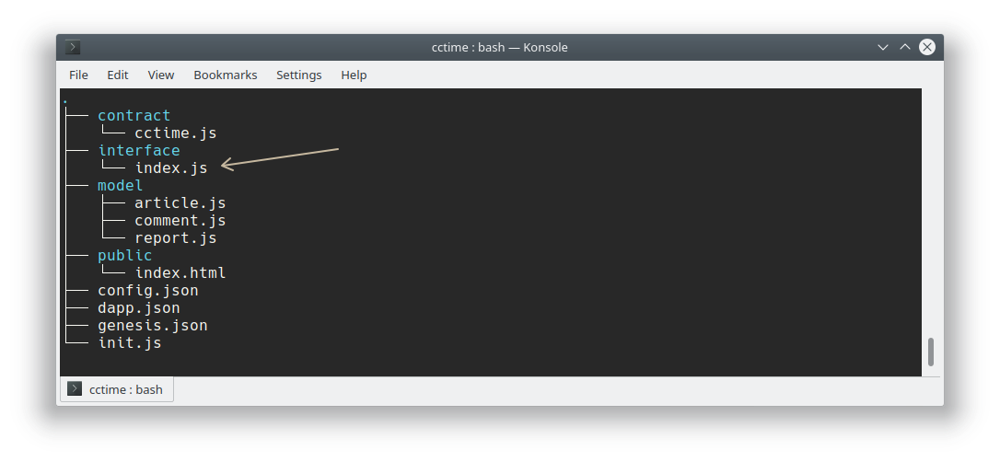

Table of Contents
=================


<!-- TOC -->

- [Asch Dapp Inbuilt HTTP API](#asch-dapp-inbuilt-http-api)
  - [**1 Blocks**](#1-blocks)
    - [**1.1 Get the Dapp Block Height**](#11-get-the-dapp-block-height)
    - [**1.2 Get Dapp Block Data**](#12-get-dapp-block-data)
  - [**2 Accounts**](#2-accounts)
    - [**2.1 Get Information to a Single Account**](#21-get-information-to-a-single-account)
  - [**3 Transactions**](#3-transactions)
    - [**3.1 Signature**](#31-signature)
      - [**3.1.1 Client signed transaction - more secure**](#311-client-signed-transaction---more-secure)
        - [**3.1.1.1 Dapp Recharge**](#3111-dapp-recharge)
        - [**3.1.1.2 Dapp Withdraw Money, Type=2**](#3112-dapp-withdraw-money-type2)
        - [**3.1.1.3 Dapp Internal Transfer,Type=3**](#3113-dapp-internal-transfertype3)
        - [**3.1.1.4 Dapp set a Nickname, Type=4**](#3114-dapp-set-a-nickname-type4)
      - [**3.1.2 Server Side Signed Transaction (unsigned)**](#312-server-side-signed-transaction-unsigned)
        - [**3.1.2.1 Dapp recharge**](#3121-dapp-recharge)
        - [**3.1.2.2 Dapp Withdraw money, Type=2**](#3122-dapp-withdraw-money-type2)
        - [**3.1.2.3 Dapp Internal Transfer, Type=3**](#3123-dapp-internal-transfer-type3)
        - [**3.1.2.4 set a dapp nickname, type=4**](#3124-set-a-dapp-nickname-type4)
    - [**3.2 Get unconfirmed transactions**](#32-get-unconfirmed-transactions)
    - [**3.3 Get already confirmed transactions**](#33-get-already-confirmed-transactions)
    - [**3.4 Get transaction details for one transaction by id**](#34-get-transaction-details-for-one-transaction-by-id)
    - [**3.5 Obtain dapp transfer records**](#35-obtain-dapp-transfer-records)
  - [**4 Smart Contract**](#4-smart-contract)
    - [**4.1 Get all smart contracts for one Dapp**](#41-get-all-smart-contracts-for-one-dapp)
    - [**4.2 Access Custom Dapp Interface**](#42-access-custom-dapp-interface)

<!-- /TOC -->

# Asch Dapp Inbuilt HTTP API

This document describes the inbuilt HTTP API endpoints that every Dapp/Sidechain inherits from the [asch-sandbox](https://github.com/aschplatform/asch-sandbox-dist).

## **1 Blocks**
### **1.1 Get the Dapp Block Height**  
API Endpoint: /api/chains/`chain-name`/blocks/height  
HTTP Header: GET  
Supported Format: urlencode  

Return Parameter:

|Name	  |Type   |Description       |
|------ |-----  |----              |
|success|boolean|Was the operation successful |
|height |integer|Dapp Block Height |

Javascript Request:
```js
const axios = require('axios')

let chainName = 'my-custom-dapp'
let url = `http://localhost:4096/api/chains/${chainName}/blocks/height`

axios.get(url)
  .then((response) => {
    console.log(JSON.stringify(response.data))
  })
  .catch((error) => {
    console.log(error.message)
  })
```

Bash Request:  
```bash
curl -k -H "Content-Type: application/json" -X GET http://localhost:4096/api/chains/my-custom-dapp/blocks/height && echo
```

JSON Response
```json
{
  "height": 10,
  "success": true
}
```


### **1.2 Get Dapp Block Data**
API Endpoint: /api/chains/`chain-name`/blocks  
HTTP Verb: GET  
Supported Format: urlencode  
Endpoint Description: Get all blocks from the Dapp  

Request Parameters:

|Name   |Type   |Required |Description              |   
|------ |-----  |---  |----              |   
|limit |integer |No    |Limit the number of results, Minimum: 0, Maximum: 100  |   
|offset|integer  |No     |Offset, Minimum: 0 |   

Return Parameter:

|Name	|Type   |Description   |   
|------ |-----  |----              |   
|success|boolean  |Was the request successful?     |   
|count|integer   |The total number of blocks that met the query condition|   
|blocks|Array  |Each element of the returned array carries the data of one block, like id, height and other information|
        

Javascript Request:
```js
const axios = require('axios')

let parameters = {
  params: {
    limit: 1
  }
}

let chainName = 'my-custom-dapp'
let url = `http://localhost:4096/api/chains/${chainName}/blocks`

axios.get(url, parameters)
  .then((response) => {
    console.log(JSON.stringify(response.data))
  })
  .catch((error) => {
    console.log(error.message)
  })
```

Bash Request:  
```bash
curl -k -H "Content-Type: application/json" -X GET http://localhost:4096/api/chains/my-custom-dapp/blocks?limit=1 && echo
```

JSON Response:
```json
{
  "blocks": [{
    "id": "451dd17f273ea5fbd240238178c1343b11031a1d309ee8b29e8b1a5838473ec6",
    "timestamp": 0,
    "height": 1,
    "payloadLength": 103,
    "payloadHash": "995f4749e1924af55f1cdefd202efd0b37b2aa70553982378c037bc6015d5634",
    "prevBlockId": "",
    "pointId": "",
    "pointHeight": 0,
    "delegate": "8065a105c785a08757727fded3a06f8f312e73ad40f1f3502e0232ea42e67efd",
    "signature": "b1d0171494ce6c0621902c6005f7a85e15f3509a68ac6106b166abf711ced73efaeaf1eae0cdf594143854e27b417b253485cf98b3cc9f7aa967a929b717020b",
    "count": 1
  }],
  "count": 133,
  "success": true
}
```

## **2 Accounts**
### **2.1 Get Information to a Single Account** 
API Endpoint: /api/chains/`chain-name`/accounts/:address  
HTTP Verb: GET  
Supported Format: urlencode  

Request Parameter:  
  
|Name   |Type   |Required   |Description   |
|------ |-----  |---        |----          |
|address |string|Yes        |Asch Address|
  
Return Parameter: 

|Name   |Type   |Description   |
|------ |-----  |----              |
|success|boolean  |Was the request successful?     |
|account|json  |All information regarding one account such as: Asset balances, is the address a delegate? and other information|
  

Javascript Request:
```js
const axios = require('axios')

let address = 'AHMCKebuL2nRYDgszf9J2KjVZzAw95WUyB'

let chainName = 'my-custom-dapp'
let url = `http://localhost:4096/api/chains/${chainName}/accounts/${address}`

axios.get(url)
  .then((response) => {
    console.log(JSON.stringify(response.data))
  })
  .catch((error) => {
    console.log(error.message)
  })
```
  
Bash Request:  
```bash
curl -k -H "Content-Type: application/json" -X GET http://localhost:4096/api/chains/my-custom-dapp/accounts/AHMCKebuL2nRYDgszf9J2KjVZzAw95WUyB && echo   
```

JSON Response:
```js
{
  "success": true,
  "account": {
    "balances": [{
      "currency": "XAS", // this account has a XAS balance (either through a recharge or an internal dapp transfer)
      "balance": "10000000000"  // 100 XAS
    }],
    "extra": null,
    "isDelegate": false // is not a delegate
  }
}
```

JSON Response (address with __no balance__):
```js
{
  "account":{
    "balances":[],
    "extra":null,
    "isDelegate":false
  },
  "success":true
}
```


## **3 Transactions**  
### **3.1 Signature**
The transaction HTTP API Endpoint is divided into ___signed___ und ___unsigned___ transactions. Either will the transaction be signed locally (usually with [asch-js](https://github.com/aschplatform/asch-js)) and then send to the server (signed endpoint) or the secret must be send to the server and there the transaction will be signed (unsigned endpoint).

#### **3.1.1 Client signed transaction - more secure**
This is a peer related API endpoint, you need to set the a header at a request.

 - __magic__ header:
    - testnet / localnet: `594fe0f3`
    - mainnet: `5f5b3cf5`
 - __version__ header: `''` (empty)

Set Headers (with Axios and Headers for testnet or localnet):  
```js
const aschJS = require('asch-js')
const axios = require('axios')

let secret = 'sentence weasel match weather apple onion release keen lens deal fruit matrix'

let transaction = aschJS.basic.setName('sqfasd', secret)
let data = {
  transaction: transaction
}
let headers = {
  headers: {
    magic: '594fe0f3',
    version: ''
  }
}
let url = 'http://localhost:4096/peer/transactions'

axios.post(url, data, headers)
  .then(result => {
    
  })

```

<br/>

All write operations to the sidechain database start in Asch with a transaction.  

The data for the __signed__ transactions are created through the [asch-js](https://github.com/AschPlatform/asch-js) library and are then send to the `/peer/transactions` endpoint via HTTP POST.


The HTTP-POST API specification are as follows:

|Matter   |Description  |
|---    |---   |
|API Endpoint|/peer/transactions  |
|payload|transaction data that were created with `asch-js`|
|HTTP Method|post/put etc.|
|Supported format|json |
  
##### **3.1.1.1 Dapp Recharge**  
API Endpoint: /peer/transactions  
HTTP Verb: POST   
Supported Format: json   

> Note:  
> When the recharge is initiated in the mainchain (mainchain-transaction-type 204) then the Dapp will automatically call the smart contract number 1 for a dapp internal recharge. This happens behind the scenes in the [asch-sandbox](https://github.com/aschplatform/asch-sandbox-dist).  

Info:  
A Dapp Recharge is necessary if you want to spend XAS or another currency in the Dapp. If you have 2000 XAS on your mainchain account that doesn't mean that you can spend 2000 XAS in the Dapp. You have to first "recharge" the Dapp with money. If you send some XAS to the Dapp this gets credited to your Dapp balance.

Request Parameter:

|Name   |Type   |Required   |Description   |
|------ |-----  |---  |----              |
|transaction|json|Yes|A transaction generated with a function call to `aschJS.transfer.createInTransfer` |

  
Return Parameter:  

|Name   |Type   |Description   |
|------ |-----  |----              |
|success|boolean  |Was the request successful?     |
|transactionId|string  |Transaction id|
  
Javascript Request:
```js

const aschJS = require('asch-js')
const axios = require('axios')

let chainName = 'my-custom-dapp'

// this account must have enough XAS on the mainchain
let secret = 'sentence weasel match weather apple onion release keen lens deal fruit matrix'
let secondSecret = undefined

let currency = 'XAS'
let amount = 500 * 1e8
let transaction = aschJS.transfer.createInTransfer(chainName, currency, amount, secret, secondSecret)

let data = {
  transaction: transaction
}

let headers = {
  headers: {
    magic: '594fe0f3',
    version: ''
  }
}

let url = 'http://localhost:4096/peer/transactions'

axios.post(url, data, headers)
  .then((response) => {
    console.log(JSON.stringify(response.data))
  })
  .catch((error) => {
    console.log(error.message)
  })


```

Bash Request
```bash
curl -H "Content-Type: application/json" -H "magic:594fe0f3" -H "version:''" -k -X POST -d '{"transaction":{"type":204,"timestamp":72915427,"fee":10000000,"args":["my-custom-dapp","XAS",50000000000],"senderPublicKey":"a7cfd49d25ce247568d39b17fca221d9b2ff8402a9f6eb6346d2291a5c81374c","senderId":"AHMCKebuL2nRYDgszf9J2KjVZzAw95WUyB","signatures":["88a10986431d15c1cc7309af6f9563fa75a5dbb8f1a2dbe82abf4ac0e8b4467a9a0329eacdda8ce5127718b951d36d511832b112fcb282062f2b994b0e8ea409"],"id":"209fada537763875c28fcea1a918ca13172a9a1abb3e685c6549aaee85a281bb"}}' http://localhost:4096/peer/transactions && echo  
```

JSON Response:
```js
{
  "success": true,
  "transactionId": "209fada537763875c28fcea1a918ca13172a9a1abb3e685c6549aaee85a281bb"
}
```

##### **3.1.1.2 Dapp Withdraw Money, Type=2**
API Endpoint: /api/chains/`chain-name`/transactions/signed  
HTTP Verb: PUT  
Supported Format: json

Info:  
This operation is the opposite to [**3.1.1.1 Dapp Recharge**](#3111-dapp-recharge). This operation withdraws money from the Dapp to the mainchain.


Request Parameter:

|Name   |Type   |Required   |Description   |
|------ |-----  |---  |----              |
|transaction|json|Yes|Transaction data generated by a function call to `aschJS.dapp.createInnerTransaction`|


Return Parameter:  

|Name   |Type   |Description   |
|------ |-----  |----              |
|success|boolean  |Was the request successful?     |
|transactionId|string  |Transaction Id|


Example:
```js
// you need at least 0.1 XAS on your sidechain account
const aschJS = require('asch-js')
const axios = require('axios')

let fee = String(0.1 * 100000000)
let amount = String(1 * 1e8)
let type = 2 // withdraw money to mainchain
var options = {
  fee: fee,
  type: type,
  args: JSON.stringify(['XAS', amount])
};

let secret = 'sentence weasel match weather apple onion release keen lens deal fruit matrix'
let transaction = aschJS.dapp.createInnerTransaction(options, secret)

let chainName = 'my-custom-dapp'
let url = `http://localhost:4096/api/chains/${chainName}/transactions/signed`
let data = {
  transaction: transaction
}
let headers = {
  magic: '594fe0f3',
  version: ''
}

axios.put(url, data, headers)
  .then((response) => {
    console.log(JSON.stringify(response.data))
  })
  .catch((error) => {
    console.log(error.message)
  })
```

Bash Request:  
```bash
# The Money withdraw transaction (type=2) is send to the server
curl -H "Content-Type: application/json" -H "magic:594fe0f3" -H "version:''" -k -X PUT -d '{"transaction":{"fee":"10000000","timestamp":72916189,"senderPublicKey":"a7cfd49d25ce247568d39b17fca221d9b2ff8402a9f6eb6346d2291a5c81374c","type":2,"args":["XAS","100000000"],"signature":"87a86bef35bc72cbe75b340d23f1aa49a9d87359310a679c3db8dddbde41bef109ff69b4d6ca1b7601c86a29713d6faac8f30a1caae303ddc419f98b3d08a003"}}' http://localhost:4096/api/chains/my-custom-dapp/transactions/signed && echo
```

JSON Response:
```js
{
  "success": true,  
  "transactionId": "8bcae742206bf236214b9972efaca0bbe29f3703b4055a14cc8b095546880dc4"    
}
```

##### **3.1.1.3 Dapp Internal Transfer,Type=3**
API Endpoint: /api/chains/`chain-name`/transactions/signed  
HTTP Verb: PUT  
Supported Format: JSON  

Info:  
This operation transfers money (XAS or other currencies) only between Dapp accounts.

Request Parameter:  
  
|Name   |Type   |Required   |Description   |
|------ |-----  |---  |----              |
|transaction|json|Yes|Transaction data generated by a function call to `aschJS.dapp.createInnerTransaction`|


Return Parameter: 

|Name   |Type   |Description   |
|------ |-----  |----              |
|success|boolean  |Was the request successful?|
|transactionId|string  |Internal Transfer Transaction Id|

Example:
```js
// you need at least 1 CCTime.XCT on your sidechain account
const aschJS = require('asch-js')
const axios = require('axios')

let fee = String(0.1 * 1e8)
let type = 3 // internal transfer

let currencyToTransfer = 'CCTime.XCT'
let amountToTransfer = String(1 * 1e8)
let recipient = 'A6H9rawJ7qvE2rKwQfdtBHdeYVehB8gFzC'
let options = {
  fee: fee,
  type: type,
  args: JSON.stringify([currencyToTransfer, amountToTransfer, recipient])
}

let secret = 'sentence weasel match weather apple onion release keen lens deal fruit matrix'
let transaction = aschJS.dapp.createInnerTransaction(options, secret)

let chainName = 'my-custom-dapp'
let url = `http://localhost:4096/api/chains/${chainName}/transactions/signed`
let data = {
  transaction: transaction
}
let headers = {
  magic: '594fe0f3',
  version: ''
}

axios.put(url, data, headers)
  .then((response) => {
    console.log(JSON.stringify(response.data))
  })
  .catch((error) => {
     console.log(error.message)
  })
```

Bash Response:
```bash
curl -H "Content-Type: application/json" -H "magic:594fe0f3" -H "version:''" -k -X PUT -d '{"transaction":{"fee":"10000000","timestamp":72918059,"senderPublicKey":"a7cfd49d25ce247568d39b17fca221d9b2ff8402a9f6eb6346d2291a5c81374c","type":3,"args":["CCTime.XCT","100000000","A6H9rawJ7qvE2rKwQfdtBHdeYVehB8gFzC"],"signature":"de01e2228a1b18e29e0c3941a443b3f8fa62712b77d20882639a68aada8148a2665b084aad8bab8c900ab1f485b7a16d1e6e556fc73523f18a10e6b1b3f44c04"}}'  http://localhost:4096/api/chains/my-custom-dapp/transactions/signed && echo  
```

JSON Response:
```json
{
  "success": true,
  "transactionId": "e2687a471ac2ddbbdd919266e58b0b652c55f74402b27be850d767fa44162c79"
}
```

##### **3.1.1.4 Dapp set a Nickname, Type=4**
API Endpoint: /api/chains/`chain-name`/transactions/signed  
HTTP Verb: PUT  
Supported Format: json  

Request Parameter:  
  
|Name   |Type   |Required   |Description   |
|------ |-----  |---  |----              |
|transaction|json|Yes|Transaction data generated by a function call to `aschJS.dapp.createInnerTransaction`|

  
Return Parameter:  

|Name   |Type   |Description   |   
|------ |-----  |----              |   
|success|boolean  |Was the request successful?     |   
|transactionId|string  |The TransactionId for the set nickname operation|   
  
Javascript Example:  
```js
const aschJS = require('asch-js')
const axios = require('axios')

let fee = String(0.1 * 1e8)
let type = 4 // set nickname transaction-type
let nickname = 'sqfasd'
let options = {
  fee: fee,
  type: type,
  args: JSON.stringify([nickname])
}

let secret = 'sentence weasel match weather apple onion release keen lens deal fruit matrix'
let transaction = aschJS.dapp.createInnerTransaction(options, secret)

let chainName = 'my-custom-dapp'
let url = `http://localhost:4096/api/chains/${chainName}/transactions/signed`
let data = {
  transaction: transaction
}
let headers = {
  magic: '594fe0f3',
  version: ''
}

axios.put(url, data, headers)
  .then((response) => {
    console.log(JSON.stringify(response.data))
  })
  .catch((error) => {
    console.log(error.message)
  })
```
Bash Request:
```bash
curl -H "Content-Type: application/json" -H "magic:594fe0f3" -H "version:''" -k -X PUT -d '{"transaction":{"fee":"10000000","timestamp":72918332,"senderPublicKey":"a7cfd49d25ce247568d39b17fca221d9b2ff8402a9f6eb6346d2291a5c81374c","type":4,"args":["sqfasd"],"signature":"45f19df8b82da085038cc6edef3e800e96321f896bda24c439bc5e195d43a54a528819b7d59a70a7ec23dfd370ed152837889da0e375703ce30696f3c05ae707"}}' http://localhost:4096/api/chains/my-custom-dapp/transactions/signed && echo    
```

JSON Response:  
```json
{
  "success": true,
  "transactionId": "7teae742206bf236214b9972efaca0bbe29f3703b4055a14cc8b095546880dc4"
}
```

#### **3.1.2 Server Side Signed Transaction (unsigned)**
##### **3.1.2.1 Dapp recharge**

> INFO:  
> For this operation is no __unsigned__ transaction API endpoint available. There is no need for it. This endpoint is not getting called by a user it is only getting called by the [asch-sandbox](https://github.com/aschplatform/asch-sandbox-dist).

##### **3.1.2.2 Dapp Withdraw money, Type=2**
API Endpoint: /api/chains/`chain-name`/transactions/unsigned  
HTTP Verb: PUT  
Supported Format: JSON  

Info:  
This operation is the opposite of the [**3.1.1.1 Dapp Recharge**](#3111-dapp-recharge) operation. This operation withdraws money from the Dapp to the mainchain.

Request Parameter:  
  
|Name   |Type   |Required   |Description   |   
|------ |-----  |---  |----              |   
|secret|string|Yes|Asch account secret|  
|fee|string|Yes|Transaction fee, currently fixed at 10000000 (0.1 XAS)  |  
|type|integer|Yes|Smart contract type |  
|args|Array|Yes|The Array must contain the contract type|


Return Parameter: 

|Name   |Type   |Description   |   
|------ |-----  |----              |   
|success|boolean  |Was the request successful?     |   
|transactionId|string  |Withdrawal transaction Id   |   

Example:
```js
const axios = require('axios')

let headers = {
  magic: '594fe0f3',
  version: ''
}

let chainName = 'my-custom-dapp'
let url = `http://localhost:4096/api/chains/${chainName}/transactions/unsigned`

let assetToWithdraw = 'CCTime.XCT'
let amountToWithdraw = String(10 * 1e8)

// in this example the fee can be 0.1 XAS or 0.1 CCTime.XCT. This depends solely upon how the Dapp is configured
let data = {
  secret: 'sentence weasel match weather apple onion release keen lens deal fruit matrix',
  fee: String(0.1 * 1e8),
  type: 2, // withdraw money to mainchain
  args: JSON.stringify([assetToWithdraw, amountToWithdraw])
}

axios.put(url, data, headers)
  .then((result) => {
    console.log(JSON.stringify(result.data))
  })
  .catch((error) => {
    console.log(error.message)
  })
```

```bash
curl -H "Content-Type: application/json" -H "magic:594fe0f3" -H "version:''" -k -X PUT -d  '{"secret":"sentence weasel match weather apple onion release keen lens deal fruit matrix","fee":"10000000","type":2,"args":"[\"CCTime.XCT\",\"1000000000\"]"}' 'http://localhost:4096/api/chains/my-custom-dapp/transactions/unsigned' && echo

```
JSON Response:  
```json
{
  "success": true,
  "transactionId": "f59d365cbc8ea29f5d3798af795dc66dbdda00e2f1ae6677d5c7239180f3e98a"
}
```

##### **3.1.2.3 Dapp Internal Transfer, Type=3**  
API Endpoint: /api/chains/`chain-name`/transactions/unsigned  
HTTP Verb: PUT  
Supported Format: JSON  

Info: See [**3.1.1.3 Dapp Internal Transfer,Type=3**](#3112-dapp-internal-transfertype3)

Request Parameter:  
  
|Name   |Type   |Required   |Description   |
|------ |-----  |---  |----              |
|secret|string|Yes|Asch account secret |
|fee|string|Yes|  |
|type|integer|Yes|The sidechain smart contract number |
|args|Array|Yes|Pass in the currency, amount and recipient for the internal transfer |


Return Parameter:  

|Name   |Type   |Description   |
|------ |-----  |----              |
|success|boolean  |Was the request successful?     |
|transactionId|string  |Internal transfer transacation Id|

Javascript Request:
```js
const axios = require('axios')

let headers = {
  magic: '594fe0f3',
  version: ''
}

// in this example the fee can be 0.1 XAS or 0.1 CCTime.XCT. This depends solely upon how the Dapp is configured
let data = {
  secret: 'elite brush pave enable history risk ankle shrimp debate witness ski trend',
  fee: '10000000',
  type: 3, // internal transfer
  args: JSON.stringify(['CCTime.XCT', '1000000000', 'ADimyhJa99XFzVrbnTYsCqPB4TKQNdjCWw'])
}

let chainName = 'my-custom-dapp'
let url = `http://localhost:4096/api/chains/${chainName}/transactions/unsigned`

axios.put(url, data, headers)
  .then((result) => {
    console.log(JSON.stringify(result.data))
  })
  .catch((error) => {
    console.log(error.message)
  })
```

Bash Request:
```bash
curl -H "Content-Type: application/json" -H "magic:594fe0f3" -H "version:''" -k -X PUT -d  '{"secret":"elite brush pave enable history risk ankle shrimp debate witness ski trend","fee":"10000000","type":3,"args":"[\"CCTime.XCT\",\"1000000000\",\"ADimyhJa99XFzVrbnTYsCqPB4TKQNdjCWw\"]"}' 'http://localhost:4096/api/chains/my-custom-dapp/transactions/unsigned' && echo   
```

JSON Response:
```json
{
  "success": true,
  "transactionId": "96d886b7d724e6a00cc8c52c24b674ec8a9fc7fd8145a326bf69983fdc74a006"
}
```

##### **3.1.2.4 set a dapp nickname, type=4**  
API Endpoint: /api/chains/`chain-name`/transactions/unsigned  
HTTP Verb: PUT  
Supported Format: JSON  

Request Parameter:  
  
|Name   |Type   |Required   |Description   |
|------ |-----  |---  |----              |
|secret|string|Yes|Asch account password |
|fee|string|Yes|Transaction fee, currently 10000000 (0.1 XAS)|
|type|integer|Yes|Smart contract number |
|args|Array|Yes|Pass the nickname as a string in an array, see example below |

  
Return Parameter: 

|Name   |Type   |Description   |   
|------ |-----  |----              |   
|success|boolean  |Was the request successful?|   
|transactionId|string  |Set nickname transaction id|   
  
Javascript Request:  
```js
const axios = require('axios')

let headers = {
  magic: '594fe0f3',
  version: ''
}


let data = {
  secret: 'sentence weasel match weather apple onion release keen lens deal fruit matrix',
  fee: String(0.1 * 1e8),
  type: 4, // set nickname
  args: JSON.stringify(['liangpeili'])
}

let chainName = 'my-custom-dapp'
let url = `http://localhost:4096/api/chains/${chainName}/transactions/unsigned`

axios.put(url, data, headers)
  .then((response) => {
    console.log(JSON.stringify(response.data))
  })
  .catch((error) => {
    console.log(error.message)
  })
```

Bash Request:  
```bash
curl -H "Content-Type: application/json" -H "magic:594fe0f3" -H "version:''" -k -X PUT -d  '{"secret":"sentence weasel match weather apple onion release keen lens deal fruit matrix","fee":"10000000","type":4,"args":"[\"liangpeili\"]"}' 'http://localhost:4096/api/chains/my-custom-dapp/transactions/unsigned' && echo  
```

JSON Response:  
```json
{
  "success": true,  
  "transactionId": "7b5d9d13cf718ee28efde6bae85fbefbcd0eca3d6c0c6fff1421a1102d730669"  
}
```

### **3.2 Get unconfirmed transactions** 
API Endpoint: /api/chains/`chain-name`/transactions/unconfirmed  
HTTP Verb: GET  
Supported Format: urlencode  

Return Parameter:  

|Name   |Type   |Description   |  
|------ |-----  |----  |  
|success|boolean  |Was the request successful?     |  
|transactions|array  |A list of unconfirmed transactions|


Javascript Example:
```js
const axios = require('axios')

let chainName = 'my-custom-dapp'
let url = `http://localhost:4096/api/chains/${chainName}/transactions/unconfirmed`

axios.get(url)
  .then((response) => {
    console.log(JSON.stringify(response.data))
  })
  .catch((error) => {
    console.log(error.message)
  })
```

Bash Example:  
```bash
curl -k -X GET http://localhost:4096/api/chains/my-custom-dapp/transactions/unconfirmed && echo
```

JSON Response:
```json
{
  "transactions": [],
  "success": true
}
```

### **3.3 Get already confirmed transactions** 
API Endpoint: /api/chains/`chain-name`/transactions  
HTTP Verb: GET  
Supported Format: urlencode  

Request Parameter:  
  
|Name   |Type   |Required   |Description   |
|------ |-----  |---  |----              |
|senderId |string |No|ASCH Address of sender |
|type |interger |No|contract number |
|limit |interger |No|Limit the result set, default is 100|
|offset |interger |No|Offset |


Return Parameter:  

|Name   |Type   |Description   |
|------ |-----  |----              |
|success|boolean  |Was the request successful?|
|transactions|array  |List of confirmed transactions|
|count|integer  |The total number of transactions that met the query conditions|


Javascript Request:
```js
const axios = require('axios')

const parameters = {
  params: {
    senderId: 'AHMCKebuL2nRYDgszf9J2KjVZzAw95WUyB'
  }
}

let chainName = 'my-custom-dapp'
let url = `http://localhost:4096/api/chains/${chainName}/transactions`

axios.get(url, parameters)
  .then((response) => {
    console.log(JSON.stringify(response.data))
  })
  .catch((error) => {
    console.log(error.message)
  })
```

Bash Request:  
```bash
curl -k -X GET http://localhost:4096/api/chains/my-custom-dapp/transactions?senderId=AHMCKebuL2nRYDgszf9J2KjVZzAw95WUyB && echo   
```

JSON Response:
```json
{
  "count": 1,
  "success": true,
  "transactions": [{
      "id": "b12b144b3dbb76b70cd62f97e3d3b0606d97c0f402bba1fb973dd2d3ab604a16",
      "timestamp": 0,
      "senderId": "AHMCKebuL2nRYDgszf9J2KjVZzAw95WUyB",
      "senderPublicKey": "a7cfd49d25ce247568d39b17fca221d9b2ff8402a9f6eb6346d2291a5c81374c",
      "fee": "0",
      "signature": "22739bb762ff0135a0c4199507e3c45a8615c467bfeb4efa5110802033959698588e39b76d037445e02959ee67b483ac4d24f12304181f4955871cdcd28e3001",
      "type": 3,
      "args": "[\"CNY\",\"100000000000000\",\"A8QCwz5Vs77UGX9YqBg9kJ6AZmsXQBC8vj\"]",
      "height": 1
  }]
}
```

### **3.4 Get transaction details for one transaction by id**  
API Endpoint: /api/chains/`chain-name`/transactions/:id  
HTTP Verb: GET  
Supported Format: urlencode  

Request Parameter:  

|Name   |Type   |Required   |Description   |
|------ |-----  |---  |----              |
|id |string |Yes|Transaction Id|

Return Parameter:  

|Name   |Type   |Description|
|------ |-----  |----              |
|success|boolean  |Was the request successful?|
|transaction|object  |The requested transaction|
  

Javascript Request:  

```js
const axios = require('axios')

let transactionId = '7088c67edd43326276453b833727677df6f312271b824564a6a934371265f0dc'

let chainName = 'my-custom-dapp'
let url = `http://localhost:4096/api/chains/${chainName}/transactions/${transactionId}`

axios.get(url)
  .then((response) => {
    console.log(JSON.stringify(response.data))
  })
  .catch((error) => {
    console.log(error.message)
  })
```

Bash Request:  

```bash
curl -k -X GET http://localhost:4096/api/chains/my-custom-dapp/transactions/7088c67edd43326276453b833727677df6f312271b824564a6a934371265f0dc && echo     
```

JSON Response:
```json
{
  "success": true,
  "transaction": {
    "id": "7088c67edd43326276453b833727677df6f312271b824564a6a934371265f0dc",
    "timestamp": 39709980,
    "senderId": "AHMCKebuL2nRYDgszf9J2KjVZzAw95WUyB",
    "senderPublicKey": "a7cfd49d25ce247568d39b17fca221d9b2ff8402a9f6eb6346d2291a5c81374c",
    "fee": "0",
    "signature": "bd51295c3373da2a92c77b6a96a0edbda75cdcde5fd7824ff326c366ed0ec5778e1d02e7d9c280a219d6c815d9bfdbc2d03bb960a0f5d8d35458e4bda87d6104",
    "type": 1,
    "args": "[\"XAS\",\"10000000000\",\"2f1db0014483ffef85289e086af321e374944668dd7fb4f156c70609276ed903\",\"ANH2RUADqXs6HPbPEZXv4qM8DZfoj4Ry3M\"]",
    "height": 637
  }
}
```

### **3.5 Obtain dapp transfer records**
API Endpoint: /api/chains/`chain-name`/transfers  
HTTP Verb: GET  
Supported Format: urlencode  

Info:  
Get the records of sended or received asset transfers.

Request Parameter:  
  
|Name   |Type   |Required   |Description   |
|------ |-----  |---  |----              |
|ownerId |string |No|The owner is either the sender or the receiver of an asset transfer. So specifiying e.g. the address `AHMCKebuL2...` returns the transfers that this address send but also the transfers where this address received an asset |
|currency |string |No|Filter for a specific currency|
|limit |interger |No|Limits the return list, default is 10|
|offset |interger |No|Offset, default 0|

Return Parameter: 

|Name   |Type   |Description|
|------ |-----  |----              |
|success|boolean|Was the request successful?|
|transfers|array|Get the paged transfer results|
|count|integer|The total number of transfers that met the query conditions|

Javascript Request:
```js
const axios = require('axios')

let chainName = 'my-custom-dapp'
let url = `http://localhost:4096/api/chains/${chainName}/transfers`

let parameters = {
  ownerid: 'AHMCKebuL2nRYDgszf9J2KjVZzAw95WUyB'
}

axios.get(url, parameters)
  .then((response) => {
    console.log(JSON.stringify(response.data))
  })
  .catch((error) => {
    console.log(error.message)
  })
```

Bash Request:
```bash
curl -k -X GET http://localhost:4096/api/chains/my-custom-dapp/transfers?ownerid=AHMCKebuL2nRYDgszf9J2KjVZzAw95WUyB && echo
```

JSON Response (transfer for one __received__ and one __send__ asset):  
```json
{
  "success": true,
  "count": 2,
  "transfers": [{
    "tid": "b12b144b3dbb76b70cd62f97e3d3b0606d97c0f402bba1fb973dd2d3ab604a16",
    "senderId": "AJTGR8EGsprrF7r63D2XLDftGAKUu1Ucjn",
    "recipientId": "AHMCKebuL2nRYDgszf9J2KjVZzAw95WUyB",
    "currency": "XAS",
    "amount": "100000000000000",
    "t_timestamp": 0,
    "t_type": 3,
    "t_height": 1
  }, {
    "tid": "ba21b9a68c72cc945c7a092af838cef538769b836c07de7a5af169d0ab2ee76b",
    "senderId": "AHMCKebuL2nRYDgszf9J2KjVZzAw95WUyB",
    "recipientId": "AJTGR8EGsprrF7r63D2XLDftGAKUu1Ucjn",
    "currency": "CCTime.XCT",
    "amount": "15000000000",
    "t_timestamp": 1865421,
    "t_type": 3,
    "t_height": 98215
  }]
} 
```

## **4 Smart Contract**
### **4.1 Get all smart contracts for one Dapp** 
API Endpoint: /api/chains/`chain-name`/contracts  
HTTP Verb: GET  
Supported Format: urlencode  

Return Parameter: 

|Name   |Type   |Description   |
|------ |-----  |----              |
|success|boolean  |Was the request successful?|
|contracts|array  |Each element is a object with the following properties: type (number), contract name (string)|


Javascript Request:
```js
const axios = require('axios')

let chainName = 'my-custom-dapp'
let url = `http://localhost:4096/api/chains/${chainName}/contracts`

axios.get(url)
  .then((response) => {
    console.log(JSON.stringify(response.data))
  })
  .catch((error) => {
    console.log(error.message)    
  })
```

Bash Request:
```bash
curl -k -H "Content-Type: application/json" -X GET http://localhost:4096/api/chains/my-custom-dapp/contracts && echo   
```

JSON Response:  
```js
{
  success: true,
  contracts: [{
    type: "1",
    name: "core.deposit" // built-in contract, recharge (from the main chain to dapp within the asset reload), ordinary users can not be called directly (the delegate can call this contract but the operation can not be verified by other nodes), when the main chain transaction-type=204 (intransfer) the dapp will automatically call core.deposit
  },
  {
    type: "2",
    name: "core.withdrawal" // built-in contract, this contract transfers an asset from the dapp-sidechain to the mainchain
  },
  {
    type: "3",
    name: "core.transfer" // built-in contract, transfers assets within the sidechain between accounts (assets that can be transferred are XAS or any other custom created asset like CCTime.XCT)
  },
  {
    type: "4",
    name: "core.setNickname" // built-in contract, set nickname for dapp account
  },
  {
    type: "1000",
    name: "cctime.postArticle" // custom contract, publish article
  },
  {
    type: "1001",
    name: "cctime.postComment" // custom contract, post a comment
  },
  {
    type: "1002",
    name: "cctime.voteArticle" // custom contract, vote for an article
  },
  {
    type: "1003",
    name: "cctime.likeComment" // custom contract, like comments
  },
  {
    type: "1004",
    name: "cctime.report" // custom contract, report article
  }]
}
```


### **4.2 Access Custom Dapp Interface**

To borrow an example from the [aschplatform/cctime](https://github.com/AschPlatform/cctime/blob/master/interface/index.js) sidechain. It is possible to register custom API endpoints for your Dapp. This makes especially sense if you create a new entity like `articles` (which becomes a table in the sidechain SQL database). Through the new custom api endpoint your frontend can access articles.  



```js
// filename your-dapp/interface/index.js

app.route.get('/articles/:id', async (req) => {
  let id = req.params.id
  let key = 'article_' + id
  if (app.custom.cache.has(key)) {
    return app.custom.cache.get(key)
  }
  let article = await app.model.Article.findOne({
    condition: { id: id }
  })
  if (!article) {
    throw new Error('Article not found')
  }
  if (article.reports >= 3) {
    throw new Error('Article not allowed')
  }
  let account = await app.model.Account.findOne({
    condition: { address: article.authorId }
  })
  if (account) {
    article.nickname = account.str1
  }
  let result = { article: article }
  app.custom.cache.set(key, result)
  return result
})

// ommitted other functions
```


This API Endpoint exposes articles by id.

API Endpoint: /api/chains/`chain-name`/articles/:id  
HTTP Verb: GET  

Request Parameter:  

|Name   |Type   |Required   |Description   |
|------ |-----  |---  |----              |
|id |integer |Yes|The id of the desired article|


Return Paramter:  

|Name   |Type   |Description   |
|------ |-----  |----              |
|id|number  |Auto incremented intenger article identifier   |
|tid|string |TransactionId, id of transaction in which the article was published |
|authorId|string|Asch Address of publisher|
|timestamp|number|Timestamp of article publication|
|title|string|Title of article|
|url|string|Url that points to other ressource on the internet |
|text|string|Text of article|
|tags|string|tags under which the article should be categorized|
|votes|number|How many times other users voted for the article|
|comments|number|How many comments do this article have?|
|reports|number|How often was this article reported?|


Javascript Request:
```js
const axios = require('axios')

let articleId = 33

let chainName = 'my-custom-dapp'
let url = `http://localhost:4096/api/chains/${chainName}/articles/${articleId}`

axios.get(url)
  .then((response) => {
    console.log(JSON.stringify(response))
  })
  .catch((error) => {
    console.log(error.message)
  })
```

JSON Response:
```json
{
  "id": "33",
  "tid": "e4a95e133b76af2c1c6bf55ecb8ba8d6d007fc5d1bb353edac688577f0ca19a0",
  "authorId": "AHMCKebuL2nRYDgszf9J2KjVZzAw95WUyB",
  "timestamp": "62515470",
  "title": "How to develop Dapps",
  "url": null,
  "text": "This is a very long text...",
  "tags": "sidechain,dapps,aschplatform",
  "votes": 58,
  "comments": 4,
  "reports": 0
}
```
