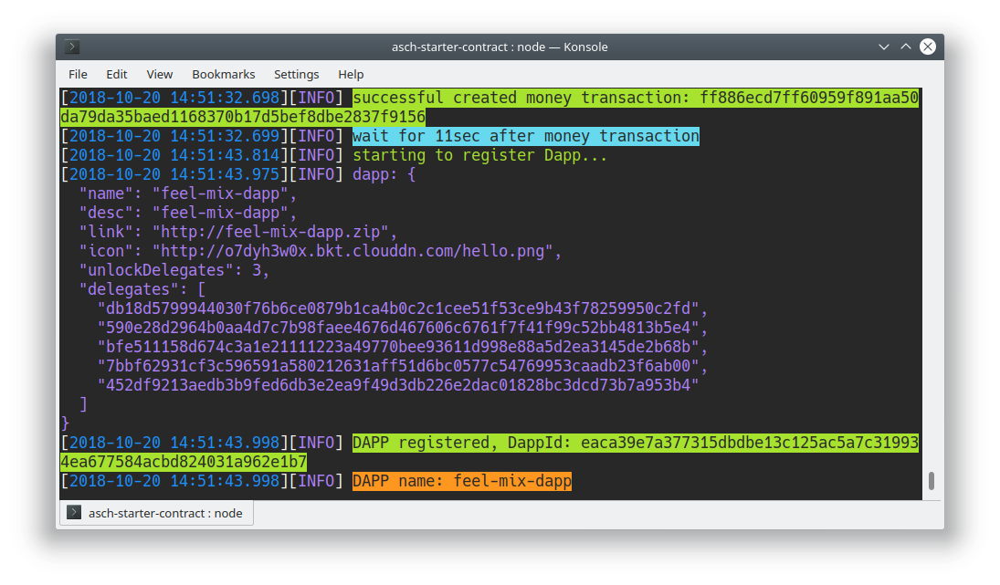

Table of Contents
=================

<!-- TOC -->

- [Dapp Development Tutorial 1: Asch Dapp Hello World](#dapp-development-tutorial-1-asch-dapp-hello-world)
  - [1 Development Process Overview](#1-development-process-overview)
    - [1.1 System requirements](#11-system-requirements)
  - [2 Setup Tools](#2-setup-tools)
  - [3 Setup ASCH](#3-setup-asch)
  - [4 Start localnet](#4-start-localnet)
  - [5 Start The Frontend Application (optional)](#5-start-the-frontend-application-optional)
  - [6 Download Dapp Starter Kit](#6-download-dapp-starter-kit)
  - [7 Register and install Dapp](#7-register-and-install-dapp)
    - [**7.1 Automatic Registration (preferred)**](#71-automatic-registration-preferred)
    - [**7.2 Manual Registration**](#72-manual-registration)
      - [7.2.1 Prepare Account For Dapp Registration](#721-prepare-account-for-dapp-registration)
      - [7.2.2 Create Dapp Delegates](#722-create-dapp-delegates)
      - [7.2.3 Create `dapp.json` file](#723-create-dappjson-file)
      - [7.2.4 Register The Dapp On The Localnet](#724-register-the-dapp-on-the-localnet)
      - [7.2.5 Check `config.json` file](#725-check-configjson-file)
      - [7.2.6 Install the dapp on the localnet](#726-install-the-dapp-on-the-localnet)
      - [7.2.7 Restart whole Blockchain](#727-restart-whole-blockchain)
      - [7.2.8 Access The Dapp In Your Browser](#728-access-the-dapp-in-your-browser)
      - [7.2.9 The folder structure](#729-the-folder-structure)

<!-- /TOC -->

# Dapp Development Tutorial 1: Asch Dapp Hello World

## 1 Development Process Overview

There are three types of networks in Asch, `localnet`, `testnet`, and `mainnet`. The later two, `testnet` and `mainnet`, are usually deployed online, which can be accessed by a public network. Meanwhile the first type, `localnet`, as its name is running on local machine, which is actually a private chain with only one node. Localnet is designed to help developing and testing locally.

The development of Dapp involves all of these types of network simultaneously, which is:
- step 1: developing and testing locally on the localnet
- step 2: testing on the testnet
- step 3: deploying officially on mainnet

### 1.1 System requirements
- Node v8.x.x

## 2 Setup Tools

```bash
npm install -g asch-redeploy
npm install -g asch-cli
```

## 3 Setup ASCH
```bash
# clone asch
git clone https://github.com/aschplatform/asch.git asch && cd asch && npm install && cd ..
```

## 4 Start localnet

Run your own local asch node.

```bash
# change directory
cd asch

# start the localnet (default on localhost:4096)
node app.js
```


## 5 Start The Frontend Application (optional)

To access the localnet via a graphical user interface (GUI) you need to download and unzip the frontend files. Be sure to have the localnet up and running (via `node app.js`).

This step must be run from another console. The first console is already busy with running the localnet.

```bash
# you should be in the asch/ directory
cd public/dist
```

Download pre-built frontend files:  
```bash
wget http://china.aschcdn.com/frontend-mainnet-5f5b3cf5.zip
unzip frontend-mainnet-5f5b3cf5.zip
```

Now you can access the frontend application on the address ```localhost:4096```. 
*NOTE:* You don't need to start a http-server. Asch is already providing one for you.


## 6 Download Dapp Starter Kit

Go one directory above the `asch/` directory:  
```bash
cd ../../..
```

Now you should see following directories (with `ls -la`):  
```log
- asch/
```

Download the Dapp Starter kit:  
```bash
https://github.com/AschTemplates/asch-starter-contract
```

Now we should have the following folder structure:  
```log
- asch/
- asch-starter-contract/
```

## 7 Register and install Dapp

### **7.1 Automatic Registration (preferred)**

We downloaded before the [asch-redeploy](https://github.com/aschplatform/asch-redeploy) tool. Lets register and install our Dapp now.

> Important:  
> Be sure to terminate the process that started the `node app.js` before. Because asch-redeploy needs to start and stop the ASCH blockchain during the installation process.

```bash
# change directory
cd asch-starter-contract/
```

Install and register your Dapp with one command. The asch-redeploy does all manual steps for you to register and install your Dapp.  

```bash
asch-redeploy
```

After a few seconds you will see your new Dapp. In this case the name of our dapp is `feel-mix-dapp` (your Dapp name will be different):  



Now you can see your Dapp producing its own blocks. Head in your favourite browser to `http://localhost:4096/api/chains/feel-mix-dapp/blocks` to see the Dapp block production. Be sure to reload the url a few times.


<br/>
<br/>

### **7.2 Manual Registration**

This step executes all steps the [7.1 Automatic Registration (preferred)](#71-automatic-registration-preferred) step is executing in the background.

#### 7.2.1 Prepare Account For Dapp Registration

First create a new local asch-account.

```bash
# this command can be executed everywhere
asch-cli -H 127.0.0.1 -P 4096 crypto --generate

# ?  Enter number of accounts to generate:
1
```

__Our New Account__
```
    address: AHMCKebuL2nRYDgszf9J2KjVZzAw95WUyB
    secret: sentence weasel match weather apple onion release keen lens deal fruit matrix
    publicKey: a7cfd49d25ce247568d39b17fca221d9b2ff8402a9f6eb6346d2291a5c81374c
```

__Mainchain Genesis Account__
```
    address: ABuH9VHV3cFi9UKzcHXGMPGnSC4QqT2cZ5
    secret: stone elephant caught wrong spend traffic success fetch inside blush virtual element
    publicKey: 116025d5664ce153b02c69349798ab66144edd2a395e822b13587780ac9c9c09
```


__Our new Acccount__ will be __our__ account for this tutorial.

We need __100 XAS__ to register a dapp. Our new account has __0 XAS__. The __genesis__ account has 100000000 XAS on it. Lets send some money to __our__ account. Make sure that your local ASCH blockchain is running.


```bash
# send money to our account 
asch-cli -H 127.0.0.1 -P 4096 sendmoney --secret "someone manual strong movie roof episode eight spatial brown soldier soup motor" --to "AHMCKebuL2nRYDgszf9J2KjVZzAw95WUyB" --amount 100000000000

# check your balance
asch-cli -H 127.0.0.1 -P 4096 openaccount "sentence weasel match weather apple onion release keen lens deal fruit matrix"
```


#### 7.2.2 Create Dapp Delegates

First we have to create 5 delegate accounts:

```bash
# this command can be executed everywhere
asch-cli crypto --generate

? Enter number of accounts to generate
5
```

Delegate secrets:  
```js
[
  {
    address: 'AN1yKK47P3MtD5ZgHYoncGQ1gCn4p2vGAC',
    secret: 'flame bottom dragon rely endorse garage supply urge turtle team demand put',
    publicKey: 'db18d5799944030f76b6ce0879b1ca4b0c2c1cee51f53ce9b43f78259950c2fd' 
  },
  {
    address: 'AGeeCmSVLDNbtMqqpJchQZakchwzpuje1P',
    secret: 'thrive veteran child enforce puzzle buzz valley crew genuine basket start top',
    publicKey: '590e28d2964b0aa4d7c7b98faee4676d467606c6761f7f41f99c52bb4813b5e4' 
  },
  { 
    address: 'A7NWaYUkpa543hdTsfw57AoZAgCBr2NFY6',
    secret: 'black tool gift useless bring nothing huge vendor asset mix chimney weird',
    publicKey: 'bfe511158d674c3a1e21111223a49770bee93611d998e88a5d2ea3145de2b68b'
  },
  {
    address: 'ABU1G2pQFMGa7c1GiAPYCQuUhiPHdvCSB2',
    secret: 'ribbon crumble loud chief turn maid neglect move day churn share fabric',
    publicKey: '7bbf62931cf3c596591a580212631aff51d6bc0577c54769953caadb23f6ab00' 
  },
  {
    address: 'AG1A3ojeLAMZySaZWTkg49jcoVCV7FCKXF',
    secret: 'scan prevent agent close human pair aerobic sad forest wave toe dust',
    publicKey: '452df9213aedb3b9fed6db3e2ea9f49d3db226e2dac01828bc3dcd73b7a953b4' 
  }
]
```


#### 7.2.3 Create `dapp.json` file

Go to the `asch-starter-contract/` directory:  
```bash
cd asch-starter-contract/
```

Execute:  
```bash
asch-cli dapps -a

# enter dapp name?
hello-dapp

# enter dapp description?
[empty]

# enter dapp tags?
[empty]

# choose dapp category
1

# enter dapp link
https://github.com/nonexistingproject/archive/master.zip

# enter dapp icon url
http://o7dyh3w0x.bkt.clouddn.com/hello.png

# enter public keys of dapp delegates  - hex array, use ',' for separator (at least 5 delegates, max 101):
db18d5799944030f76b6ce0879b1ca4b0c2c1cee51f53ce9b43f78259950c2fd,590e28d2964b0aa4d7c7b98faee4676d467606c6761f7f41f99c52bb4813b5e4,bfe511158d674c3a1e21111223a49770bee93611d998e88a5d2ea3145de2b68b,7bbf62931cf3c596591a580212631aff51d6bc0577c54769953caadb23f6ab00,452df9213aedb3b9fed6db3e2ea9f49d3db226e2dac01828bc3dcd73b7a953b4

# how many delegates are needed to unlock asset of a dapp?
3

# Enter master secret of your genesis account (take your secret)
"sentence weasel match weather apple onion release keen lens deal fruit matrix"

# Do you want publish a inbuilt asset in this dapp? 
No
```

This step created the `asch-starter-contract/dapp.json` file.
```
{
  "name": "hello",
  "link": "https://github.com/nonexistingproject/archive/master.zip",
  "category": 1,
  "description": "",
  "tags": "",
  "icon": "http://o7dyh3w0x.bkt.clouddn.com/hello.png",
  "delegates": [
      "db18d5799944030f76b6ce0879b1ca4b0c2c1cee51f53ce9b43f78259950c2fd",
      "590e28d2964b0aa4d7c7b98faee4676d467606c6761f7f41f99c52bb4813b5e4",
      "bfe511158d674c3a1e21111223a49770bee93611d998e88a5d2ea3145de2b68b",
      "7bbf62931cf3c596591a580212631aff51d6bc0577c54769953caadb23f6ab00",
      "452df9213aedb3b9fed6db3e2ea9f49d3db226e2dac01828bc3dcd73b7a953b4"
  ],
  "unlockDelegates": 3,
  "type": 0
}
```


#### 7.2.4 Register The Dapp On The Localnet

Until now we only have generated the `asch-starter-contract/dapp.json` file. Now we want to register this dapp on the localnet with the help of the metadata file. We register the dapp with __our__ newly generated account.

```
# execute (in asch-starter-contract/)
asch-cli -H 127.0.0.1 -P 4096 registerdapp --metafile ./dapp.json --secret "sentence weasel match weather apple onion release keen lens deal fruit matrix"
```

Server response:  
```
# This returns the transactionId with which the Dapp was registred with
<dapp Id>
```

Now navigate in your browser to `localhost:4096`. Login with __our__ new created account. Under dapps you should see the register dapps.

Or use your browser to query all installed Dapps `http://localhost:4096/api/chains/installed`. This is the query result:

```
{
  "success": true,
  "chains": [{
    "tid": "eaca39e7a377315dbdbe13c125ac5a7c319934ea677584acbd824031a962e1b7",
    "name": "hello-dapp",
    "address": "CVaAAiuqKY5k1gSdZng4yAhYAT1HbiEtd",
    "desc": "feel-mix-dapp",
    "link": "http://feel-mix-dapp.zip",
    "icon": "http://o7dyh3w0x.bkt.clouddn.com/hello.png",
    "unlockNumber": 3,
    "_version_": 1
  }]
}
```

#### 7.2.5 Check `config.json` file

Check your `asch-starter-contract/config.json` file. It should contain all 5 delegate secrets we created before:  

Check with:  
```bash
cat config.json
```

Result:  
```json
{
  "peers": [{"ip":"127.0.0.1","port":4096}],
  "secrets": [
    "flame bottom dragon rely endorse garage supply urge turtle team demand put",
    "thrive veteran child enforce puzzle buzz valley crew genuine basket start top",
    "black tool gift useless bring nothing huge vendor asset mix chimney weird",
    "ribbon crumble loud chief turn maid neglect move day churn share fabric",
    "scan prevent agent close human pair aerobic sad forest wave toe dust"
  ]
}
```

#### 7.2.6 Install the dapp on the localnet

Finally it is time to install the dapp on the localnet.

We will copy the `asch-starter-contract/` directory to the `asch/chains/hello-dapp` directory and give the target directory the same with which we registered the dapp with (in this case `hello-dapp`):

```bash
> cp -r ./asch-starter-contract/ ./asch/chains/hello-dapp
```

#### 7.2.7 Restart whole Blockchain

After the installation restart the ASCH node
```bash
# stop the localnet with Ctrl + C

# restart the localnet
node app.js
```

#### 7.2.8 Access The Dapp In Your Browser

Now you can access the dapp like a website `localhost:4096/chains/hello-dapp/` in your browser.

#### 7.2.9 The folder structure

Now we can see that there is a new folder added under `asch/chains`, named as the dapp name we registered the dapp with.

```bash
ls -la asch/chains/

hello-dapp/
  └─ contract/       # contains all smart contracts contracts
  └─ interface/      # contains the custom REST API endpoints
  └─ model/          # contains the custom DB table definitions
  └─ public/         # contains all front-end files
  └─ blockchain.db   # the dapp database
  └─ config.json     # contains peer db information and elgate secrets
  └─ genesis.json    # the genesis block, this blcok can be generated with the asch-cli
  └─ init.js         # this file registers the contracts
```
Don't worry about the complexity of the file structure. For now a first look is enough. 

All the essential files for developers can be found in ```contracts/``` Developers need to create a new contact to run business logic. That's all.

