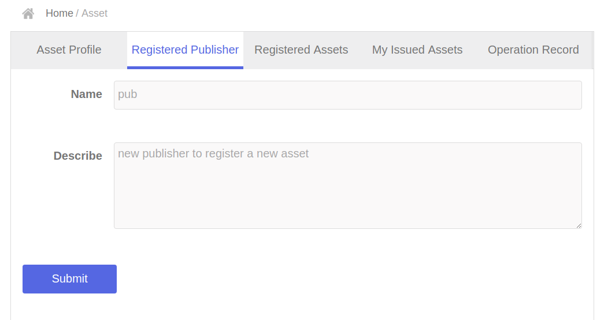
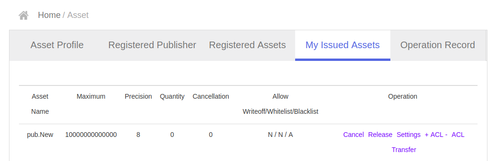
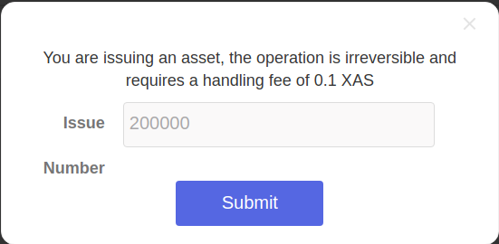

# Create a new Asset by using the (default) front-end

The normal process would be:

- Register publisher
- Wait 10 sec for next block
- Register asset
- Wait 10 sec for next block
- Mint tokens (only available in Chinese language, you can see it on the screen, but not translated yet)

## Preparation
Make sure that ASCH is running (`cd asch && node app.js`) and you've created a (new) account. See also [Create a new account by using the (default) front-end](../create-account/en.md). Notice that one account can only register as publisher once.

## Create a publisher
Point yout browser to http://localhost:4096/#/login and login with your account. Make sure your account contains enough XAS. Registering a publisher requires 100 XAS and registering an asset requires 500 XAS again. Choose the "Asset" tab from the left side of the screen now. Then navigate to "Registered Publisher" tab and fill in the form like that shown in the frgure below:



Confirm the popup that: "This operation requires a fee of 100 XAS"

Now wait at least 10 seconds for the next block.

## Create an asset
Now navigate to the "Registered Assets" tab an fill in the form like that shown in the figure below, ignore the field under "Accuracy":

Confirm the popup that: "This operation requires a fee of 500 XAS". After 10 second you will find your asset under the "My Issued Assets":

.

Now you can cancel, change, release and transfer your new assets. Let's try to release some pub.New assets now.

Enter the number of asset you're issuing in the popup and confirm your operation:

.

After 10 seconds you'll find your 200000 new `pub.NEW` assets under the "Asset Profile". Now you're able to send (transfer) `pub.NEW` assets to other adresses too. 

# Using asch-redeploy
Notice that you can also use [asch-redeploy](https://github.com/AschPlatform/asch-redeploy) to create a new Asset:

Change the directory to some random Dapp and execute:

```
> asch-redeploy --publisher pub --asset NEW
```


